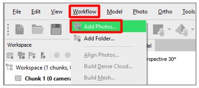
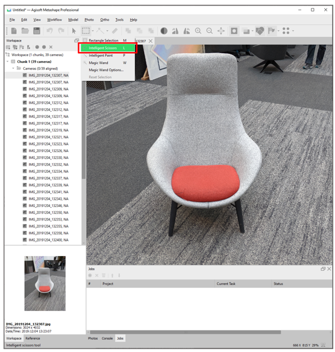
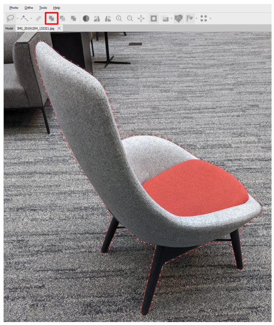
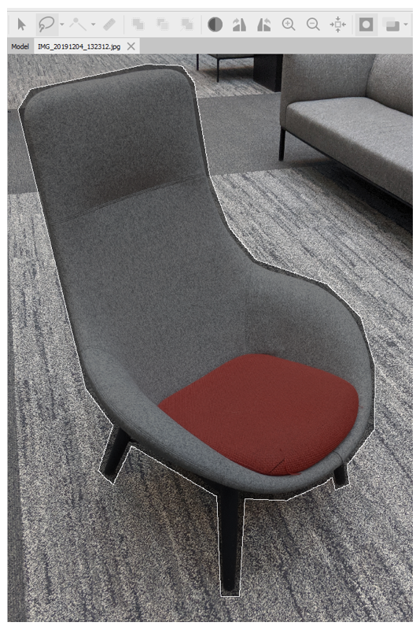
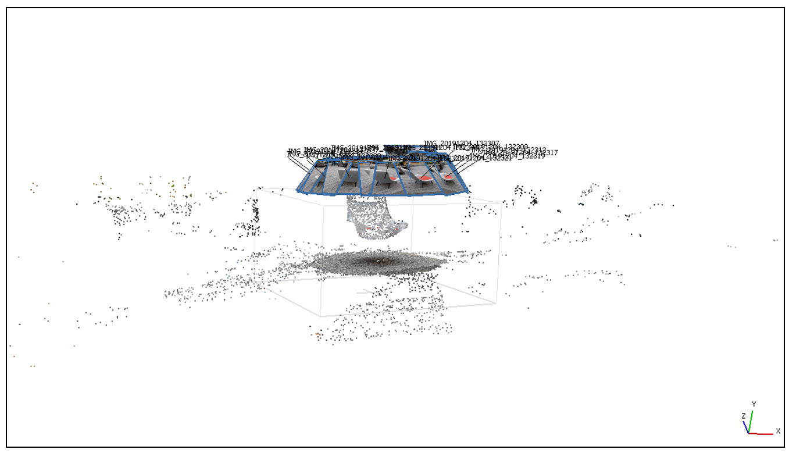
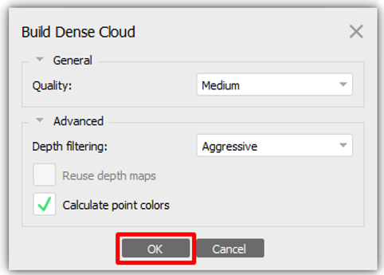
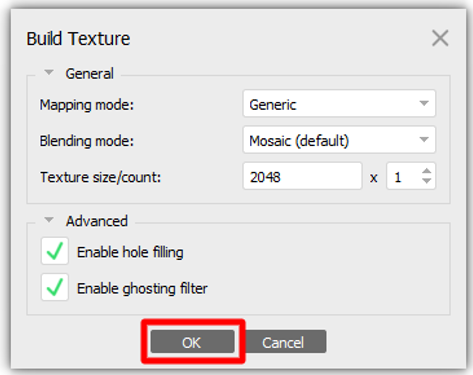

# Use Agisoft Metashape to create 3D models for Dynamics 365 Guides and for mixed-reality components included in apps created with Power Apps

This tutorial guides you through the process of using Agisoft Metashape photogrammetry software to create a 3D model that you can use in Microsoft Dynamics Guides and in mixed-reality components included in apps created with Microsoft Power Apps.

This tutorial was created only for informational purposes, to show how Agisoft Metashape works with Dynamics 365 Guides and Power Apps. Microsoft Corporation isn't affiliated with, isn't a partner of, and doesn't endorse or sponsor Agisoft or any of its products.

## What is Agisoft Metashape?

Agisoft Metashape is a standalone software product that photogrammetrically processes digital images and generates 3D spatial data that can used in geographic information system (GIS) applications, in cultural heritage documentation, for visual effects production, and for indirect measurements of objects of various scales. [Learn more about Agisoft Metashape](https://www.agisoft.com/).

## Photography tips

The following tips will help you take quality photos for photogrammetry:

- If you can, take photos in a location where lighting is consistent and doesn't cast shadows.

- Try to keep your own shadow out of the picture.

- Make sure that there are no moving objects in the background when you take the photos.

- If the camera that you're using has a high dynamic range (HDR) setting, turn the feature off, and try not to adjust the exposure of your photographs while you capture images.

- Take pictures about one meter apart while you circle the object.

- If you can, maintain a perpendicular location relative to the object while you take photos.

- If the object is large, move in a lateral motion from one end of it to the other, and change the height at each pass, until you've captured all surfaces.

## Set preferences

For the most part, you can use the default preferences. However, there are a few changes that you must make before you start.

1. On the **Tools** menu, select **Preferences**.

    

2. In the **Metashape Preferences** dialog box, on the **GPU** tab, select the check box for any graphics processing units (GPUs) that are available. If only one GPU is available, select the **Use CPU when performing GPU accelerated processing** check box at the bottom of the dialog box. When you've finished, select **Apply**.

    

3. On the **Advanced** tab, in the **Miscellaneous** section, follow these steps:

    1. Select the **Enable fine-level subdivision** check box. This option produces a more refined model that has more triangles.

    2. Select the **Enable VBO support** check box. This option provides a more refined way of storing the information in the structure of the graphics card memory. The result is a more detailed polygonal model.

    3. Select **OK** to apply your changes and close the **Metashape Preferences** dialog box.

    

    > [!NOTE]
    > If the camera that you're using has extensive metadata about location, orientation, and so on, you might also want to experiment with the options in the **Export/Import** section of the **Advanced** tab.

## Import your photos

After you've finished setting up your preferences, the first step is to import the photos that Metashape will use to construct the 3D model.

- On the **Workflow** menu, select **Add Photos**, and then select the photos to import.

    

## Mask your photos

You can "mask out" any irrelevant elements in your source photos that might be confusing to the program or produce undesirable results. By limiting the number of pixels that the application must be aware of, you help reduce the memory profile of each image. The result is a better 3D model. You might want to complete this step from different angles in your photos. Although you don't have to mask objects in every photo, the more photographs you mask, the more accurate the result will be.

1. Double-click an image to open it, and then select a selection tool, such as **Intelligent Scissors**.

    

2. Outline your 3D model subject, and then select **Add Selection** to create the mask.

    

    Your model should now resemble the following illustration.

    

3. For the best results, repeat this procedure in multiple photos, from multiple angles.

    

## Align the photos

Photogrammetry uses objects that are consistently present in multiple images to create a map of where it thinks the camera was when the photo was taken. For this step of the process, you use the **Align photos** command.

1. On the **Workflow** menu, select **Align Photos**.

    

2. In the **Align Photos** dialog box, use the default settings (see the following illustration), or change the settings as you require. When you've finished, select **OK**.

    

3. Select the **Model** menu to view the results. Your model should now resemble the following illustration.

    

## Align the region

After you've finished aligning the photos, you can use the bounding box to trim the size of your 3D object.

> [!NOTE]
> This step isn't required, but it speeds up the next steps.

1. On the toolbar, select the **Resize Region** tool.

    

2. Drag the spheres at the edge of the region to select the area that you want to convert.

    

## Build a dense point cloud

The next step is to generate a point cloud. You can then use the point cloud to generate polygonal data that is used to form a mesh. By increasing the number of points that are generated from the aligned photos, you help define an accurate 3D representation of the surface.

1. On the **Workflow** menu, select **Build Dense Cloud**.

    

2. In the **Build Dense Cloud** dialog box, use the following settings:

    - **Quality:** Select **Medium**.

        > [!NOTE]
        > If you have a powerful computer, you can set the **Quality** field to **High**. However, for many operations, the **Medium** setting produces quality results.

    - **Deep filtering:** Select **Aggressive**.

    - **Calculate point colors:** Select the check box.

    

    These settings are good settings to start from. Experiment with other options to see the different results that they produce. Your results might vary, depending on the subject matter and surface characteristics of the object that you're working with.

3. When you've finished, select **OK**.

## Build the mesh

The next step is to build the mesh.

1. On the **Workflow** menu, select **Build Mesh**.

    

2. In the **Build Mesh** dialog box, use the following settings:

    - **Source data:** Select **Dense cloud**.

    - **Surface type:** Select **Arbitrary (3D)**.

    - **Face count:** Select **Medium (89,796)**.

    - **Interpolation:** Select **Enabled (default)**.

    - **Calculate vertex colors:** Select the check box.

    

    > [!NOTE]
    > These settings work for general cases. Experiment with other options to find the best combination for your needs. You might want to change the **Face count** setting to match the [performance requirements for your targeted platform](optimize-models.md#performance-targets).

3. When you've finished, select **OK** to convert the point cloud into a 3D model.

4. Examine the results, and then follow one of these steps:

    - If you're satisfied with the results, skip ahead to the [Export the 3D model](#export-the-3d-model) procedure later in this tutorial.

    - If you want a higher level of surface detail, move on to the next procedure, [Build the texture](#build-the-texture).

    - If you don't like the shape of the object, you might want to add more masks to the areas that are missing details.

## Build the texture

By adding a texture map to your 3D model, you can significantly increase the visual fidelity but also maintain performance.

> [!NOTE]
> This step is optional.

1. On the **Workflow** menu, select **Build Texture**.

    

2. Use the default settings (see the following illustration). When you've finished, select **OK**.

    

    > [!NOTE]
    > Depending on the platform that you're targeting, you might want to reduce the texture size.

## Export the 3D model

The last step is to convert the model to the GLB file format, so that you can use it in Dynamics 365 Guides and Power Apps.

1. On the **File** menu, select **Export** \> **Export Model**.

    

2. In the **Save As** dialog box, specify a name and location for the 3D model. Then, in the **Save as type** field, select **Binary glTF (\*.glb**). When you've finished, select **Save**.

    

3. In the **Export Model** dialog box, in the **Export texture** field group, we recommend that you select **PNG**. Leave the other default settings.

    

4. When you've finished, select **OK**.

The model is now completed and ready to be used in Dynamics 365 Guides and Power Apps.

## View a 3D model in Dynamics 365 Guides or Power Apps

After you've prepared a 3D model, use the following links to learn more about using the model in Dynamics 365 Guides or Power Apps:

- [Dynamics 365 Guides](../index.md)

- [Power Apps](https://docs.microsoft.com/powerapps/maker/canvas-apps/mixed-reality-overview)

## More information

Screenshots in this tutorial were taken from the Agisoft Metashape software program to provide clear instructions about how to use Agisoft software. [Learn more about Agisoft Metashape](https://www.agisoft.com/).

Microsoft Corporation is not responsible for, and expressly disclaims all liability for damages of any kind arising out of the use of Agisoft Metashape, or reliance on these instructions. This document is created only to provide general information to our customers and does not take into consideration any individualized business plans or specifications.

The use in this document of trademarked names and images is strictly for informative and descriptive purposes, and no commercial claim to their use, or suggestion of sponsorship or endorsement, is made by Microsoft Corporation.
