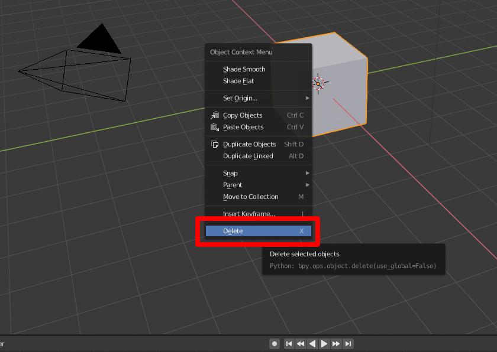
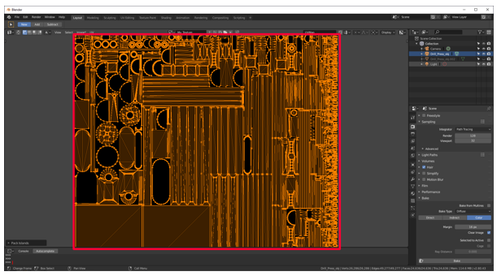
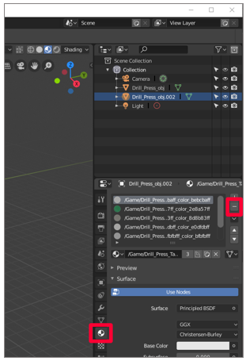
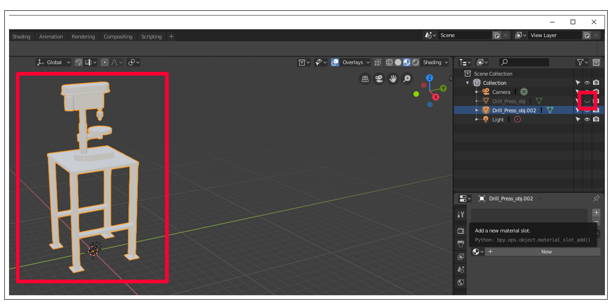

# Use Blender to prepare 3D models for use in Dynamics 365 Guides and in mixed-reality components included in apps created with Power Apps

This tutorial provides step-by-step instructions that show you how to:

- Reduce the polygon count of a 3D model so that it matches the performance needs specific to [performance targets](optimize-models.md#performance-targets) for Microsoft Dynamics 365 Guides and for mixed-reality components included in apps created with Microsoft Power Apps.

- Combine the 3D model's multiple materials (colors) into a single texture that can be applied to the model.

- Export the optimized 3D model as a [GLB file](index.md#gltf-and-glb-file-formats) that can be used in Dynamics 365 Guides and Power Apps.

The combination of reducing polygons and turning multiple materials into a single texture can transform a complex and resource-intensive 3D model into a 3D model that performs well in Dynamics 365 Guides and Power Apps.

> [!IMPORTANT]
> This document is created strictly for informative purposes to demonstrate how Blender works with Dynamics 365 Guides and Power Apps. Your use of third-party applications is subject to terms between you and the third party. Microsoft Corporation is not affiliated with, is not a partner to, and does not endorse or sponsor Blender or any of Blender's products. There are [other content-creation apps](convert-models.md#tools-for-exporting-cad-models) you can use to prepare your 3D models.

## What is Blender?

[Blender](https://www.blender.org/) is a free, open-source 3D creation suite. It supports the entirety of the 3D pipeline: modeling, rigging, animation, simulation, rendering, compositing and motion tracking, and video editing and game creation.

If Blender is the software that you decide to use to prepare your 3D models, review Blender's website and [download the most current stable version for Windows](https://www.blender.org/download/).

## Overall steps for preparing a 3D model with Blender

Preparing a 3D model for mixed reality with Blender includes the following steps:

1.	Import the model into Blender.

2.	Decimate the model.

3.	Unwrap the model (UV unwrapping).

4.	Assign materials.

5.	Bake the textures.

6.	Export the model as a GLB file.

## Import the model into Blender

1.	Open Blender. When you open the app, a new scene is automatically created.

2.	Right-click the cube, and then select **Delete** to delete it.

    

3.	Select **File** > **Import** > **Wavefront (.obj)** to import the OBJ file.

    

4.	Under **Import OBJ**, do the following:

    a. Clear the **Object** and **Group** check boxes, and select the **Image Search** check box.

    

    b. Select **Import OBJ** on the right side of the screen. This imports the 3D model as one item, and searches in the subfolder for any materials.

    

    When you select **Import OBJ**, you'll see the 3D model with the imported materials.

      > [!TIP]
      > If the 3D model is extremely large or small, or hard to see, or is possibly off-screen as shown in the following graphic, you can use the mouse wheel to zoom the camera in or out until the model is visible.

      

      If the 3D model appears gray, select the **Look Dev** shading option to show the colors.

      

      c. Review the **Tris** count (number of polygons) at the bottom right of the screen.

      

      If this number meets the [performance target resolution](optimize-models.md#performance-targets), you can skip the decimation step and go directly to [Unwrap the model](#unwrap-the-model) later in this tutorial. If it doesn't meet the target resolution, continue to the next section to decimate the model.

## Decimate the model

To reach application-specific performance goals, you might need to "decimate" the model. _Decimation_ is the process of recomputing the surface polygons of the model to create a similar shape with fewer polygons. This reduces visual fidelity, but increases performance. The example images below show a high-fidelity model that can be used when you're viewing one or two 3D models at a time on Microsoft HoloLens, and a low-quality 3D model used when you're viewing ten or more models at a time on HoloLens.

1.	Select the model, and then go to the **Modifiers** menu  in the tool column on the right.

2.	On the **Modifiers** menu, in the **Add Modifier** list, select **Decimate**.

    

3.	With the model selected, change the **Ratio** value to a number between 0.0 and 1.0. This setting determines the percentage of polygons (triangles) that are removed. For example, a value of 0.5 reduces the original polygon count to 50%. You'll see the **Tris** value in the bottom right of the Blender window decrease as you change the ratio. When the number reaches a value that matches your performance goal and looks good, select **Apply**.

    

## Unwrap the model (UV unwrapping)

You can skip this step if your model has only one color.

To visualize the concept of UV unwrapping, imagine cutting out every surface of a 3D model and placing those surfaces flat on a piece of paper. The U and V dimensions represent the vertical and horizontal axes of the piece of paper in the same way that X, Y, and Z represent the three-dimensional axes of a 3D model. Unwrapping the UVs enables you to paint the flattened pieces with the material colors of the model. This painted paper is called a *texture*, and it's later wrapped back on top of the model, giving it the illusion of being made from different-colored pieces when it's actually one item with a colorful texture wrapped around it. This process is called *texture baking*, which is covered later in this tutorial.

1.	Select the model, hover over the main menu, press the **Tab** key to enter **Edit Mode**, press **a** to select all, and then on the **UV** menu, select **Smart UV Project**.

    

    > [!TIP]
    > Enter **Edit Mode** by selecting the **Edit Mode** list in the upper-left corner, or press the **Tab** key. Pressing the Tab key while already in **Edit Mode** returns you to **Object Mode**, as shown in the following graphic.

    

2.	Keep the default settings for the properties, and then select **OK**.

    

3.	Make sure that you're in **Edit Mode** (press the **Tab** key), and that the entire model is still selected (press **a**). When the entire model is selected, it's orange.

4.	Select the **UV Editor** menu (or press **Shift+F10**).
  
    

5.	On the **UV** menu, select **Pack Islands**.

    

    The outlined pieces are reorganized to represent the surface of the model as efficiently as possible. After packing the islands, the UVs look like this:

    

6.	Create a copy of the mesh to bake the texture onto. To do this:

    a. Select the model.

    b. Right-click the model to open the menu.

    c. Select **Duplicate Objects**.

    d. Press **Spacebar**.

    

## Prepare materials for texture baking

1. Select the duplicate model, and then select the **Materials** tab  to go the **Materials** panel.

   

2. Delete all the materials for the duplicate 3D model by selecting the minus sign to the right of the materials.

   

3. To hide the original 3D model and show just the duplicate, select the "eye" to the right of the original 3D model name. Notice that there are no materials on the duplicate 3D model.

    

4. Select the plus sign in the **Materials** panel to add a new material to the duplicate.

    

5. Select **New** to add a new material to the material slot.

    

6. Hover over the viewport (the main window where the 3D model is shown), press the **Tab** key to enter **Edit Mode**, press **a** to select all, and then select **Assign** from the **Materials** tab .

    

7.	Select the icon to the left of **Object Mode**, and then select **Image Editor**.

    

8.	Create a new image (select **Add** > **Image** > **New**).

    

9. Save the new image as **My_Texture** or a similar name that's easy to remember, and then set the width and height to 1024 &times; 1024 pixels. Keep the default values for the other options.

    

10.	Select the icon to the left of **View**, and then select the **Shader Editor**.

    

11.	With the duplicate 3D model selected, select **Add** > **Texture** > **Image Texture**. Select or click to place the image texture node in the window.

    

12.	Drag the yellow node link (the yellow dot) labeled **Color** in the image texture window to the **Base Color** yellow node on the **Principled BSDF** node, to connect them.

    

13.	In the drop-down menu on the image texture node, find the texture you just created and select it.

    

14.	Select **3D Viewport** at the upper left to go to the **3D Viewport** menu.

    

## Bake the materials onto the texture

After the texture and material are set up on the duplicate 3D model, it's time to bake the materials from the original 3D model onto that texture. The texture will be wrapped around the duplicate 3D model, which makes it higher performing while using the original colors.

1.	Select the **Render** tab 

2.  Select **Cycles** as the render engine.

3.	In the **Bake** menu, set **Bake Type** to **Diffuse**.

4.	Clear the **Direct** and **Indirect** check boxes.

5.	Select the original 3D model, and then hold **Shift** while selecting the duplicate 3D model.

6.	Select the **Selected to Active** check box.

7.	Add a **Ray Distance** value. Start with **.01**, and then increase it if the result is missing patches of color.

8.	Select **Bake**.

    

    The duplicate 3D model now has the same coloring as the original, but with only one material instead of several. This can significantly reduce draw calls and increase performance.  

    To confirm that the bake was successful, you can select the eye icon  next to the original model to hide it. Now only the duplicate with one material and texture is visible.

    

## Export the model to a GLB file

The last step is to export the model to a GLB file so it can be used with Dynamics 365 Guides and Power Apps.

1.	In Blender, select **File** > **Export** > **glTF 2.0**.

    

2. On the **Export** menu, make sure that the GLB format is selected and that the **Selected Objects** check box is selected. Name your file, and then select **glTF 2.0 (.glb/.gltf)**.

    

## View a 3D model in Dynamics 365 Guides or Power Apps

After you've prepared a 3D model, use the following links to learn more about using the model in Dynamics 365 Guides or Power Apps:

- [Dynamics 365 Guides](../index.md)

- [Power Apps](https://docs.microsoft.com/powerapps/maker/canvas-apps/mixed-reality-overview)

### More information

Several screenshots in this document were taken from the Blender software program in order to provide clear instructions on how to use Blender's software. [Learn more about the Blender Foundation](https://www.blender.org/).

Microsoft Corporation is not responsible for, and expressly disclaims all liability for damages of any kind arising out of the use of Blender, or reliance on these instructions. This document is created only to provide general information to our customers and does not take into consideration any individualized business plans or specifications.
Read about license terms for Blender at: [Creative Commons Attribution ShareAlike](https://creativecommons.org/licenses/by-sa/3.0/).

The use in this document of trademarked names and images is strictly for informative and descriptive purposes, and no commercial claim to their use, or suggestion of sponsorship or endorsement, is made by Microsoft.

[!INCLUDE[footer-include](../../includes/footer-banner.md)]