# Use SideFX Houdini to turn point clouds into optimized 3D models for Dynamics 365 Guides and for mixed-reality components in apps created with Power Apps

This tutorial provides step-by-step instructions for the following tasks:

- Convert a [point cloud](https://aka.ms/pointCloudDef) into a 3D model.

- Optimize a 3D model by reducing the polygon count so that it matches [performance targets for Dynamics 365 mixed-reality applications](optimize-models.md#performance-targets).

- Export an optimized 3D model as a .glb file that can be used in Dynamics 365 Guides and mixed-reality components in apps created with Power Apps

- Create a processing pipeline template, so that you can quickly optimize point clouds in the future.

This tutorial has been created only for informational purposes, to show how SideFX Houdini works with Microsoft Dynamics 365 Guides and Power Apps. Your use of third-party applications is subject to terms between you and the third party. Microsoft Corporation isn't affiliated with, isn't a partner of, and doesn't endorse or sponsor SideFX or any of its products. There are several other [content-creation applications that you can use to prepare your 3D models](convert-models.md#tools-for-exporting-cad-models).

## What is Houdini?

[Houdini](https://www.sidefx.com/) is a tool for creating 3D procedural content. It uses a non-destructive node-based tool system to design process pipelines and 3D content. 

## Set up your environment

To set up your environment, you must complete these tasks:

- Install the SideFX Labs extension.

- Set up AliceVision for photogrammetry.

### Install the SideFX Labs extension

SideFX Labs is a testing ground for tools that can help you get up and running with Houdini more quickly. This collection of free tools includes tools that are useful for converting point clouds to optimized 3D models. To use SideFX Labs, you must be using Houdini 18 or later.

SideFX provides a [tutorial video](https://www.sidefx.com/tutorials/sidefx-labs-installation/) that helps you install these tools.

> [!NOTE]
> You must install Houdini before you can install SideFX Labs. [Learn more about how to install Houdini](https://aka.ms/sidefxHome).

1. Open Houdini.

2. To install SideFX Labs, select the plus sign  at the top of the Houdini window, select **Shelves**, and then select the **SideFX Labs** check box.

    

2. On the toolbar that appears near the top of the window, select **Update Toolset** to open the installer.

    

3. Select **Update** to install the tools.

    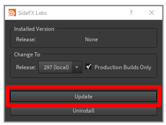

If the installation is successful, more tools appear on the toolbar. You can then continue with this tutorial.

### Set up AliceVision for photogrammetry

[AliceVision](https://alicevision.org/) is a [photogrammetric](https://aka.ms/PhotogrammetryDef) computer vision framework that was developed by Mikros Image. It provides 3D reconstruction and camera tracking algorithms. Learn more [about AliceVision](https://alicevision.org/#about) and the [AliceVision plug-in](https://www.sidefx.com/tutorials/alicevision-plugin/).

For information about how to install and set up the AliceVision plug-in for Houdini, see the [SideFX tutorial](https://www.sidefx.com/tutorials/alicevision-plugin/).

## Import a point cloud into Houdini

Houdini can import point cloud files in the PLY file format. If your file is in a PTS file format, you can manually convert it to the PLY format.

### Convert a .pts file to a .ply file

1. Open your .pts file in a file editor of your choice, and add the following header.

    ```
    ************************
    ply
    format ascii 1.0
    element vertex 534993
    property float x
    property float y
    property float z
    property uchar intensity
    property uchar red
    property uchar green
    property uchar blue
    end_header
    ************************
    ```

2. In the header, next to **element vertex**, replace the value **534993** with the value that originally appeared at the top of your .pts file (but now immediately follows the header).

    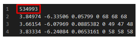

    This value is the total number of points in your point cloud.

3. Remove the original value after the header. The following table shows a side-by-side comparison of the files before and after you make the preceding changes. The **element vertex** value is highlighted in red.

    | Top of the .pts file | Top of the .ply file |
    |------------------|------------------|
    |  |  |

4. Save the file so that it has the .ply file name extension.

### Import the .ply file

1. Open Houdini. A new scene is automatically created. In this procedure, you will build a chain of nodes to process the point cloud into a 3D model. These nodes will be built in the lower-right pane of the Houdini window.

    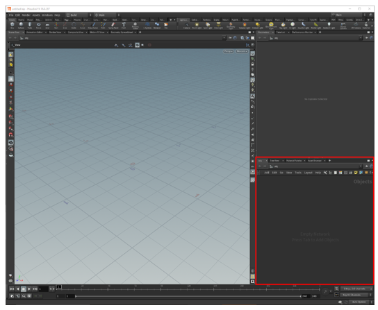

2. Right-click in the lower-right pane to open the **TAB Menu**. (Alternatively, press the **Tab** key.)

3. On the **TAB Menu**, select **Import \> File**, and then click in the **Geometry** pane to place the node.

    

3. Double-click in the middle of the **file1** node (or press **I**) to drill down into the file selection part of the node, select the **File Chooser** button, and then select the file to import.

    

4. In the file browser that appears, browse to the location of the .ply point cloud file that you want to import, select the file, and then select **Accept**.

    

    The point cloud appears in the main part of the window. If you can't see it, try to use the mouse wheel to zoom out until you can see the whole point cloud.

    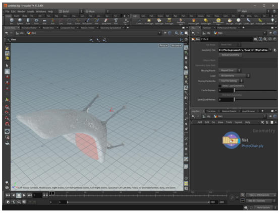

## Prepare the point cloud

### Reorient the point cloud

Sometimes, when you first import a point cloud, it has the wrong orientation. You can fix the orientation by adding a transform node to the node tree.

1. Right-click in the **Geometry** pane to open the **TAB Menu**, and then select **Manipulate \> Transform** to add a transform node.

    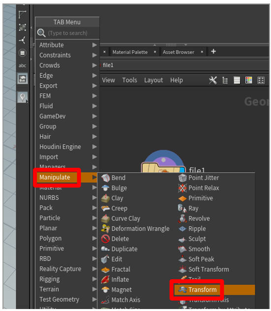

2. Drag from the dot on the bottom of the **file1** node to the dot on the top of the **transform1** node. In this way, you connect the output of the **file1** node to the input of the **transform1** node. Then click on the right side of the **transform1** node. The right side of the **transform1** node becomes blue, and the node becomes active in the main part of the window, so that you can see your model after it has been reoriented.

    

    > [!TIP]
    > To view the model during a specific stage of the process in Houdini, click on the right side of the appropriate node. This capability is helpful if you ever have to look at your 3D model in a previous state and edit the changes that occurred during that state.

3. To correct the rotation of your model, in the options pane above the node pane, add values in the **Rotate** row. You can often set the **x** value to **270** to rotate the model to the correct position. However, if that value doesn't work, try different values.

    

4. To center your point cloud over the origin point, add an axis align node after the transform node. To place the node, hover your mouse over the **Geometry** pane, press the **Tab** key to open the **TAB Menu**, and then select **Labs** \> **Geo** \> **Labs Axis Align**.

    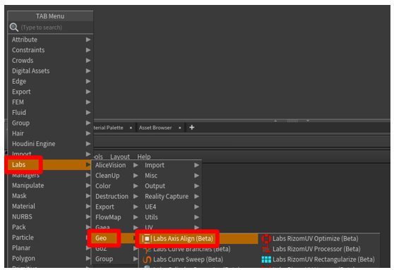

5. Drag to connect the output dot on the bottom of the **transform1** node to the input dot on the top of the **axis\_align1** node. Leave the default values as they are to position your point cloud on top of the origin point (an ideal place for it).

    

### Clean up the point cloud to remove stray points

If your point cloud has stray points that you want to remove, you can select and delete individual points or groups of points.

1. Change the **Geometry select** method to **Points** and the **Select** tool to **Lasso Picking**.

    > [!NOTE]
    > You can use a different method if you prefer.

    

2. Select the points to delete.

    

3. Press the **Delete** key. A new **blast1** node appears. The input dot on the top of this node is connected to the output dot on the bottom of the last node that you were working with.

    

4. Continue to remove points until you're satisfied with the results. Each deletion adds a new blast node that you can view or remove at any time.

    

## Convert the point cloud to a mesh

Both glTF and real-time rendering applications require that models be represented as a triangulated polygon surface. You can use the **Particle Fluid Surface** command to connect the points into a logical surface as polygonal geometry.

1. Click in the **Geometry** pane to open the **TAB Menu**, and then select **Fluid** \> **Particle Fluid Surface**. Then select the node, and add it to the **Geometry** pane.

    

2. Drag to connect the output dot on the bottom of the **transform1** node to the input dot on the upper left of the **particlefluidsurface1** node. Then click on the right side of the **pariclefluidsurface1** node to activate the node in the main part of the window.

    

    In the main part of the window, the point cloud is rendered as a mesh. The **Surfacing** tab is selected in the upper-right pane above the **Geometry** pane.

    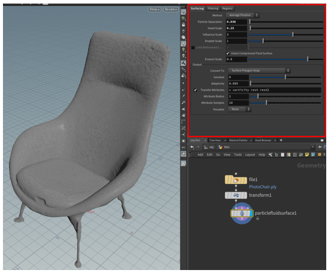

3. If color data is associated with the points in the point cloud, you can use the color attributes by adding the letters **Cd** to the end of the value in the **Transfer Attributes** field. The color will then be shown on your mesh.

    

4. If there are holes in the mesh, as shown in the following illustration, adjust the **Particle Separation** and **Voxel Scale** sliders in the upper-right pane to try to fix the issue.

    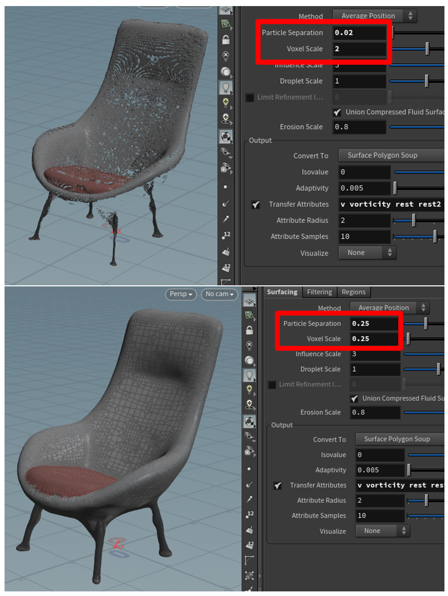

5. To prepare the mesh for decimation (the next step in the overall process), under **Output**, change the value of the **Convert To** field from **Surface Polygon Soup** to **Surface Polygons**. In this way, you can remesh the mesh and decimate it.

    

6. Right-click in the **Geometry** pane to open the **TAB Menu**, and then select **Polygon** \> **Remesh**. A remesh node is added to convert the mesh to triangles. In this way, you can decimate the 3D model to a polygon count that meets your performance requirements.

    

7. Drag to connect the output dot on the bottom of the **particlefluidsurface1** node to the input dot on the upper left of the **remesh** node. Click in the middle of the **remesh** node to activate it in the pane above the **Geometry** pane. Then click on the right side of the **remesh** node to activate the model in the main part of the window. You can now edit the properties of the remesh, and the model in the main part of the window will reflect those edits.

    

8. Experiment with the options under **Element Sizing** to get the results that you want. For the **Edge Lengths** field, you can keep the default value (**Uniform**), or you can select **Adaptive** and adjust the **Relative Density** slider (and other options) to produce the mesh that you want.

    

## Decimate the 3D model to help improve performance

To achieve application-specific goals, you might have to decimate your 3D model. *Decimation* is the process of recomputing the surface polygons of a model to create a similar shape by using fewer polygons. Although this process reduces visual fidelity, it helps improve performance. The following table shows a side-by-side comparison of a high-quality model that is used for low-scene complexity on HoloLens and a low-quality model that is used for high-scene complexity.

| High-polygon 3D model | Low-polygon 3D model |
|-----------------------|----------------------|
|  | 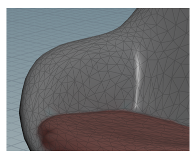 |
| 500,000 triangles | 8,000 triangles |

### Decimate a model

1. In the **Geometry** pane, press the **Tab** key to open the **TAB Menu**, and then select **Polygon** \> **PolyReduce** to place a PolyReduce node in the **Geometry** pane.

    

2. Drag to connect the output dot on the bottom of the **remesh** node to the input dot on the upper left of the **polyreduce1** node. Click in the middle of the **polyreduce1** node, and then click on the right side of the node to activate it in the main part of the window.

3. Under **Reduction Amount**, in the **Target** field, select **Output Polygon Count**, and then use the **Number To Keep** slider to adjust the polygon count to meet your performance requirements but also maintain acceptable visual fidelity.

    

The point cloud has now been converted to an optimized 3D mesh. In the next step, you will bake a high-resolution texture onto the 3D model to recover some of the visual fidelity that existed before decimation.

## Bake a high-resolution texture onto a low-polygon mesh

One downside of reducing the number of polygons in a mesh is that much of the detail might be lost. To restore some of that detail, you can capture it and apply it as a texture that is layered on top of the low-polygon model. During this process, which is known as *texture baking*, you take a picture of all the surfaces from your high-polygon model and join them into a "quilt" that you drape on top of the low-polygon model. In this way, you gain the performance of a low-polygon model but maintain some of the finer details of a high-polygon model.

Texture coordinates (also known as *UVs*) are pairs of numbers (*U* and *V*) that are stored in the geometry of a model. These numbers represent that way that a 2D image can be mapped to a 3D surface, and enable surface properties to be defined as an image. The images can be simple decals or complex material components, such as roughness and metallic. You can manually generate UV positions for a mesh, or the process can be done semi-automatically or automatically. The AutoUV surface operator is one tool in Houdini that can generate UVs. It uses a few automatic methods during the creation of UVs.

### Bake the texture

1. Right-click in the **Geometry** pane to open the **TAB Menu**, and then select **Labs** \> **UV** \> **Labs Auto UV** to add an AutoUV node to the scene.

    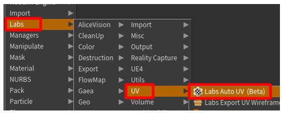

2. Under **Method**, change the value of the **Method** field to **UV Unwrap**.

    

3. Drag to connect the output dot on the bottom of the **polyreduce1** node to the input dot on the top of the **autouv1** node.

    

4. To view the "before" and "after" models side by side, select the **Viewport Layout** button, and then select **Two Views Side by Side**.

    

5. In the main part of the window, on the drop-down menu, select **Set View \> UV viewport**.

    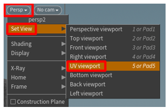

    The unwrapped UVs appear on the left, and the 3D model appears on the right.

    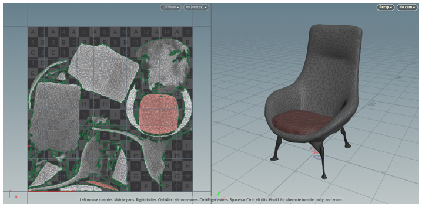

5. In the **Geometry** pane, select **Labs** \> **Output** \> **Labs Maps Baker** to add a **maps\_baker1** node.

    

6. Drag to connect the output dot on the bottom of the **autouv1** node to the input dot on the upper left of the **maps\_baker1** node. (The upper-left dot is the **LOW Resolution input** node.)

    

7. Drag to connect the output dot on the bottom of the **particlefluidsurface1** node to the input dot on the upper right of the **maps\_baker 1** node. (The upper-right dot is the **HIGH Resolution input** node.)

    

8. Select the **maps\_baker1** node, and then, under **Bake**, change the value of the **Preview Channel** field to **diffuse**. Under **Bake Options**, set the **Diffuse Map** field to **diffuse**.

    

    > [!TIP]
    > To save your project in a specific folder, select the **File Chooser** button next to the **Output Directory** field that is shown in the previous illustration. When you bake a texture, the .png texture file is saved to a **render** folder that is created in the root folder of the saved project. By saving your project in its own folder, you make the baked texture easy to find.

9. Select the **maps\_baker1** node, and then, in the options pane, select **Bake**.

    

10. Right-click in the **Geometry** pane to open the **TAB menu**, and then select **Managers** \> **Material Network** to add a **matnet1** node to the scene.

    

11. Double-click the **matnet1** node to open the **VEX Builder** pane.

    

12. Right-click in the **VEX Builder** pane, and then select **Shaders \> Principled Shader** to add a **Principled Shader** material.

    

13. In the options pane, on the **Surface** tab, use the sliders to change the value of the **Roughness** field to **0.6** and the value of the **Metallic** field to **0.1**. (You can set these fields to whatever you want, but we have found that these values are a good starting point when they are used in conjunction with the default values.)

    

14. On the **Textures** tab, under **Base Color**, select the **Use Texture** check box. Then select the **File Chooser** button, and select the **\*\_color.png** texture file that you saved to the **render** folder earlier. The principled shader is now ready to use. 

    > [!NOTE]
    > Feel free to modify the material further. For the purpose of this tutorial, this configuration is sufficient.

    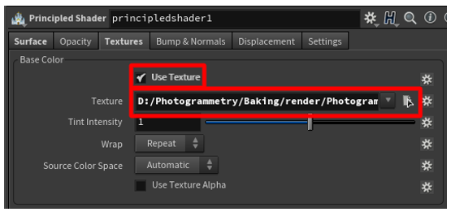

15. In the **VEX Builder** pane, select the **Back** (left arrow) button to return to the **Geometry** pane.

    

16. Select **Material \> Material** to place a material node in the **Geometry** pane.

    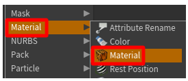

17. Drag to connect the output dot on the bottom of the **autouv1** node to the input dot on the top of the **material1** node.

    

18. Select the **material1** node, and select the **Operator chooser** button. Then, in **Choose Operator** dialog box, select **file1** \> **matnet1** \> **principledshader1** to select the principled shader that you created earlier.

    

19. Click on the right side of the node to activate it in the main part of the window.

The texture is rendered on top of your low-polygon 3D model. If it looks acceptable, move on to the next step.

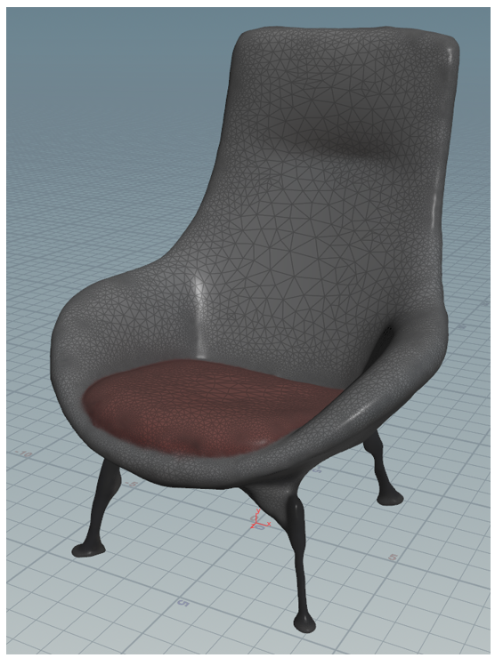

## Export the model to a .glb file

In this step, you will export the model to a .glb file so that it can be used with Dynamics 365 Guides and Power Apps.

1. Right-click in the **Geometry** pane to open the **TAB Menu**, and then select **Export** \> **ROP GLTF Output**.

    

2. Drag to connect the output dot on the bottom of the **material1** node to the input dot on the top of the **rop\_gltf1** node.

    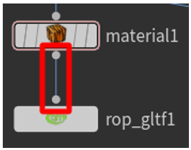

3. In the upper pane, change the value of the **Export Type** field to **glb**.

    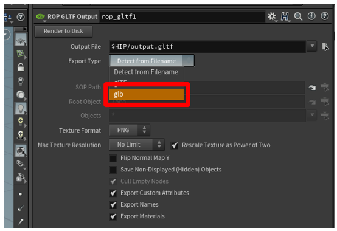

4. Select the **File Chooser** button next to the **Output File** field, and then enter a name and destination for the .glb file. Be sure to add **.glb** to the end of the file name. When you've finished, select **Accept**.

    

5. Select **Render to Disk** to finalize the export and create the .glb file.

    

## Create a template to reuse your settings for other point clouds

To save time and effort, you can create a template. In this way, the settings that you create for a point cloud can be used for other point clouds. Although you must still manually select **Bake** and will probably have to adjust a few values, you can automate most of the processing.

### Create a template

1. Replace the geometry that is currently being used with a default geometry. This step makes the template file lightweight, so that it's loaded quickly.

    1. In the **Geometry** pane, click in the middle of the file node to switch to the **File** menu in the upper pane.

    2. Change the value of the **Geometry File** field to **default.bgeo**, and then select **Reload Geometry**.

    3. Notice that the geometry is redrawn so that it's now a generic cube.

    4. Change the file name to something generic, such as **Template**.

    

2. Select **File \> Save**, and enter a name that you will remember, such as **Prep\_Template**.

    

3. Close Houdini.

### Use the template

1. Open Houdini, select **File** \> **Open**, and then select the template that you just created.

    

2. In the **Geometry** pane, click in the middle of the file node to switch to the **File** menu in the upper pane. Then select the **File Chooser** button next to the **Geometry File** field to select the .ply point cloud file.

    

3. Select **Reload Geometry** to load the point cloud into the scene.

    

4. Go to the **maps\_baker1** node, and then select **Bake** to bake a new texture for your 3D model.

    

5. Click on the right side of the **material1** node to view your baked model.

    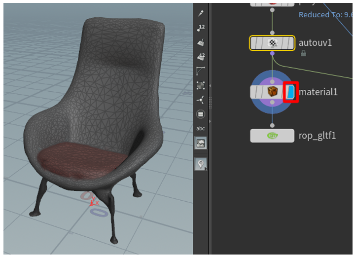

6. Follow one of these steps:

    - If you're satisfied with the 3D model, go to the **rop\_gltfB** node, and then select **Render to Disk** to export your 3D model.

        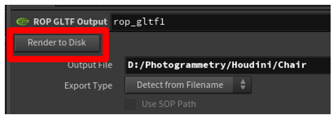

    - If you aren't satisfied with how the 3D model looks, adjust the settings for the **particlefluidsurface1**, **remesh**, and **polyreduce1** nodes. When your model looks acceptable, bake your texture again, and export the 3D model.

## View a 3D model in Dynamics 365 Guides or Power Apps

After you've prepared a 3D model, use the following links to learn more about using the model in Dynamics 365 Guides or Power Apps:

- [Dynamics 365 Guides](../index.md)

- [Power Apps](/powerapps/maker/canvas-apps/mixed-reality-overview)

### More information

Screenshots in this tutorial were taken from the Houdini software program to provide clear instructions about how to use the Houdini software. [Learn more about SideFX Houdini](https://www.sidefx.com/tutorials/alicevision-plugin/).

Microsoft Corporation is not responsible for, and expressly disclaims all liability for damages of any kind arising out of the use of Houdini, or reliance on these instructions. This document is created only to provide general information to our customers and does not take into consideration any individualized business plans or specifications.

The use in this document of trademarked names and images is strictly for informative and descriptive purposes, and no commercial claim to their use, or suggestion of sponsorship or endorsement, is made by the Microsoft Corporation.


[!INCLUDE[footer-include](../../includes/footer-banner.md)]