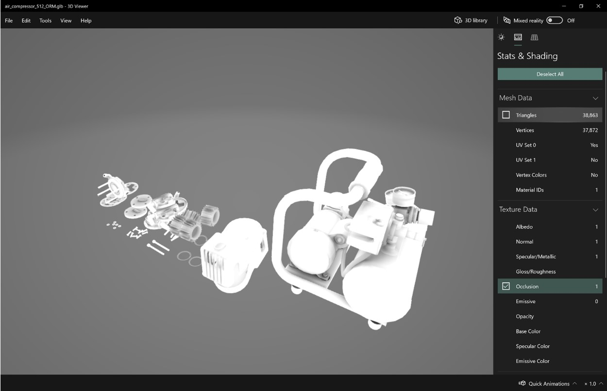

# Review a 3D model

After exporting a .GLF file, you can preview it with the Windows [3D Viewer](https://www.microsoft.com/p/3d-viewer/9nblggh42ths). You can use 3D Viewer to visualize the individual texture channels and view stats such as triangle count and draw calls to confirm the asset meets the recommended performance targets.

1.	Open [3D Viewer](https://www.microsoft.com/p/3d-viewer/9nblggh42ths).

2.	Drag a .GLB file into the viewport (or select **File** > **Open** to browse for a .GLB file).

3.	Select the **Stats & Shading** tab on the right side of the screen to start visualizing different components of the .GLB file.

4.	Use the check boxes to turn the different viewport visualizations on or off.

5.	If your device has a camera, you can move the **Mixed reality** slider to the **On** position and place the asset to preview it in your world.

    
 
Ensure that your model conforms to the recommended optimization for the platform you're creating content for.

> [!TIP]
> The [Babylon.JS Web Viewer](https://sandbox.babylonjs.com/) is another great option if uploading the asset is not a concern.

If the asset requires any additional editing or animation work in another staging application, consider using .FBX as an intermediate file format. FBX is an 
Autodesk exchange format designed to preserve additional authoring data that might be required by your staging application.
