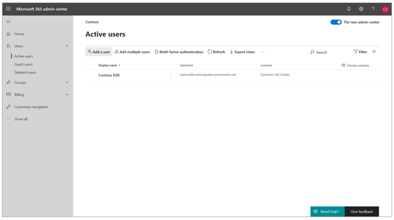
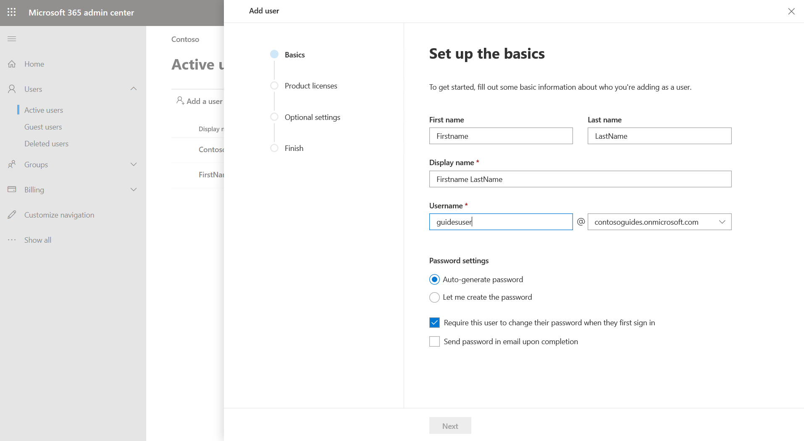
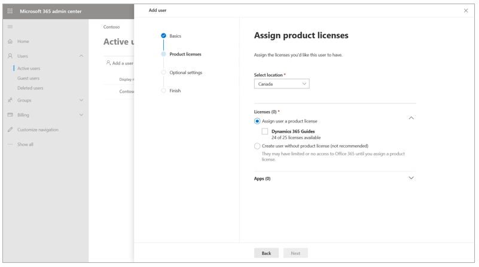
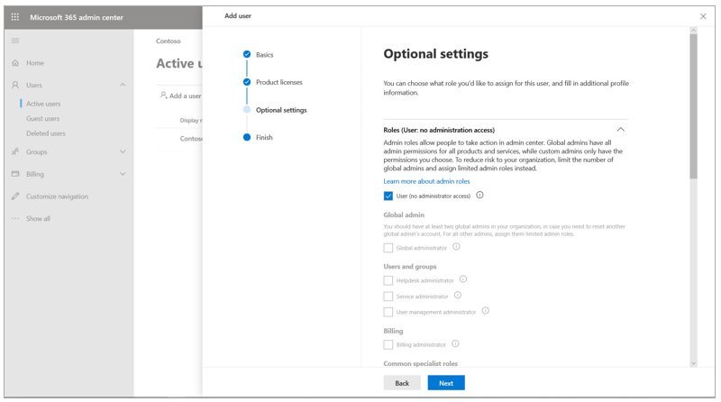
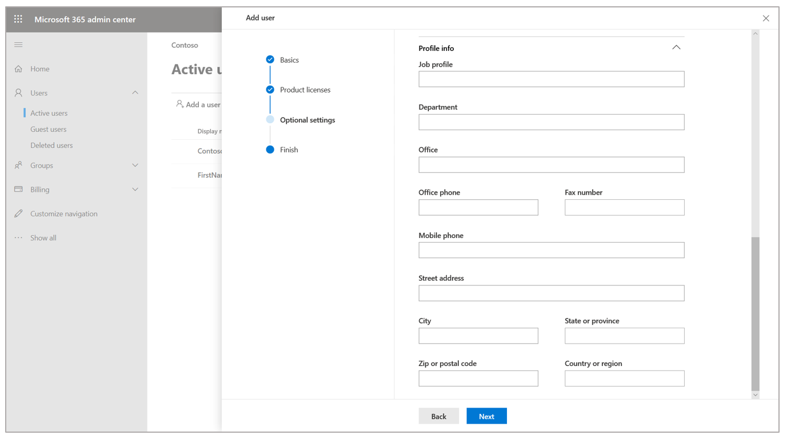
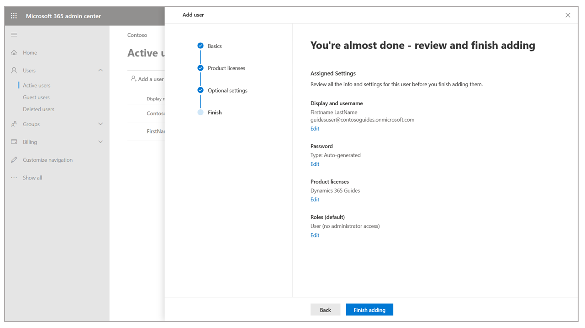
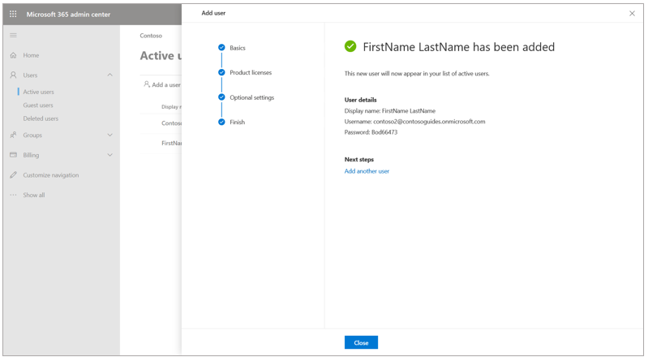
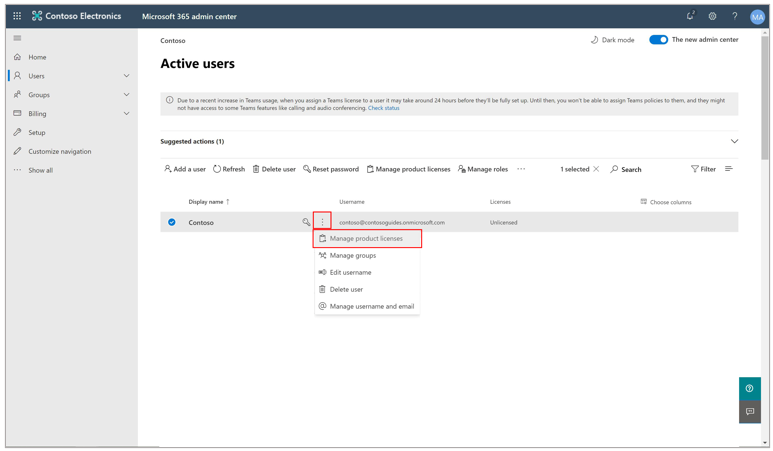
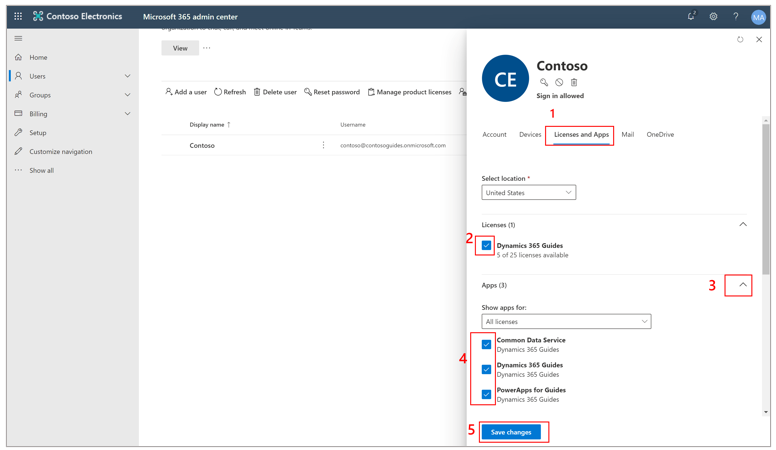

# Add additional user accounts to Dynamics 365 Guides

[!include [rename-banner](~/includes/cc-data-platform-banner.md)]

To add additional users to [!include[cc-microsoft](../includes/cc-microsoft.md)] [!include[pn-dyn-365-guides](../includes/pn-dyn-365-guides.md)], you must first assign the [!include[pn-dyn-365-guides](../includes/pn-dyn-365-guides.md)] license to a new or existing user in the Microsoft 365 admin center. Then, in the Power Platform admin center, configure the roles that the users will have access to (Author, Operator, or Admin).

## Add a new user 

1. Open the [Microsoft 365 admin center](https://admin.microsoft.com/AdminPortal/Home).

2. In the left pane, select **Users**, and then select **Active users**.

3. On the **Active users** page, select **Add a user**.

    

4. On the **Set up the basics** page, fill in the information for the new user. When you've finished, select **Next**.

    

    > [!NOTE]
    > By default, a password is automatically generated for new user accounts. Users must change this password the first time that they sign in by using their new account. If you want to set a permanent password instead of using an automatically generated password, select the **Let me create the password** option, and clear the **Require this user to change their password when they first sign in** check box.

5. On the **Assign product licenses** page, select the location for the user, and then, under **Licenses**, select the **[!include[pn-dyn-365-guides](../includes/pn-dyn-365-guides.md)]** check box. When you've finished, select **Next**.

    

6. On the **Optional settings** page, leave the **User (no administrator access)** check box selected unless the user will be an admin. In that case, select the **Global administrator** check box.

    

7. Scroll down, expand the **Profile info** section, and fill in the user's profile information. When you've finished, select **Next**.

    

8. Review the information on the last page. To make changes, select the **Edit** button below the relevant sections. When you've finished, select **Finish Adding**.

    

8. If you selected the **Auto-generate password** option in step 4, make a note of the password. The user will need this password to sign in.

    

9. Select **Close**.

After you add user accounts, the next step is to assign the **Author**, **Operator**, or **Admin** user role for the solution. For more information, see [Assign user roles](assign-role.md).

## Assign a Dynamics 365 Guides license to an existing user

1. Open the [Microsoft 365 admin center](https://admin.microsoft.com/AdminPortal/Home). 

2. In the left pane, select **Users**, and then select **Active users**. 

3. Select the **More actions** (**...**) button for the user that you want to assign a license to, and then select **Manage product licenses**. 

    

4. In the dialog box that appears, on the **Licenses and Apps** tab, select the **Dynamics 365 Guides** check box. Then, on the **Apps** FastTab, make sure that the **Common Data Service**, **Dynamics 365 Guides**, and **PowerApps for Guides** check boxes are selected. 

    

5. Select **Save changes**.

## What's next?

[Assign user roles](assign-role.md)

[!INCLUDE[footer-include](../includes/footer-banner.md)]
