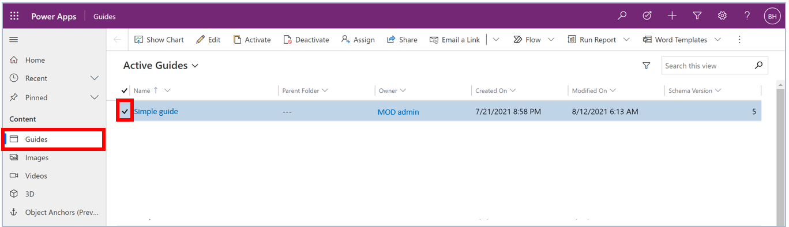
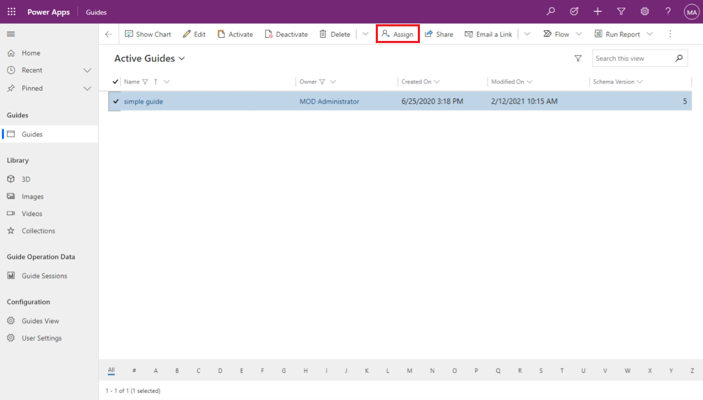
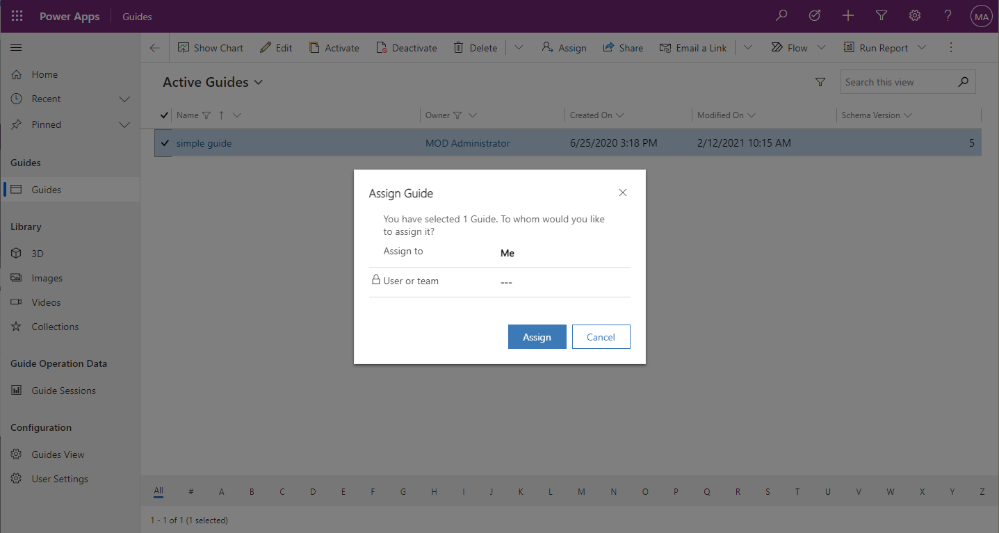
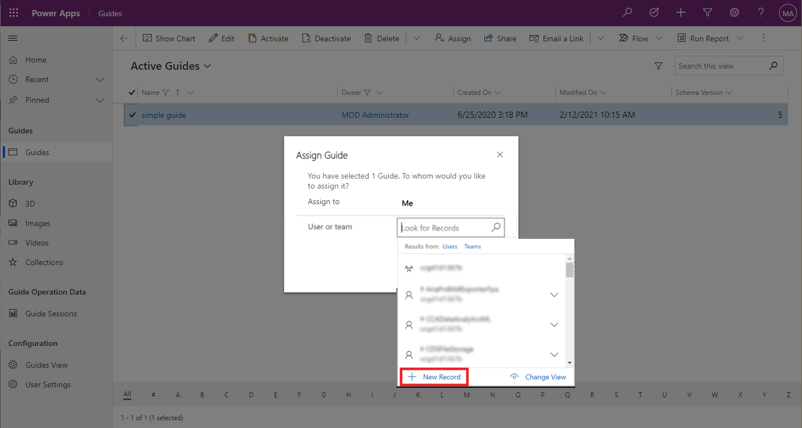

<!-- This article is a copy of the article below with the term "record" updated to "guide".   A better solution will have to be found to "customize" core power apps support documents to address the specific D365 Guides user experience.  
https://docs.microsoft.com/powerapps/user/assign-or-share-records -->

# Limit access to a specific guide or guide content in Dynamics 365 Guides by using owner teams

When you create a guide in Microsoft Dynamics 365 Guides, you are automatically assigned as the owner of the guide. If you want to share ownership of the guide with others in your organization, you can:

- Assign ownership of the guide to another person. 

- Assign ownership of the guide to an owner team. 

- Keep ownership of the guide, but let someone else work on it with you by using the **Share** option.

> [!NOTE]
> You can also assign the ownership of a guide to yourself if you have a role with the Assign privilege.

For more information on privileges, teams, and controlling access to apps, see the following articles.

|To|See this article|
|---------------------------------------|-----------------------------------------------------|
|Learn how privileges and access work| [How access to a record (guide) is determined](https://docs.microsoft.com/power-platform/admin/how-record-access-determined)|
|Learn about the three types of teams (*owner* team, Azure Active Directory *group* team, or *access* team)|[Manage teams](https://docs.microsoft.com/power-platform/admin/manage-teams)|
|Control access to the Dynamics 365 Guides HoloLens app or PC app|[Security roles and privileges](https://docs.microsoft.com/power-platform/admin/security-roles-privileges#team-members-privilege-inheritance)|
|Control access to the Guides model-driven app| [Share a model-driven app using Power Apps](https://docs.microsoft.com/powerapps/maker/model-driven-apps/share-model-driven-app)|

## Assign a guide to a user or an owner team

1. Go to [Dynamics 365 Home](https://home.dynamics.com/), and then select the **App launcher** button  in the upper-left corner of the window.

2. Select **Power Apps**, select **Apps**, and then select **Guides**.  

3. Select the guide that you want to assign. You can select multiple guides.
   
   

4. Select **Assign**.

   

5. In the **Assign Guide** dialog box, select the **Assign to** column, and then select one of the following options:

    - Select **Me** to assign the guide to yourself. Keep in mind that you must be a system administrator to re-assign ownership of a guide that belongs to someone else.    
      
      
      
    - Select **User or team** and then enter the name of the user or team (or use the lookup). To create a new user or team, select **New Record**.
      
      
      
6. Select **Assign** when you're done.

## Share a guide with someone else

Teams should be structured so that ownership of a guide is assigned to one or more teams that include the groups of users who need to collaborate on guides as authors, or use guides as operators. In exceptional cases, the Share option can be used for individuals who are not members of a team. For details on the sharing process, see [Use access teams to limit access to specific guides or guide content in Dynamics 365 Guides](https://docs.microsoft.com/dynamics365/mixed-reality/guides/admin-access-teams).

[!INCLUDE[footer-include](../includes/footer-banner.md)]
