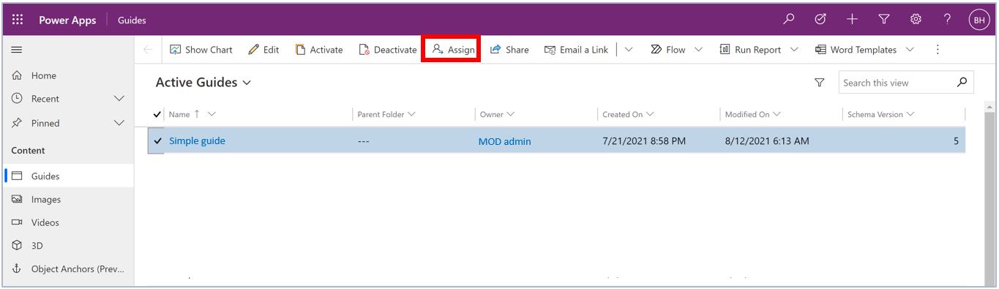
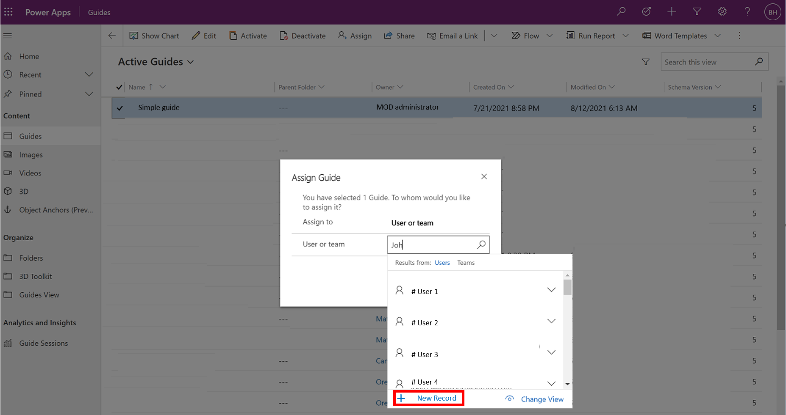

# Assign ownership of a guide or folder in Dynamics 365 Guides

You can assign ownership to a folder or guide through the model-driven app. For more information, see [Guide content management.](admin-content-mgmt.md)

## Change the owner of a folder

When you change the owner of a folder, any guides, subfolders, and assets within that folder are assigned to that owner. This allows you to easily manage access for a group of related guides and assets.

1. [Open the model-driven app](open-model-driven-app.md) in Guides.

1. In the left pane, select **Folders** to view the list of folders in the instance.

1. Select the desired folder, and then at the top of the screen, select **Assign** to display the folder information.

    

1. In the **Assign Folder** dialog box, select the box to the right of the **Assign to** label to toggle between **Me** and **User or team**. If **Me** is selected, the folder is assigned to you. If **User or team** is selected, you can enter the owner in the **User or team** field or search for an owner.

1. Select **Assign** to save the new owner.

   > [!NOTE]
   > By default, authors and restricted authors have access to all assets (3D parts, images, videos, and object anchors). If you want to restrict access to certain assets, [create a new security role or update permissions](admin-restrict-access-assets.md) for the particular users. 

## Change the owner of a guide

Change the owner of a guide to a user or an owner team

1. [Open the model-driven app](open-model-driven-app.md) in Guides.

1. Select the guide that you want to assign. You can select multiple guides.

   

1. Select **Assign**.

   

1. In the **Assign Guide** dialog box, to the right of the **Assign to** column, do one of the following:

    - Select **User or team** and then enter the name of the user or team (or use the search box) you want to assign the guide to. To create a new user or team, select **New Record**.

      

      > [!NOTE]
      > You must have admin permissions to see the **New Record** button.

    - Select **Me** to assign the guide to yourself. Keep in mind that you must be a system administrator to re-assign ownership of a guide that belongs to someone else.

1. Select **Assign** when you're done.

## Share a folder with someone else

1. [Open the model-driven app](open-model-driven-app.md) in Guides.

1. In the left pane, select **Folders** to view the list of folders in the instance.

1. Select the desired folder, and then at the top right of the screen, select **Share** > **Copy link**.

1. Share the link with the appropriate users.

## Share a guide with someone else

Teams should be structured so that ownership of a guide is assigned to one or more teams that include the groups of users who need to collaborate on guides as authors, or use the guides as operators. In exceptional cases, you can use the **Share** option for individuals who are not members of a team. For details on the sharing process, see [Use access teams to limit access to specific guides or guide content in Dynamics 365 Guides](/dynamics365/mixed-reality/guides/admin-access-teams).

> [!NOTE]
> When you share a guide, the content (images, videos, and 3D objects) associated with the guide is not automatically shared. You can use the **All Content** tab in the Guides model-driven app to do bulk operations, such as sharing content. 
>
> 
>
> Or, put all assets for a guide in a folder and share the folder.

## See also

- [Create an access team](admin-access-teams.md)
- [Assign an Operator or Author role to an individual user](assign-role.md)
- [Assign roles in bulk by using Active Directory groups](admin-assign-role-groups.md)
- [Restrict access to an environment by using security groups](admin-security.md)

[!INCLUDE[footer-include](../includes/footer-banner.md)]
