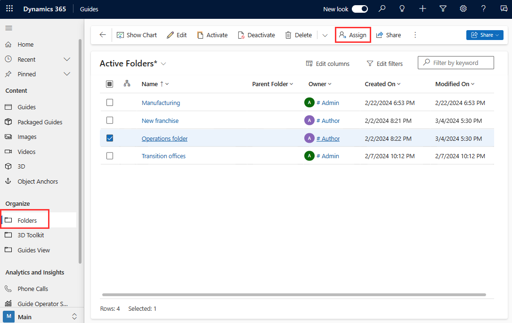
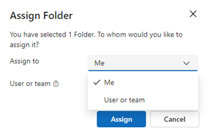

# Change ownership of a guide or folder in Dynamics 365 Guides

You can assign ownership to a folder or guide through the model-driven app. For more information, see [Guide content management.](admin-content-mgmt.md)

## Change the owner of a folder

When an Author or Admin change the owner of a folder, any guides, subfolders, and assets within that folder are assigned to that owner. This allows you to easily manage access for a group of related guides and assets.

> [!NOTE]
> By default, Authors and Restricted authors have access to all assets (3D parts, images, videos, and object anchors). Although not recommended, admins can restrict access by creating a new security role. See [Restrict access to assets.](admin-restrict-access-assets.md) 

1. [Open the model-driven app](open-model-driven-app.md) in Guides.

1. In the left pane, select **Folders** to view the list of folders in the instance.

1. Select the desired folder, and then at the top of the screen, select **Assign** to display the folder information.

    

1. In the **Assign Folder** dialog box, select the box to the right of the **Assign to** label to toggle between **Me** and **User or team**. If **Me** is selected, the folder is assigned to you. If **User or team** is selected, you can enter the owner in the **User or team** field or search for an owner.

    

1. Select **Assign** to save the new owner.

## Change the owner of a guide

Change the owner of a guide to a user or an owner team.

1. [Open the model-driven app](open-model-driven-app.md) in Guides.

1. Select the guide that you want to assign. You can select multiple guides.

   

1. Select **Assign**.

   

1. In the **Assign Guide** dialog box, to the right of the **Assign to** column, do one of the following:

    - Select **User or team** and then enter the name of the user or team (or use the search box) you want to assign the guide to. To create a new user or team, select **New Record**.

      

      > [!NOTE]
      > You must have admin permissions to see the **New Record** button.

    - Select **Me** to assign the guide to yourself. Keep in mind that you must be a system administrator to re-assign ownership of a guide that belongs to someone else.

1. Select **Assign** when you're done.

## Next steps

- [Assign an Operator or Author role to an individual user](assign-role.md)
- [Assign roles in bulk by using Active Directory groups](admin-assign-role-groups.md)
- [Restrict access to an environment by using security groups](admin-security.md)

[!INCLUDE[footer-include](../includes/footer-banner.md)]
