# Use access teams to limit access to specific guides or guide content in Dynamics 365 Guides

A Microsoft Dynamics 365 admin can use [access teams](https://docs.microsoft.com/dynamics365/customerengagement/on-premises/developer/use-access-teams-owner-teams-collaborate-share-information) to easily control who can see specific guides and guide content (3D models, images, or videos) in Dynamics 365 Guides. Access teams are useful when you want to grant different user permissions for specific records in [Common Data Service](https://docs.microsoft.com/powerapps/maker/common-data-service/data-platform-intro). For example, you might want access to some guides to be limited to a specific factory location, or you might want to limit access to guides that are in progress.

> [!NOTE]
> Dynamics 365 offers additional ways to customize and configure access to specific records in Common Data Service. However, this topic doesn't cover advanced configuration, such as the creation of [owner teams](https://docs.microsoft.com/dynamics365/customerengagement/on-premises/developer/use-access-teams-owner-teams-collaborate-share-information).

## How access teams work with the Operator and Author user roles

You can assign an **Operator** or **Author** role to a user to specify whether that user can create and edit guides or just use them. When you assign an **Operator** or **Author** role, that role automatically grants the user access to all guides in the instance. To limit access to specific guides or guide content (3D models, images, or videos), you can use the **Restricted Author** and **Restricted Operator** roles that are already set up in your Guides solution. Users assigned one of these roles will only have access to guides that they create themselves or guides/content that's explicitly shared with them. 

## Overall process for limiting access to a guide

The process for limiting access includes these basic steps:

1. Assign the restricted security role to a user or users.

2. Create an access team, and add users to it.

3. Share the guide with the access team.

This topic describes each of these steps in detail.

>[!IMPORTANT]
>If you have already restricted access to guides or guides content by creating your own security role with reduced privileges, you’ll need to remove that security role and replace it with one of the built-in security roles as described in this article.

## Step 1: Assign the restricted security role

To prevent a specific user from accessing all guides by default, change that user's security role to the **Dynamics 365 Guides Restricted Operator** role. Once assigned, they will be able to see only the guides that have been shared with them.

> [!NOTE]
> The steps outlined in this procedure show how to restrict operator privileges. You can restrict author privileges in a similar way. This article also shows how to restrict access to the **Guides** entity. You can use the same steps to restrict access to other types of Dynamics 365 Guides records (3D models, images, or videos) to limit their visibility to certain users or teams. 

1. In the [Power Platform admin center](https://admin.powerplatform.microsoft.com/environments), on the **Environments** page, select the same Guides solution, select the **More environment actions** (**...**) button, and then select **Settings**.

    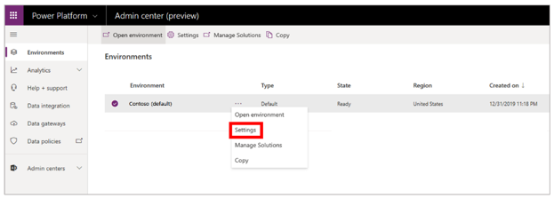

2. On the **Settings** page, select **Users**.

    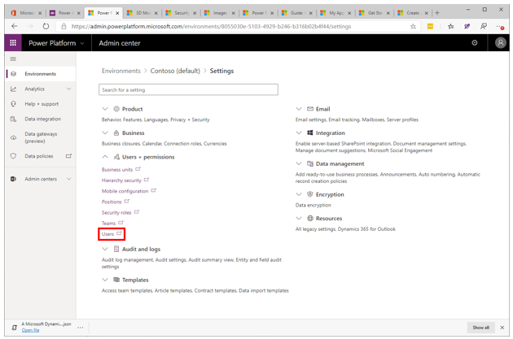

3. Select a specific user by selecting the user's full name.

    

4. Select **Manage Roles** to open the **Manage User Roles** dialog box, and then do the following:

    1. If it's selected, clear the check box for the **Dynamics 365 Guides Operator** role.
    
    2. Select the check box for the **Common Data Service User** role.

    3. Select the check box for the **Dynamics 365 Guides Operator Restricted** role.

    4. Select **OK**.

    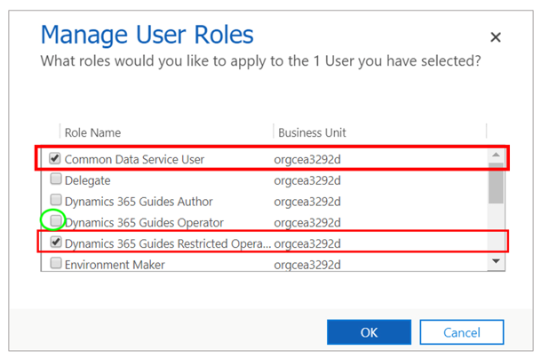

## Step 2: Create an access team and add users to it

A user can be associated with more than one access team.

> [!NOTE]
> If you or someone else has already created an access team that you want to use, skip ahead to the next procedure.

1. In the [Power Platform admin center](https://admin.powerplatform.microsoft.com/environments), on the **Environments** page, select the same Guides solution, select the **More environment actions** (**...**) button, and then select **Settings**.

    

2. On the **Settings** page, select **Teams**.

    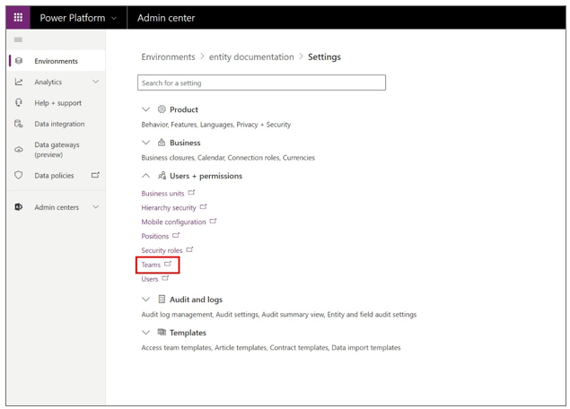

3. Select **New**.

    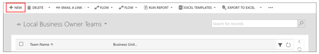

4. On the **New Team** page, set the **Team Name** and **Administrator** fields, change the value of the **Team Type** field to **Access**, and then select **Save**.

    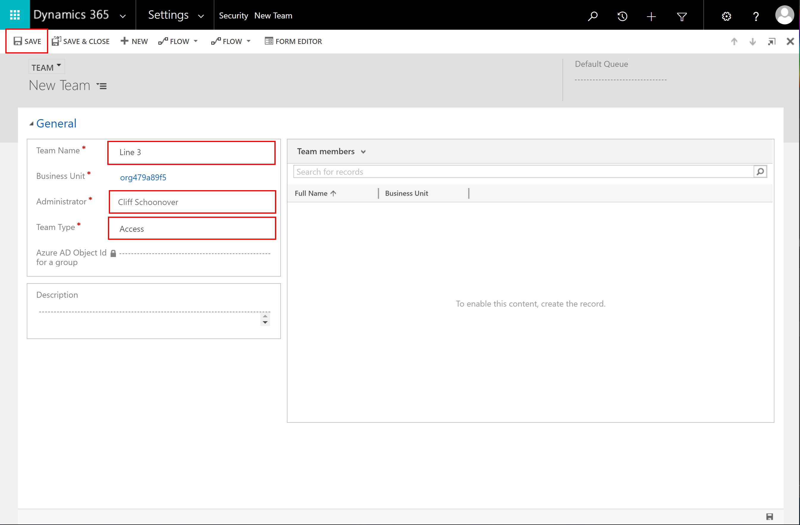

5. To add users to the team, select the plus sign (**+**) next to the **Team members** list.

    

6. Enter the name of the user that you want to add, select the **Search** button, and then select the user's name.

## Step 3: Share the guide with the access team

1. Go to <https://make.powerapps.com/>.

2. Select **Apps**, and then select **Guides**.

    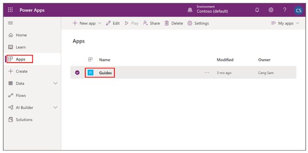

3. Find the guide that you want to share, select the check box next to the guide name, and then select **Share**.

    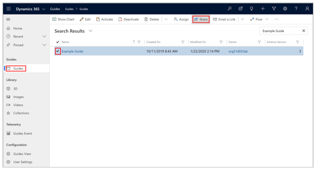

4. On the **Share guide** page, select **Add User/Team**.

    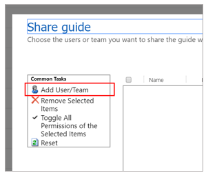

5. In the **Look Up Records** dialog box, follow these steps:

    1. In the **Look for** field, select **Team**.

    2. In the **Look in** field, select **All User Access Teams**.

    3. Select the check box next to the name of the access team that you want to share the guide with.

    4. Select **Select**, and then select **Add**.

    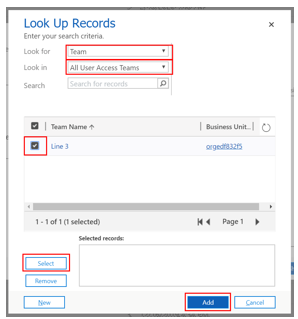

### Share a guide with another user

All users who have access to the Guides model-driven app can share the guides and guide records that they have access to with other users.

1. Go to <https://make.powerapps.com/>.

2. Select **Apps**, and then select **Guides**.

    

3. Find the guide that you want to share, select the check box next to the guide name, and then select **Share**.

    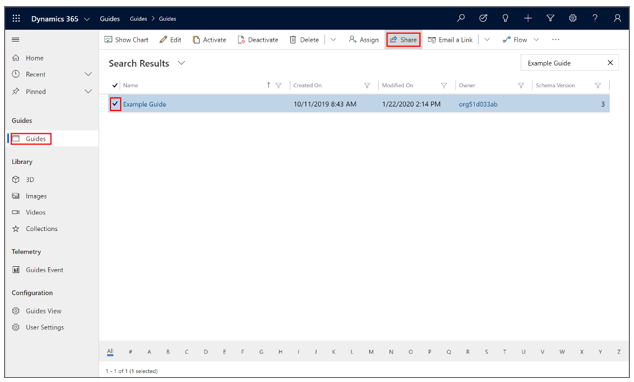

4. On the **Share guide** page, select **Add User/Team**.

    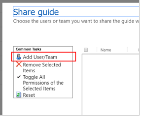

5. In the **Look Up Records** dialog box, select the check box next to a specific user, select **Select**, and then select **Add**.

    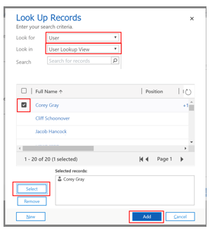

6. Make sure that the user has the **Read** privilege, and then select **Share**.

    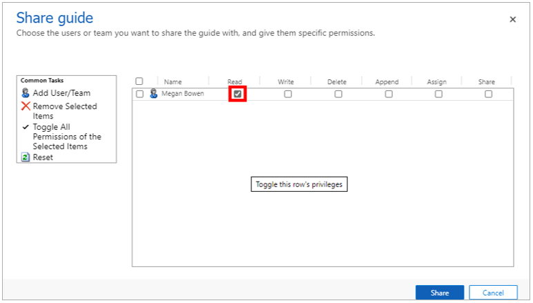

## See also

[Use access teams and owner teams to collaborate and share information](https://docs.microsoft.com/dynamics365/customerengagement/on-premises/developer/use-access-teams-owner-teams-collaborate-share-information) 
[Assign an Operator or Author role to a user](assign-role.md) 
[Restrict access to an instance in Dynamics 365 Guides by using security groups](admin-security.md) 
[Learn more about Dynamics 365 security roles and privileges](https://docs.microsoft.com/dynamics365/customerengagement/on-premises/admin/security-roles-privileges)
