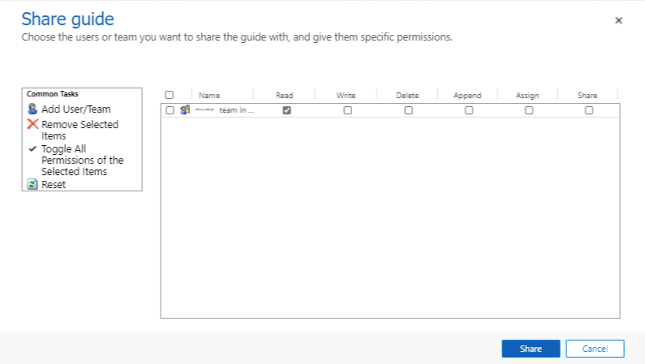

# Share a guide or guide content in Dynamics 365 Guides by using an access team

[!include [rename-banner](~/includes/cc-data-platform-banner.md)]

[Assigning the ownership of a guide](admin-access-assign.md) in Microsoft Dynamics 365 Guides to a user is the preferred method for controlling who can use specific guides. If teams change frequently, resulting in a need to create and delete access teams often, a Dynamics 365 admin (or other user with the Share privilege) can share guides with [access teams](https://docs.microsoft.com/dynamics365/customerengagement/on-premises/developer/use-access-teams-owner-teams-collaborate-share-information) to control who can see specific guides and guide content (3D models, images, or videos).

> [!NOTE]
> Dynamics 365 offers additional ways to customize and configure access to specific records in Microsoft Dataverse. However, this topic doesn't cover advanced configuration, such as the creation of [owner teams](https://docs.microsoft.com/dynamics365/customerengagement/on-premises/developer/use-access-teams-owner-teams-collaborate-share-information).

For more information on how privileges and access works, see [How access to a record (guide) is determined](https://docs.microsoft.com/power-platform/admin/how-record-access-determined).

For more information on the three types of teams (*owner* team, Azure Active Directory *group* team, or *access* team), see [Manage teams](https://docs.microsoft.com/power-platform/admin/manage-teams).

## How access teams work with the Operator and Author user roles

You can assign an Operator or Author role to a user to specify whether that user can create and edit guides as an author or use them as an operator. When you assign an Operator or Author role, that role automatically grants the user access to all guides in the environment. To limit access to specific guides or guide content (3D models, images, or videos), you can use the Restricted Operator and Restricted Author roles. A user who is assigned one of these roles does not have access to any guide created in the environment. The user has access only to:

- Guides that the user creates (unless access is explicitly removed)

- Guides that were explicitly shared with the user or shared with an owner team they are a member of.

- Guides with ownerships that were assigned to the user or assigned to an owner team that the user is a member of.

> [!IMPORTANT]
> If you have already restricted access to guides or guides content by creating your own security role with reduced privileges, you’ll need to remove that security role and replace it with one of the built-in security roles as described in this article.

## Assign a restricted security role

To prevent a specific user from accessing all guides by default, you can update the user's security role to the **Dynamics 365 Guides Restricted Operator** role. Once assigned, they will be able to see only guides assigned or shared with them or teams they are members of.

> [!NOTE]
> The steps outlined in this procedure show how to restrict operator privileges. You can restrict author privileges in a similar way. This article also shows how to restrict access to the **Guides** entity. You can use the same steps to restrict access to other types of Dynamics 365 Guides records (3D models, images, or videos) to limit their visibility to certain users or teams.

1. In the [Power Platform admin center](https://admin.powerplatform.microsoft.com/environments), in the **Environments** page, select the environment, select the **More environment actions** (**...**) button, and then select **Settings**.

    

2. In the **Settings** page, select **Users**.

    

3. Select a specific user by selecting the user's full name.

    

4. Select **Manage Roles** to open the **Manage User Roles** dialog box, and then do the following:

    1. If it's selected, clear the check box for the **Dynamics 365 Guides Operator** role.

    2. Select the check box for the **Basic User** role.

    3. Select the check box for the **Dynamics 365 Guides Restricted Operator** role.

    4. Select **OK**.

    

## Create an access team

A user can be associated with more than one access team.

> [!NOTE]
> If you or someone else has already created an access team that you want to use, skip ahead to the next procedure.

1. In the [Power Platform admin center](https://admin.powerplatform.microsoft.com/environments), in the **Environments** page, select the same Guides solution, select the **More environment actions** (**...**) button, and then select **Settings**.

    

2. In the **Settings** page, select **Teams**.

    

3. Select **New**.

    

4. In the **New Team** page, set the **Team Name** and **Administrator** fields, change the value of the **Team Type** field to **Access**, and then select **Save**.

    

5. To add users to the team, select the plus sign (**+**) next to the **Team members** list.

    

6. Enter the name of the user that you want to add, select the **Search** button, and then select the user's name.

## Share the guide with an access team

1. Go to <https://home.dynamics.com/>.

2. Select **Power Apps**.

3. Under **Your Apps**, select **Guides**.

    

4. Find the guide that you want to share, select the check box next to the guide name, and then select **Share**.

    

5. In the **Share guide** page, select **Add User/Team**.

    

6. In the **Look Up Records** dialog box:

    1. In the **Look for** field, select **Team**.

    2. In the **Look in** field, select **All User Access Teams**.

    3. Select the check box next to the name of the access team that you want to share the guide with.

    4. Select **Select**, and then select **Add**.

    

7. Select specific permissions in the dialog box. Make sure the team has the **Read** permission.

    

## Share a guide with a specific user

Users who have the share privilege can share their accessible guides and guide records with other users.

1. Go to <https://make.powerapps.com/>.

2. Select **Apps**, and then select **Guides**.

    

3. Find the guide that you want to share, select the check box next to the guide name, and then select **Share**.

    

4. In the **Share guide** page, select **Add User/Team**.

    

5. In the **Look Up Records** dialog box, select the check box next to a specific user, select **Select**, and then select **Add**.

    

6. Make sure that the user has the **Read** privilege, and then select **Share**.

    

## See also

[Use access teams and owner teams to collaborate and share information](https://docs.microsoft.com/dynamics365/customerengagement/on-premises/developer/use-access-teams-owner-teams-collaborate-share-information)
[Assign an Operator or Author role to a user](assign-role.md)
[Restrict access to an instance in Dynamics 365 Guides by using security groups](admin-security.md)
[Learn more about Dynamics 365 security roles and privileges](https://docs.microsoft.com/dynamics365/customerengagement/on-premises/admin/security-roles-privileges)
