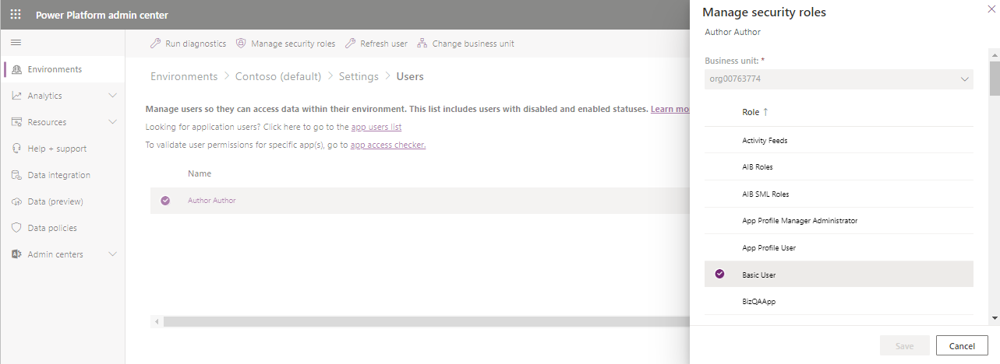
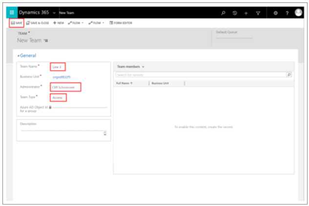
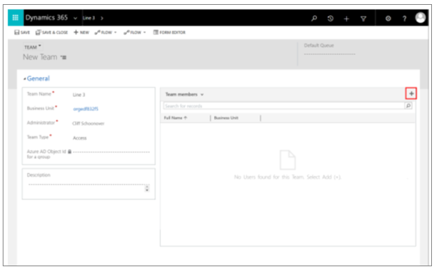
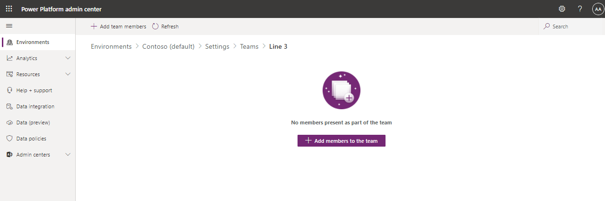
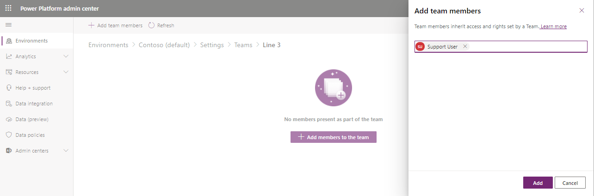

# Create an access team to share a guide in Dynamics 365 Guides

[Assigning ownership of a guide](admin-access-assign.md) to a user or owner team in Microsoft Dynamics 365 Guides is the preferred method for controlling who can use specific guides. If owner teams change frequently, however, resulting in a need to create and delete teams often, a Dynamics 365 admin (or other user with the Share privilege) can create an *access team* and share a guide through that team to control who can see specific guides and guide content (3D models, images, or videos).

For more information on how privileges and access works, see [How access to a record (guide) is determined](https://docs.microsoft.com/power-platform/admin/how-record-access-determined).

For more information on the three types of teams (*owner* team, Azure Active Directory *group* team, or *access* team), see [Manage teams](https://docs.microsoft.com/power-platform/admin/manage-teams).

## How access teams work with the Operator and Author user roles

You can assign an Operator or Author role to a user to specify whether that user can create and edit guides as an author or use them as an operator. When you assign an Operator or Author role, that role automatically grants the user access to all guides in the environment. To limit access to specific guides or guide content (3D models, images, or videos), you can use the Restricted Operator and Restricted Author roles. [Learn more about the different roles](admin-role-types.md).

> [!IMPORTANT]
> If you have already restricted access to guides or guides content by creating your own security role with reduced privileges, you’ll need to remove that security role and replace it with one of the built-in security roles as described in this article.

## Assign a restricted security role

To prevent a specific user from accessing all guides by default, you can update the user's security role to the Restricted Operator role. Once assigned, they will be able to see only guides assigned or shared with them or teams they are members of.

> [!NOTE]
> The steps outlined in this procedure show how to restrict operator privileges. You can restrict author privileges in a similar way. This article also shows how to restrict access to the **Guides** entity. You can use the same steps to restrict access to other types of Dynamics 365 Guides records (3D models, images, or videos) to limit their visibility to certain users or teams.

1. In the [Power Platform admin center](https://admin.powerplatform.microsoft.com/environments), in the **Environments** page, select the environment, select the **More environment actions** (**...**) button, and then select **Settings**.

    

2. In the **Settings** page, select **Users**.

    

3. Select a specific user by selecting the user's full name.

    

4. Select **Manage Roles** to open the **Manage User Roles** dialog box, and then do the following:

    1. If it's selected, clear the check box for the **Dynamics 365 Guides Operator** role.

    2. Select the check box for the **Basic User** role.

    3. Select the check box for the **Dynamics 365 Guides Restricted Operator** role.

    4. Select **OK**.

    

## Create an access team

> [!TIP]
> You can associate a user with more than one access team.

1. In the [Power Platform admin center](https://admin.powerplatform.microsoft.com/environments), in the **Environments** page, select the same Guides solution, select the **More environment actions** (ellipsis **...**) button, and then select **Settings**.

    

2. In the **Settings** page, select **Teams**.

    

3. Select **Create team**.

    

4. In the **New team** pane on the right side of the screen, set the **Team name**, **Business unit**, and **Administrator** fields. Change the value of the **Team type** field to **Access**, and then select **Next**.

    

5. To add users to the team, select the **More information** (ellipsis) button next to the team name, and then select **Manage team members**.

    

6. Select **Add members to the team**.

    

7. On the right side of the screen, under **Add team members**, enter the name(s) of the user(s) that you want to add, and then select **Add**.

    
    
After creating the access team, you can [share a guide with the access team](admin-share-guide). 

## See also

- [Share a guide with an access team or specific user](admin-share-guide.md)
- [Assign an Operator or Author role to an individual user](assign-role.md)
- [Assign roles in bulk by using Active Directory groups](admin-assign-role-groups.md)
- [Restrict access to an environment by using security groups](admin-security.md)

[!INCLUDE[footer-include](../includes/footer-banner.md)]
