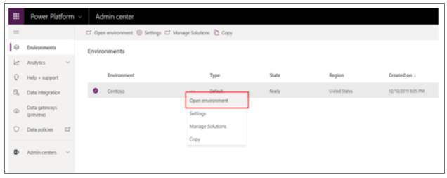
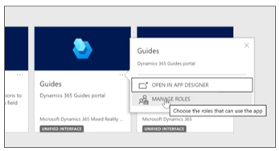
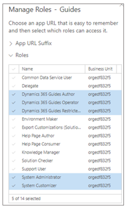
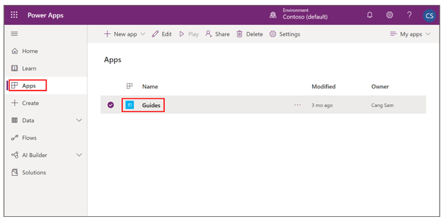

# Use access teams to limit access to specific guides or guides content in Dynamics 365 Guides

A Microsoft Dynamics 365 administrator can use [access teams](https://docs.microsoft.com/dynamics365/customerengagement/on-premises/developer/use-access-teams-owner-teams-collaborate-share-information) 
to easily customize who can see specific guides and guides content (3D models, images, or videos) in Dynamics 365 Guides. Access teams 
are useful when you want to grant different user permissions for specific records in [Common Data Service](https://docs.microsoft.com/powerapps/maker/common-data-service/data-platform-intro). 
For example, you might want to limit access of certain guides to a specific factory location, or limit access to guides that are in progress.

>[!NOTE]
>Dynamics 365 offers additional ways to customize and configure access to specific records in Common Data Service. Advanced 
configuration, such as the creation of [Owner teams](https://docs.microsoft.com/dynamics365/customerengagement/on-premises/developer/use-access-teams-owner-teams-collaborate-share-information), 
is not covered in this topic.

## How access teams work with the Operator and Author user roles

You can assign an Operator or Author role to a user to determine whether that user has the ability to create and edit guides or just use them. When you assign an Operator or Author role, that role automatically grants the user access to all guides in the instance. To limit access to specific guides or guides content (3D models, images, or videos), you must reduce privileges for the Operator or Author role and use access teams.

## Overall process for limiting access to a guide

The process for limiting access includes these basic steps:

1.	Create a new security role with reduced privileges.

2.	Grant access for the new security role to the Guides model-driven app.

3.	Assign the new security role to a user or users.

4.	Create an access team and add users to the team.

5.	Share the guide with the access team.

Each of these steps is covered in detail in this document.

## Step 1: Create a new security role with reduced privileges

To take advantage of access teams, the first step is to create a new Dynamics 365 security role with reduced Guides privileges. A user assigned this new security role will only have access to guides that have been shared with them directly or via an access team.

>[!NOTE]
>This documentation shows how to restrict access to the **Guides** entity. You can use the same steps to restrict access to other types of Dynamics 365 Guides records (3D models, images, or videos) to limit their visibility to certain users or teams.

1.	In the [Power Platform admin center](https://admin.powerplatform.microsoft.com/environments), on the **Environments** page, choose an environment with an installed Guides solution, select the **More environment actions** (...) button, and then select **Settings**.

    
 
2.	In the **Settings** page, under **Users + permissions**, select **Security roles**.

    
 
3.	Select the check box next to the **Dynamics 365 Guides Operator** role, and then at the top of the screen, select **More Actions > Copy Role**. Copying the role ensures that your changes will not be overridden the next time the Guides solution is updated. 

    

4.	Name the new role "Dynamics 365 Guides Restricted Operator", and then select **OK**.

    

5.	In the **Security Role: Dynamics 365 Guides Restricted Operator** window, select the **Custom Entities** tab, and then in the **Guides** entity row, select the dot in the second column to change the read privileges from **Organization** level to **User** level. Select **Save and Close** at the top of the window when you’re done.

    >[!NOTE]
    >The **Key** at the bottom of the window describes the different privilege levels. For more information, see [Security roles and privileges](https://docs.microsoft.com/dynamics365/customerengagement/on-premises/admin/security-roles-privileges). 

    
    
## Step 2: Grant access for the new security role to the Guides model-driven app

The Guides model-driven app provides an interface for users to share a specific guide or guide record with other users or teams. Access to the Guides model-driven app must be granted to any newly created security roles to enable them.

1.	In the [Power Platform admin center](https://admin.powerplatform.microsoft.com/environments), on the **Environments** page, choose the environment with the installed Guides solution, select the **More environment actions** (...) button, and then select **Open environment**.
 
    

2.	In the **Guides** app tile, select the **More Actions** (…) button, and then select **Manage Roles**.

    

3.	In the pane that appears on the right side of the screen, select the check box next to the **Dynamics 365 Guides Restricted Operator role** (keep the selections for the other roles), and then select **Save**.

    
 
## Step 3: Assign the new security role to a user or users

To prevent a specific user from accessing all guides by default, change that user’s security role to the newly created Dynamics 365 Guides Restricted Operator role. Once assigned, they will only be able to see guides that have been shared with them.

>[!NOTE]
>The steps outlined in this procedure show how to restrict operator privileges. You can restrict author privileges in a similar way.

1.	In the [Power Platform admin center](https://admin.powerplatform.microsoft.com/environments), on the **Environments** page, select the same Guides solution, select the **More environment actions** (...) button, and then select **Settings**. 

    

2.	In the **Settings** page, select **Users**.

    
 
3.	Select a specific user by selecting their name.

    

4.	Select **Manage Roles**, and then do the following:

    a. Clear the check box next to the **Dynamics 365 Guides Operator** role.

    b. Select the check box next to the **Dynamics 365 Guides Restricted Operator** role. 

    c. Select **OK**.
    
    

## Step 4: Create an access team and add users to the team

A user can be associated with more than one access team.

>[!NOTE]
>If you or someone else has already created an access team that you want to use, skip to the next procedure.

1.	In the [Power Platform admin center](https://admin.powerplatform.microsoft.com/environments), on the **Environments** page, select the same Guides solution, select the **More environment actions** (...) button, and then select **Settings**.

    

2.	In the **Settings** page, select **Teams**. 
    
    

3.	Select **New**. 

    

4.	In the **New Team** page, add a **Team Name** and **Administrator**, change the **Team Type** to **Access**, and then select **Save**.

    

5.	To add users to this team, click the **+** sign next to the **Team members** list.

    
    
6.	Enter the name of the user you want to add, select the search button, and then select the user’s name. 
        
## Step 5: Share the guide with the access team

1.	Go to [https://make.powerapps.com](make.powerapps.com).

2.	Select **Apps**, and then select **Guides**.

    
 
3.	Find the guide you want to share, select the check box next to the guide name, and then select **Share**. 

    
    
4.	In the **Share guide** page, select **Add User/Team**.

    

5.	In the **Look Up Records** dialog box, do the following:

    a. In the **Look for** list, select **Team**.

    b. In the **Look in** list, select **All User Access Teams**. 

    c. Select the check box next to the team name you want to share with.

    d. Select the **Select** button, and then select **Add**.
    
      
        
### Share a guide with another user

Any user that has access to the Guides model-driven app can share guides and guide records they have access to with other users.

1.	Go to https://make.powerapps.com/.

2.	Select **Apps**, and then select **Guides**.

    
 
3.	Find the guide you want to share, select the check box next to the name, and then select **Share**.

    
 
4.	In the **Share guide** page, select **Add User/Team**. 

    

5.	Select the check box next to a specific user, select the **Select** button, and then select **Add**. 

    

6.	Make sure that the user has the **Read** privilege, and then select **Share**.

    

 ## See also
 
[Use access teams and owner teams to collaborate and share information](https://docs.microsoft.com/dynamics365/customerengagement/on-premises/developer/use-access-teams-owner-teams-collaborate-share-information) 
[Assign an Operator or Author role to a user](assign-role.md) 
[Use security groups to restrict access to an instance](admin-security.md) 
[Learn more about Dynamics 365 security roles and privileges](https://docs.microsoft.com/dynamics365/customerengagement/on-premises/admin/security-roles-privileges) 
