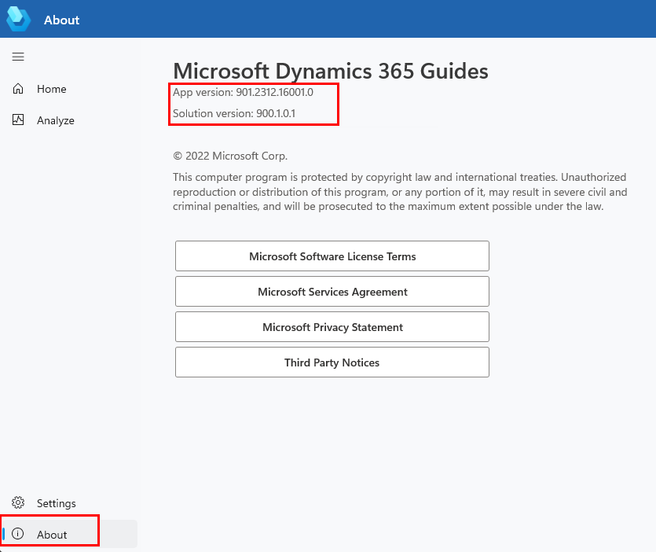

# Compatibility between Dynamics 365 Guides solutions and apps (PC and HoloLens)

We recommend that you always update the Microsoft Dynamics 365 Guides solution at every release, so that you have access to the latest features and updates. However, if you suspect that you have an older solution version, and must verify that it's compatible with the PC and HoloLens apps that you're using, see the table that follows.

To find the app and solution versions that you're using, in the PC app, select the **About** command. You must be signed in to see both version numbers.

## App/solution compatibility

| PC and HoloLens app version | Release date | Compatible Guides Dataverse solution versions |
|-----------------------------|--------------|--------------------------------------------------|
| 504.2102.24001 | February 25, 2021 |  500.4.1.2, 500.3.1.2, 500.2.1.2, 500.1.1.0, 500.0.1.1 |
| 503.2102.2001 | February 3, 2021 |  500.3.1.2, 500.2.1.2, 500.1.1.0, 500.0.1.1 |
| 502.2011.28001 | December 8, 2020 |  500.2.1.2, 500.1.1.0, 500.0.1.1|
| 501.2010.17001 | October 27, 2020 |  500.1.1.0, 500.0.1.1|
| 500.2009.23001 | October 1, 2020 |  500.0.1.1, 400.0.4.31, 400.0.0.18, 400.0.1.48, 400.0.2.66, 400.0.3.36|
| 404.2009.2003 (PC) and 404.2009.2004 (HoloLens) | September 2, 2020 | 400.0.4.31, 400.0.0.18, 400.0.1.48, 400.0.2.66, 400.0.3.36|
| 404.2008.19001 | August 25, 2020 | 400.0.4.31, 400.0.0.18, 400.0.1.48, 400.0.2.66, 400.0.3.36|
| 403.2008.3001 | August 4, 2020 | 400.0.0.18, 400.0.1.48, 400.0.2.66, 400.0.3.36|
| 402.2007.7001| July 7, 2020 | 400.0.0.18, 400.0.1.48, 400.0.2.66|
| 401.2005.21001 | May 26, 2020 | 400.0.0.18, 400.0.1.48|
| 400.2005.13001 |May 14, 2020|400.0.0.18, 300.0.5.127, 300.0.4.139, 300.0.3.137, 300.0.1.115, and 200.0.0.107|
| 400.2004.24002 | April 28, 2020| 400.0.0.18, 300.0.5.127, 300.0.4.139, 300.0.3.137, 300.0.1.115, and 200.0.0.107|
| 305.2003.28001 | April 1, 2020 | 300.0.5.127, 300.0.4.139, 300.0.3.137, 300.0.1.115, and 200.0.0.107|
| 304.2002.25001 | February 25, 2020 | 300.0.4.139, 300.0.3.137, 300.0.1.115, and 200.0.0.107 |
| 303.2001.21001 | January 28, 2020 | 300.0.3.137, 300.0.1.115, and 200.0.0.107 |
| 301.1910.24001 | October 29, 2019 | 300.0.1.115 and 200.0.0.107 |
| 200.1909.24001 | October 1, 2019 | 200.0.0.107 |

## See also

[Upgrade the Dynamics 365 Guides solution](upgrade.md) 
[Download and install the PC and HoloLens apps](setup-step-three.md)
