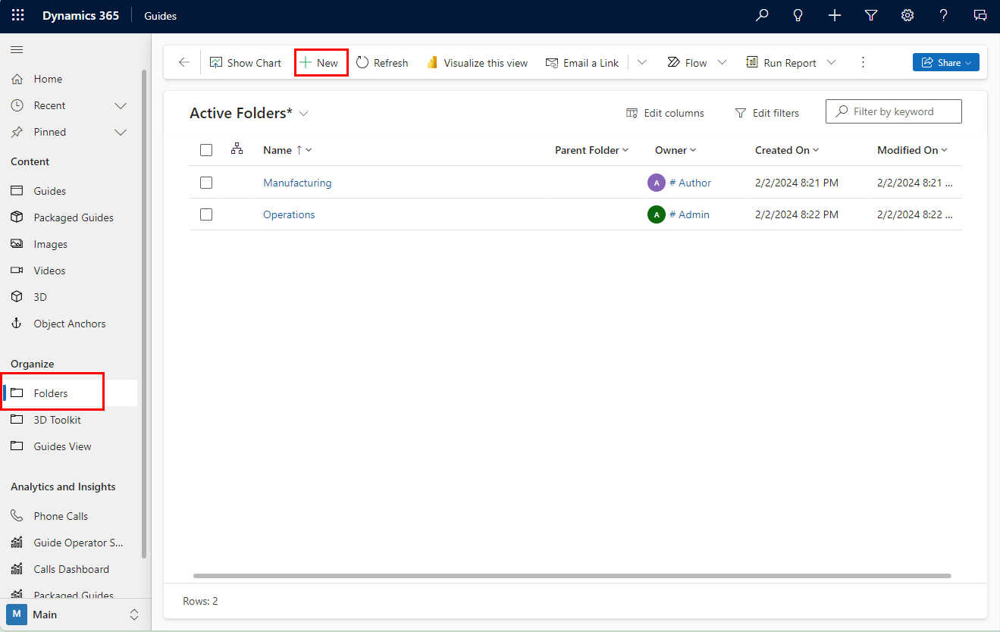
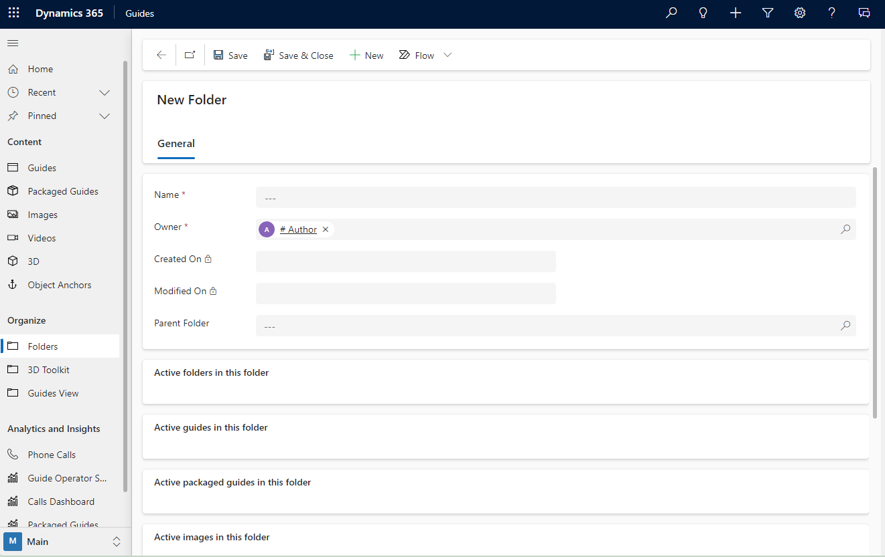
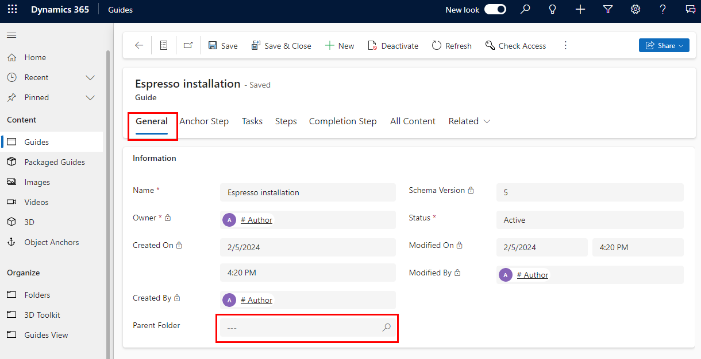
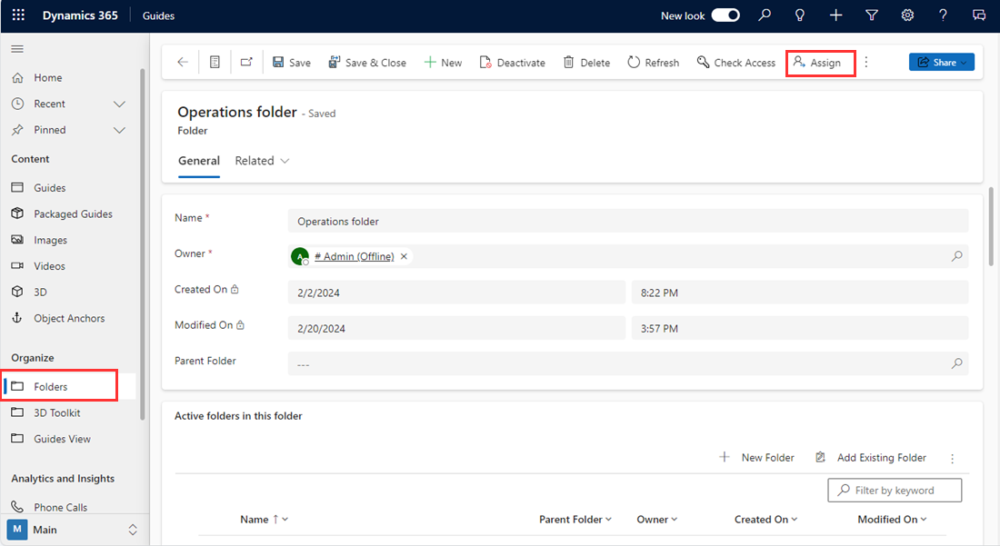
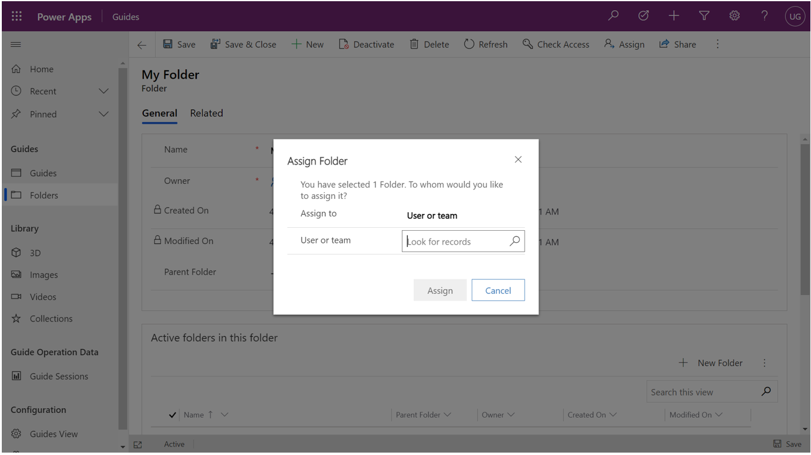

# Organize guides into folders in Dynamics 365 Guides (for admins)

As an admin, you can organize guides into folders for easier permissions management. A folder can contain guides and subfolders, and each folder can be assigned an owner that is inherited by guides or subfolders in that folder. Folders are useful for managing groups of guides with the same permissions, such as guides for a specific team or product. When you delete a folder, all items in that folder are also deleted.

> [!IMPORTANT]
> For the May 4 release, you can create folders and set permissions for those folders if you're an admin. The folders won't appear in the HoloLens and PC apps, however, until a later release.

## Create a folder

1. Sign in to the instance by using your admin credentials.

    > [!TIP]
    > To find the URL for the instance, select the **Analyze** tab in the PC app. The URL is shown in the **Instance URL** field at the bottom of the page. Copy this URL, and paste it into the Address bar of your web browser.
    >
    > 

2. In Power Apps, select the **Guides** app tile.

    
    
3.	In the left pane, select **Folders** to view all folders created in the instance.

    

4.	At the top of the screen, select **New** to create a new folder.

     

5.	Enter the name and owner of the folder. You can select an existing folder in the **Parent Folder** field, or leave the **Parent Folder** field blank to create a folder at the root level.

6.	At the top of the screen, select **Save & Close** to save the folder and return to the folder list. After saving, you can add guides and subfolders to the folder.

## Add a guide to a folder

1.	In the left pane, select **Guides**, and then locate the guide you want to add to the folder.    

2.	On the **General** tab, in the **Parent Folder** field, enter the parent folder name or search for it.

    

3.	At the top of the screen, select **Save** or **Save & Close**.

> [TIP]
> To move a guide back to the root folder, return to the guide details and delete the contents of the **Parent Folder** field.

## Change the owner of a folder

When you change the owner of a folder, any guides or subfolders within that folder will be assigned to that owner. This allows you to easily manage access for a group of related guides.

To change the owner of a folder:

1.	In the left pane, select **Folders** to view the list of folders in the instance.

2.	Go to the desired folder, and then at the top of the screen, select **Assign** to display the folder information.

    

3.	In the **Assign Folder** dialog box, select the box to the right of the **Assign to** label to toggle between **Me** and **User or team**. If **Me** is selected, the folder is assigned to you. If **User or team** is selected, you can enter the owner in the **User or team** field or search for an owner.

    

4.	Select **Assign** to save the new owner. 

## See also

[Export and import folders between environments](admin-export-import-folders.md)
