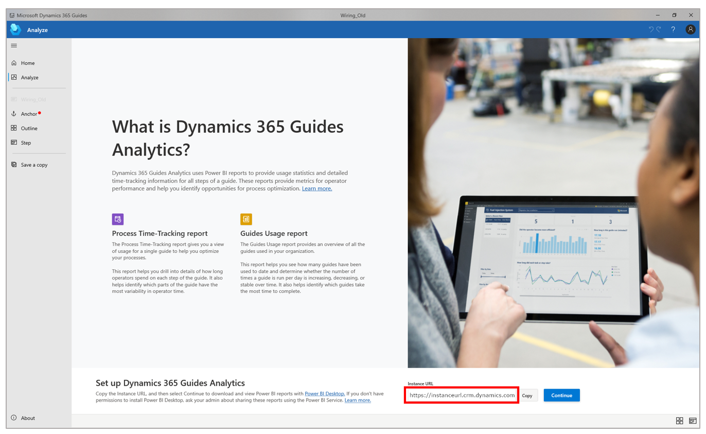
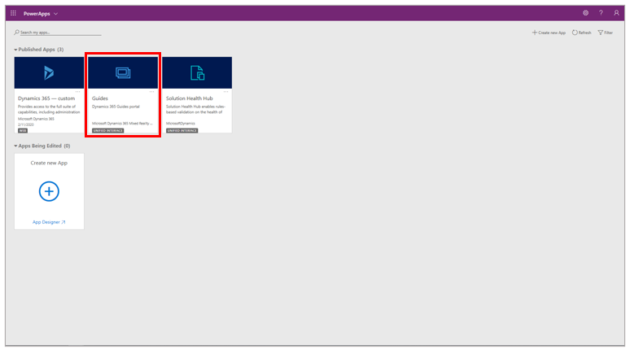
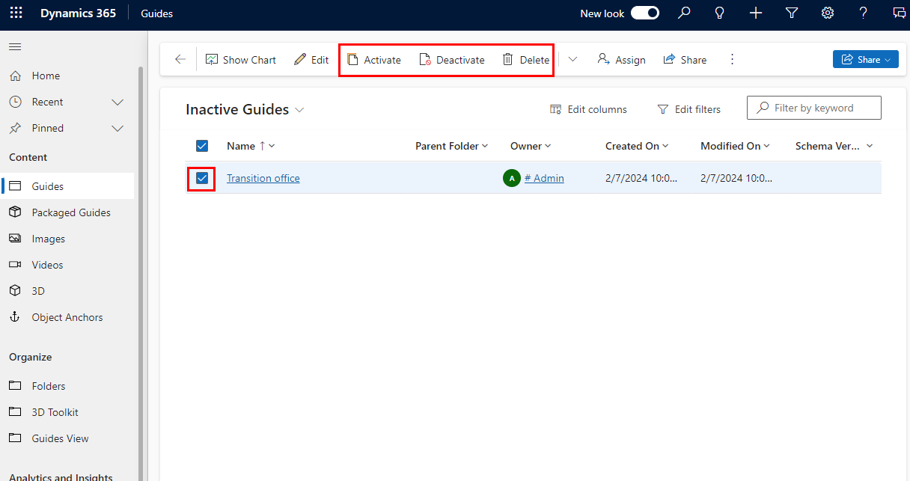
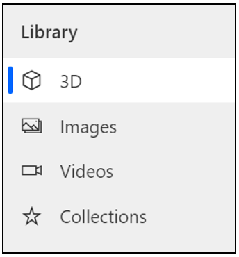
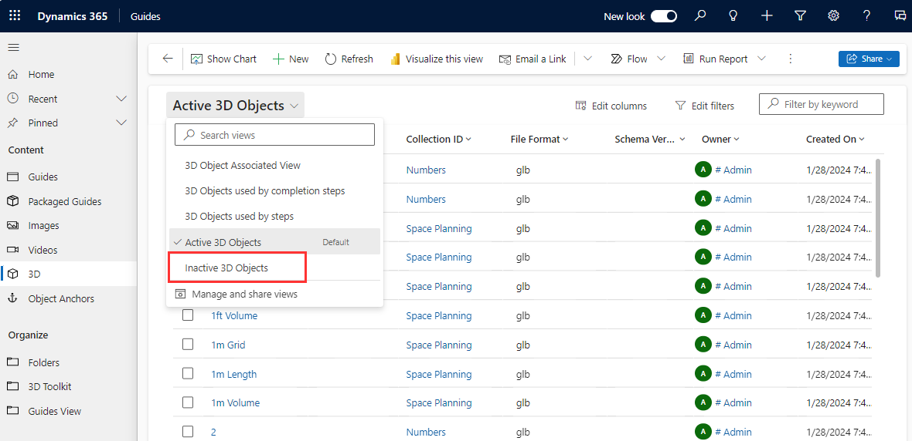
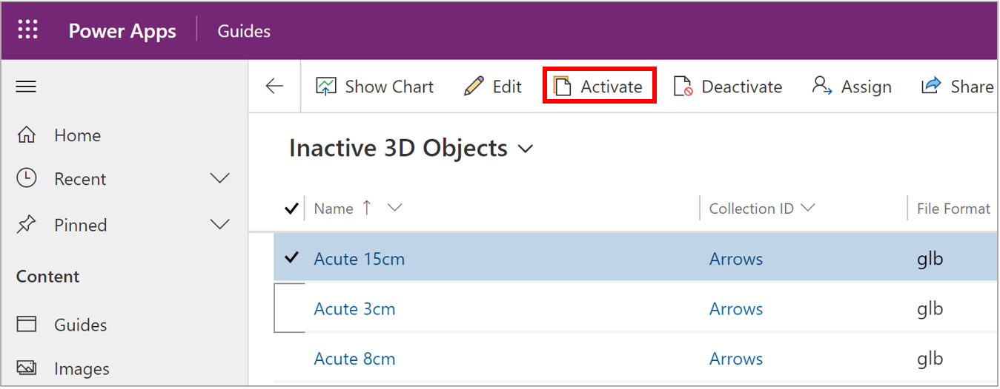

# Activate, deactivate, or delete a guide or guide content (video, image, or 3D part) in Dynamics 365 Guides (for admins)

If [a guide has been deactivated](pc-app-deactivate-guide.md) in [!include[cc-microsoft](../includes/cc-microsoft.md)] [!include[pn-dyn-365-guides](../includes/pn-dyn-365-guides.md)], you can reactivate it if you're an admin. When you reactivate a guide, it immediately becomes available for authors to open or edit in the PC app.

You can also deactivate a guide or permanently delete it if you're sure that you no longer need it.

As an admin, you can also activate, deactivate, or delete specific guide content (video, image, or 3D part).

## Activate, deactivate, or delete a guide

1. Sign in to the instance by using your admin credentials.

    > [!TIP]
    > To find the URL for the instance, select the **Analyze** tab in the PC app. The URL is shown in the **Instance URL** field at the bottom of the page. Copy this URL, and paste it into the Address bar of your web browser.
    >
    > 

2. In Power Apps, select the **Guides** app tile.

    

3. In the drop-down list above the grid, select **Inactive Guides** to view all the guides that are currently inactive.

    

4. Select the check box next to the appropriate guide, and then select **Activate**, **Deactivate**, or **Delete** at the top of the page.

    > [!WARNING]
    > You can't recover a guide if you permanently delete it.

    

    > [!TIP]
    > If there are many guides, you can use the search box in the upper-right corner of the page, or the letter filters at the bottom of the page, to find the correct guide.
    
## Activate, deactivate, or delete specific guide content (video, image, or 3D part) 

1. Sign in to the instance by using your admin credentials.

2. In Power Apps, select the **Guides** app tile.

    
    
3. From the **Library** menu on the left side of the screen, select **3D**, **Images**, or **Videos**.

    

4. In the drop-down list above the grid, select **Inactive 3D Objects** to view all the objects that are currently inactive. 

    

5. Select the check box next to the appropriate object, and then select **Activate**, **Deactivate**, or **Delete** at the top of the page. 

## Reactivate specific guide content

1. Sign into your Guides portal, open the **Library** menu on the left side of the screen, and then select **3D**, **Images**, or **Videos**.

    
    
2. Locate and select the deactivated content. 

3. Select **Activate** at the top of the screen.

        

## See also

[Deactivate a guide or guide content (video, image, or 3D part) if you're an author](pc-app-deactivate-guide.md)
