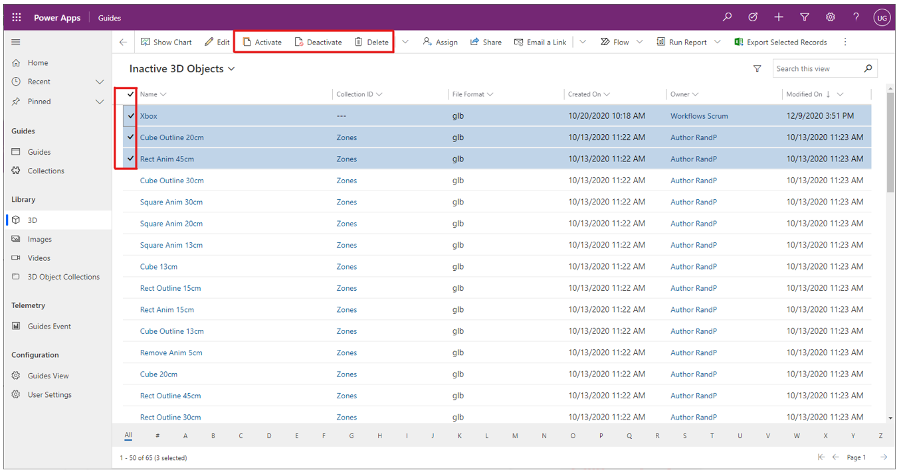

# Activate, deactivate, or delete a guide or guide content (video, image, or 3D part) in Dynamics 365 Guides (for admins)

If [a guide has been deactivated](pc-app-deactivate-guide.md) in Guides, you can reactivate it. When you reactivate a guide, it immediately becomes available for authors to open or edit in the PC app. You can deactivate a guide or permanently delete it if you're sure that you no longer need it.

You can also activate, deactivate, or delete specific guide content (video, image, or 3D part).

  > [!TIP]
  > If you're an author and want to deactivate a guide, see [deactivate a guide or guide content (video, image, or 3D part)](pc-app-deactivate-guide.md).

## Activate, deactivate, or delete a guide

1. [Open the model-driven app](open-model-driven-app.md) in Guides.

1. In the drop-down list above the grid, select **Inactive Guides** to view all the guides that are currently inactive.

    

    > [!TIP]
    > If there are many guides, use the search box in the upper-right corner of the page, or the letter filters at the bottom of the page, to find the correct guide.

1. Select the check box next to the appropriate guide, and then select **Activate**, **Deactivate**, or **Delete** at the top of the page.

    > [!WARNING]
    > You can't recover a guide if you permanently delete it.

    

## Activate, deactivate, or delete specific guide content (video, image, or 3D part)

1. [Open the model-driven app](open-model-driven-app.md) in Guides.

1. Under **Content**, on the left side of the screen, select **Images**, **Videos**, or **3D**.

1. In the drop-down list above the grid, select **Inactive 3D Objects**, **Inactive Images**, or **Inactive Videos**, depending on the item you choose in step 2. For example, if you choose **3D** under **Content**, select **Inactive 3D Objects** to view all the objects that are currently inactive.

    

1. Select the check box next to the appropriate object, and then select **Activate**, **Deactivate**, or **Delete** at the top of the page.

    

## Reactivate specific guide content

1. [Open the model-driven app](open-model-driven-app.md) in Guides.

1. Under **Content**, on the left side of the screen, select **Images**, **Videos**, or **3D**.

1. Locate and select the deactivated content.

1. Select **Activate** at the top of the screen.

[!INCLUDE[footer-include](../includes/footer-banner.md)]
