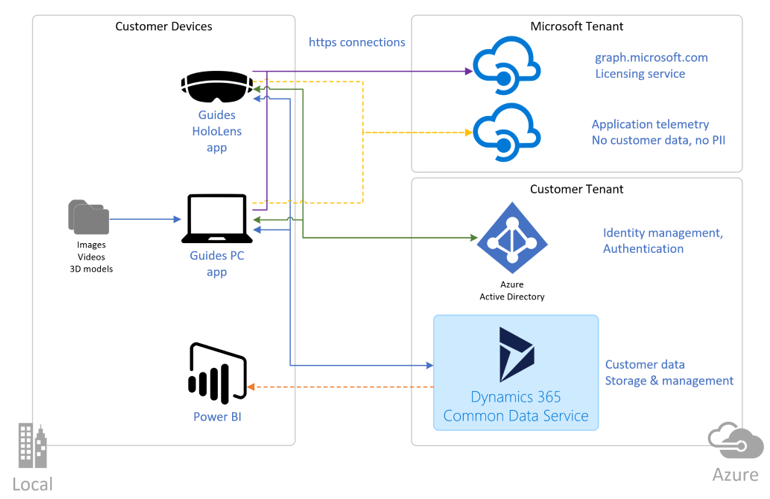
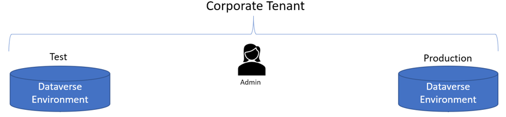
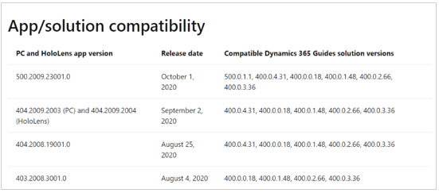
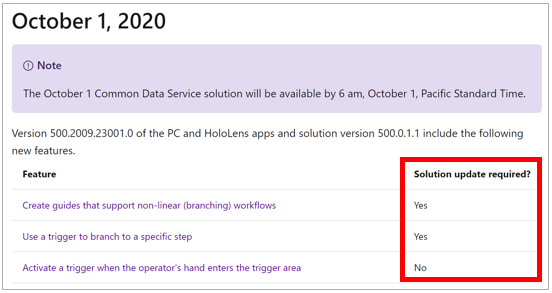
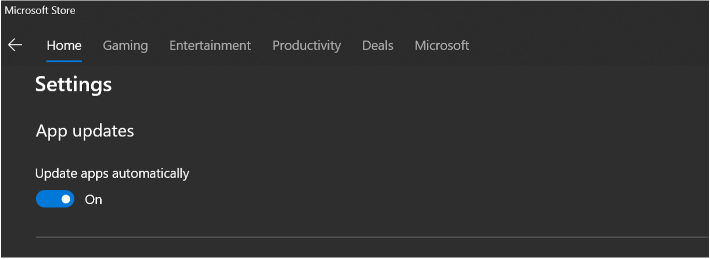
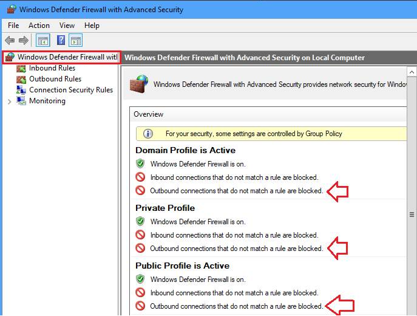
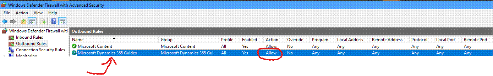

# Deployment playbook for Dynamics 365 Guides

This topic covers basic concepts that you must know about when you're deploying Microsoft Dynamics 365 Guides.

## Architecture

Dynamics 365 Guides is built on the [Microsoft Dataverse infrastructure](/powerapps/maker/common-data-service/data-platform-intro), 
which provides end-to-end control over your deployment, from the server side to the client side. A clear understanding of the Dynamics 365 Guides architecture will help you plan your deployment and manage updates.

The following illustration shows the overall architecture.

Dynamics 365 Guides includes two client-side applications: the PC app (a Universal Windows Platform \[UWP\] app) and the HoloLens app. Server-side data is stored in Dataverse in your customer tenant.

- A **tenant** is a representation of an organization. It's a dedicated Azure Active Directory (Azure AD) environment that an organization or app developer receives when the organization or app developer creates a relationship with Microsoft (for example, by signing up for Azure, Intune, or Microsoft 365).

- A **Dataverse environment** is a segmented database that securely stores and manages data that is used by business applications such as Dynamics 365 Guides. Data in Dataverse is stored in a set of tables, similarly to how a table stores data in a database. Dynamics 365 Guides uses a [custom set of Dataverse tables to store data](./developer-entity-reference.md).

    > [!NOTE]
    > You will often see the terms "environment," "instance," and "organization" used interchangeably to refer to a Dataverse environment. They all mean the same thing.

- The **Dataverse solution** refers to the database tables that are installed in your Dataverse environment, where your Dynamics 365 Guides data is stored. When the Dynamics 365 Guides team updates the PC and HoloLens apps, it also updates the solution. It's important that you [make sure that the PC and HoloLens apps that you're using are compatible with the solution](admin-apps-solution-compatibility.md).

## Test vs. production environments

A basic Dynamics 365 Guides deployment should consist of at least two Dataverse environments in your tenant: a test environment and a production environment.

You can use the test environment to validate any major updates before you push them to your production environment, where Dynamics 365 Guides is being used by your users.

> [!NOTE]
> In this case, the term "production environment" refers generally to the environment that your users access to do their daily work. It isn't the same as the Dataverse "production environment" that you select when you [install the Dynamics 365 Guides Dataverse solution](setup-step-two.md).

Your Dynamics 365 Guides license lets you access as many Dataverse environments in your tenant as you require.

## Storage capacity

You must have at least 1 gigabyte (GB) of database capacity to install the Dynamics 365 Guides Dataverse solution. [Learn how to check available capacity](/power-platform/admin/capacity-storage#verifying-your-new-storage-model). As you add more content to your guides, you will have to monitor your database capacity.

## Updating the Dynamics 365 Guides apps and the Dataverse solution

The Dynamics 365 Guides team updates the product monthly. By ensuring that you have a good workflow for getting the updates, you will help prevent downtime as you continue to get the most advanced and stable releases.

Three components are included in every update:

- PC authoring app

- HoloLens app

- Dynamics 365 Guides Dataverse solution

    > [!IMPORTANT]
    > You should always update the PC and HoloLens apps first, and then update the Dataverse solution. If you update the Dataverse solution before the apps, older apps won't work with the newer solution version and will cause downtime.

When you update the solution, schedule downtime with your team, and make sure that they aren't using the apps. An update can take over one hour if you have a large amount of content in your solution.

### Compatibility between solution and apps

Every release of Dynamics 365 Guides includes an update to the solution. The PC and HoloLens apps will always be backward compatible with their "major" version numbers. For example, version 4.0 of the PC app will always work with version 4.0 of the solution. If you're ever in doubt, [check the app/solution compatibility table](admin-apps-solution-compatibility.md).

### Major and minor updates – When you must update the solution

The Dynamics 365 Guides team updates the version numbers of the apps and solution twice per year for major updates: on April 1 and October 1. These major updates are mandatory if you want to use the latest versions of the apps and take advantage of new features and enhancements. You're notified about these updates through admin communications.

Minor updates are listed in [What's new](./new.md), through in-app notifications, and through the [Dynamics 365 Guides forum](https://community.dynamics.com/365/guides). Some features in minor updates might require an update to the solution. Although the PC and HoloLens apps will continue to work if you don't update the solution, you won't be able to use the new features. Features that require a solution update are listed in [What's new](./new.md).

To [update the solution](./upgrade.md), a Dataverse **System Admin** security role and a valid Dynamics 365 Guides or Power Apps license must be assigned to you.

### PC and HoloLens app updates

The PC and HoloLens apps are managed through Microsoft Store, which is pre-installed on HoloLens and most PCs. As a best practice, keep the **Update apps automatically** option turned on to ensure that you're using the latest and most stable versions of the apps.

If Microsoft Store isn't available to you, you can request that your IT department add Dynamics 365 Guides to Microsoft Store for Business. If this approach isn't feasible, contact your Dynamics 365 Guides team or sales representative, and request engineering support to facilitate direct installation of the applications.

### Update management through mobile device management

As you plan your deployment with your IT department, you should also consider mobile device management (MDM) solutions such as [InTune to manage app updates](/mem/intune/fundamentals/windows-holographic-for-business#deploy-and-manage-apps).

## Security and privacy

Dynamics 365 Guides is part of the Dynamics 365 application ecosystem, which is covered by the Microsoft cloud security framework. See [the Data Protection Resources site](https://servicetrust.microsoft.com/ViewPage/TrustDocumentsV3?command=Download&downloadType=Document&downloadId=a67eb07f-a1cb-4c54-afd6-f93c1fd67ef1&tab=7f51cb60-3d6c-11e9-b2af-7bb9f5d2d913&docTab=7f51cb60-3d6c-11e9-b2af-7bb9f5d2d913_FAQ_and_White_Papers), which covers compliance, privacy, security, and transparency topics. This site provides in-depth details about the overall security and compliance posture, given the move for Dynamics 365 to become first-class software as a service (SaaS) that is built on top of the Azure platform.

The [Microsoft Security Development Lifecycle (SDL)](https://www.microsoft.com/securityengineering/sdl/) consists of a set of practices that support security assurance and compliance requirements. The SDL helps developers build more secure software by reducing the number and severity of vulnerabilities in software as they also reduce development cost.

### Network access

Dynamics 365 Guides is a cloud-based application and might require that your network admin add, to an approve list, the IP addresses and/or endpoints that are required to connect to the Dynamics 365 servers. [Learn more about unblocking IP addresses and URLs](/power-platform/admin/online-requirements#ip-addresses-and-urls).

### VPN or proxy configuration

When connecting through a proxy or VPN, you must configure the proxy or VPN to allow connections with certain endpoints so that Dynamics 365 Guides functions normally. Some endpoints are required generally for Dynamics 365 apps. [Review the list of endpoints required for Dynamics 365 apps](https://docs.microsoft.com/en-us/power-platform/admin/online-requirements#internet-accessible-urls-required). 

Other endpoints are specific to Dynamics 365 Guides. The list of additional endpoints required by Dynamics 365 Guides includes:

- login.microsoft.com 
- graph.microsoft.com 
- globaldisco.crm.dynamics.com 

### Firewall configuration

For Windows Defender Firewall, sometimes it's not enough to have the app listed in the "Allowed app" sections. If Windows Firewall is configured to block outbound calls, you must have a rule that allows the Dynamics 365 Guides app in the **Outbound Rules** section. Note that installing the Dynamics 365 Guides app will add this rule. If you don't see the app in the **Outbound Rules** section, uninstalling and re-installing it might fix the issue. If you don't have permissions to do this (install the app or add the firewall rule), work with your IT department.

#### Determine if outbound connections are blocked

- Open Windows Firewall, and then in the left panel, select **Advanced settings**.

    

#### Determine if the outbound rule allowing Dynamics 365 Guides to make external calls exists

- In the left paenl, select **Outbound Rules**, sort the rules by name, and then look for a Microsoft Dynamics 365 Guides entry. Make sure the action is set to **allow**. If it's not, reinstall the app.

    

## Access management and user roles

There are three levels of access management:

- Access to the Dataverse environment

- Access/permissions to content in the Dataverse environment

- Functional user roles that limit read/write/update activities to designated authors and operators

### Control access to the Dataverse environment

You can use [security groups](./admin-security.md) to control which users can access specific Dataverse environments. Security groups provide the highest level of access control and are intended for organizations that have multiple business units (for example, product divisions) that don't collaborate with each other or share content. You can also [use bulk processes to assign security groups](/power-platform/admin/manage-teams#using-azure-active-directory-groups-to-manage-a-users-app-and-data-access).

### Control access to specific guides or content

You can use [access teams](/dynamics365/customerengagement/on-premises/developer/use-access-teams-owner-teams-collaborate-share-information) to control who can see specific guides and guide content (3D models, images, or videos). Access teams are useful when you want to grant different user permissions for specific records in Dataverse. For example, you might want access to some guides to be limited to a specific factory location, or you might want to limit access to guides that are in progress.

The following table describes the different roles and when you should use each.

| Role | Permissions | When to use it |
|---|---|---|
| Admin | <ul><li>Users can install and update Dataverse solutions.</li><li>Users can create new Dataverse environments.</li><li>Users can assign security roles.</li><li>Users have access to all teams and environments.</li></ul> | This role is required for administration of the Dynamics 365 Guides Dataverse solution.
**Note:** A best practice is to have at least two admins, to ensure coverage.
 |
| Author | <ul><li>This role grants read/write access.</li><li>Users can access all guides in an environment.</li></ul> | This role is intended for top-level Dynamics 365 Guides authors. |
| Operator | <ul><li>This role grants read-only access.</li><li>Users can access all guides in an environment.</li></ul> | This role is intended for users who don't have to create or edit a guide. |
| Restricted Author | <ul><li>This role grants read/write access.</li><li>Users can access only guides that they create, that are shared directly with them, or that are shared through an access team.</li></ul> | This role is intended for cases where an author requires access only to specific guides in the environment. |
| Restricted Operator | <ul><li>This role grants read-only access.</li><li>Users can access only guides that are shared directly with them or shared through an access team.</li></ul> | This role is intended for cases where an operator requires access only to specific guides in the environment. |

The example in the following illustration shows how Dataverse environments, access teams, and user roles can be used to manage access to environments and guides.

> [!TIP]
> You can use Azure AD security groups to [assign Dynamics 365 Guides security roles to batches of users](https://powerusers.microsoft.com/t5/Common-Data-Service-for-Apps/How-to-assign-security-roles-to-Microsoft-365-Groups-Security/m-p/648584). This capability is useful when you're deploying Dynamics 365 Guides to many operators. It lets you use a bulk operation instead of having to assign roles individually.

[!INCLUDE[footer-include](../includes/footer-banner.md)]
