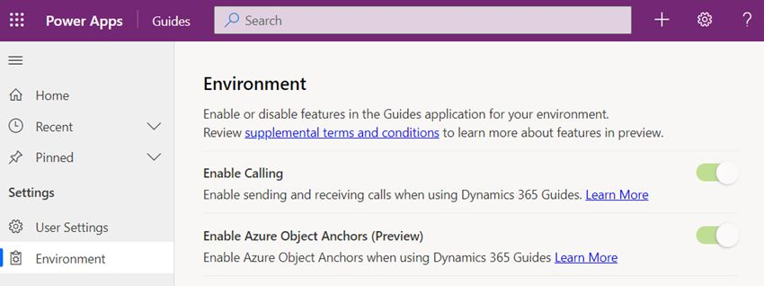

# Enable or disable calling in a Dynamics 365 Guides environment

Calling in Microsoft Dynamics 365 Guides is enabled by default. When calling is enabled, a Dynamics 365 Guides HoloLens user can call a remote collaborator. The remote collaborator can join the call using Microsoft Teams desktop (PC or Mac) or the Teams mobile app. During the call, the remote collaborator can see everything seen by the Dynamics 365 Guides user, including holograms and the real world behind the holograms.

If you're an admin for Dynamics 365 Guides, you can enable or disable calling for a user in a specific Dynamics 365 Guides environment. Enabling or disabling calling for a specific environment is useful:

- When operators or authors do not need to work with remote collaborators. 

- You don't want HoloLens users to be able to inadvertently reveal proprietary through a call. 

[Learn about licensing requirements and limitations when making calls in Dynamics 365 Guides](requirements.md)

## Enable or disable calling

1. Sign in to the instance by using your admin or author credentials.

    > [!TIP]
    > To find the URL for the instance, select the **Analyze** tab in the PC app. The URL is shown in the **Instance URL** field at the bottom of the page. Copy this URL, and paste it into the address bar of your web browser.
    >
    > 

2. In Power Apps, select the **Guides** app tile.

    

3. In the left pane, use the area picker at the bottom of the screen to switch the area selection from **Main** to **Settings** to view all settings for the instance.

    

4. In the left pane, select **Environment**, and then move the **Enable Calling** slider as needed to enable or disable calling for the environment.

    

    If a user tries to start a call while working in an environment where calling is disabled, the user will see the following error message:

    "**Your admin may have disabled calling or you may not have a Microsoft Teams or Remote Assist license.**"
    
    > [!NOTE]
    > Enabling or disabling calling is not immediate. A change can take time to propagate. [Learn how to revoke user access in an emergency in Azure Active Directory](/azure/active-directory/enterprise-users/users-revoke-access).

## See also

- [Make a call in Dynamics 365 Guides](make-call.md)
- [Licensing and product requirements for making calls in Dynamics 365 Guides](requirements.md)

[!INCLUDE[footer-include](../includes/footer-banner.md)]
