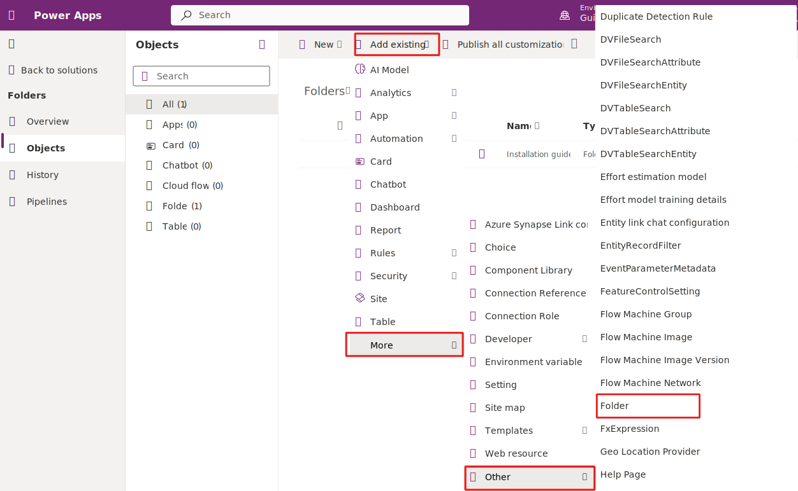

# Export and import Dynamics 365 Guides folders between environments

You can export the folders you created in Microsoft Dynamics 365 Guides and import them into another environment to recreate your file structure. The guides, 3D content, and media associated with these folders aren't included in this process. However, you can use the [Content Migration Tool](migrate.md) to migrate this content after you import your folders.  

> [!NOTE]
> If you export and import your folders first, and then migrate the content, the relationships between the folders and the content will be reconstructed.

## Prerequisites

- You must be a system administrator to access Microsoft Power Apps.  

- You must have Dynamics 365 Guides solution version 600.1.0.0 or later.  

We highly recommend [backing up the contents](/power-platform/admin/backup-restore-environments#create-a-manual-backup) of both environments before starting the export/import process.

## Export the folders

1. Sign in to [make.powerapps.com](https://make.preview.powerapps.com/), and then select the environment that contains the folders you want to export.

1. In the left navigation pane, select **Solutions**.

1. [Create a new solution](/power-apps/maker/data-platform/create-solution) with **Default Publisher for {orgid}** for the Publisher.

   

1. Select the new solution, and select **Edit**.  

1. Select **Add existing** > **More** > **Other** > **Folder**.  

   

1. Select the folders you want to include in your export, and then select **Add**.  

   > [!NOTE]
   > If you select a folder that includes subfolders, select the parent folder and the child folder individually. However, if you select a subfolder, the parent folder is automatically added to the list that will be exported. Deactivated folders will appear on the list to be exported.

1. [Export solution](/power-apps/maker/data-platform/export-solutions#export-from-power-apps), without publishing your changes.

Once the export is ready, it downloads automatically as a .zip file.

### Import the folders

1. Sign in to [make.powerapps.com](https://make.preview.powerapps.com/) and **ensure you are in the environment where you want to import the folders**. Look at the top right corner of the screen under **Environment**.  

1. [Import the solution](/power-apps/maker/data-platform/import-update-export-solutions) selecting the .zip file you downloaded.

    When the import is complete, a notification appears stating that the solution is successfully imported.

## See also

[Create folders](admin-create-folders.md)

[!INCLUDE[footer-include](../includes/footer-banner.md)]
