# Export and import Dynamics 365 Guides folders between environments

You can export folders you have created in Microsoft Dynamics 365 Guides and import them into another environment to recreate your folder structure. The guides, 3D 
content, and media associated with these folders will not be included in this process. However, you can use the [Content Migration tool](migrate.md) to migrate this content after 
you’ve imported your folders.  

> [!NOTE]
> If you export and import your folders first, and then transfer the content, the relationships between the folders and the content will be reconstructed.

## Prerequisites 

- You must be a system administrator to access the Power Platform admin center.  

- You must have Dynamics 365 Guides solution version 600.1.0.0 or later.  

We also highly recommend [backing up the contents](https://docs.microsoft.com/power-platform/admin/backup-restore-environments#create-a-manual-backup) of both environments before starting the export/import process. 

## Export the folders

1. Go to [make.powerapps.com](https://make.preview.powerapps.com/), and then sign into the environment that contains the folders you want to export. Make sure to check in the upper-right corner that the environment of your choice is selected. 

    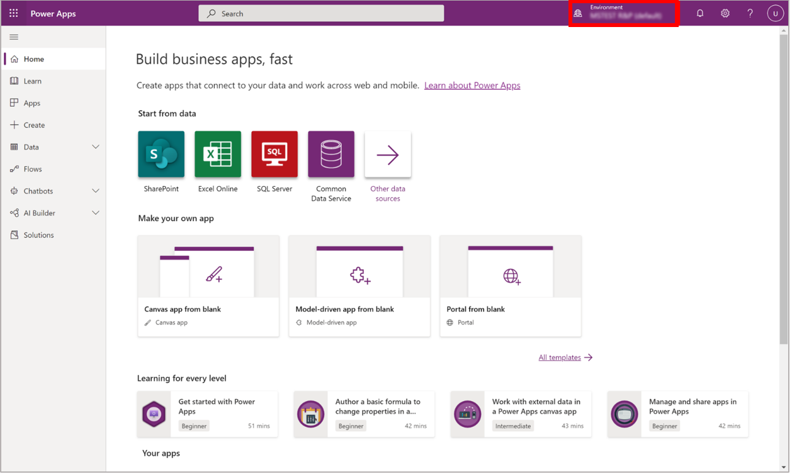

2. In the left navigation pane, select **Solutions**. 

    

3. An the top of the Power Apps page, select **Switch to classic**.

    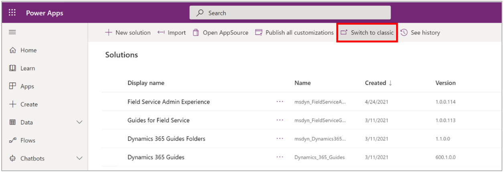

4. Create a new solution by doing the following:  

    1. At the top of the screen, select **New**.  

       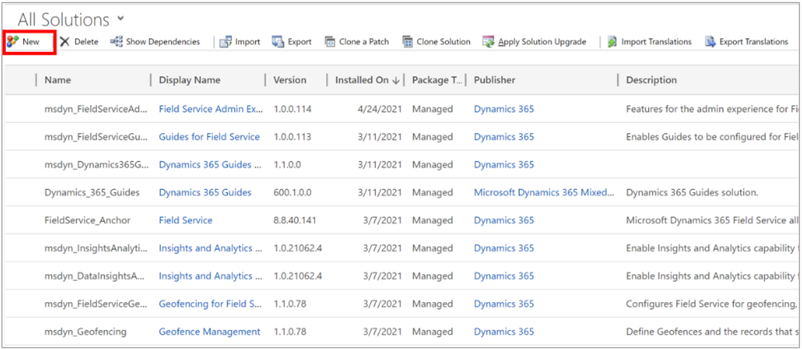

    2. Enter a display name. This will be the name of your solution.  

    3. In the **Publisher** field, select **Default Publisher for {orgid}** from the drop-down menu.  

    4. In the **Version** field, enter **1** or **1.0.0.0**.

    4. Select **Save**.  

       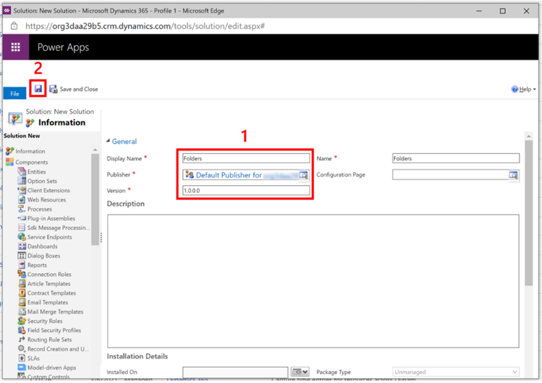

4. To add the folders as components of your solution:  

    1. Select **Add Existing** > **Folder**.  

       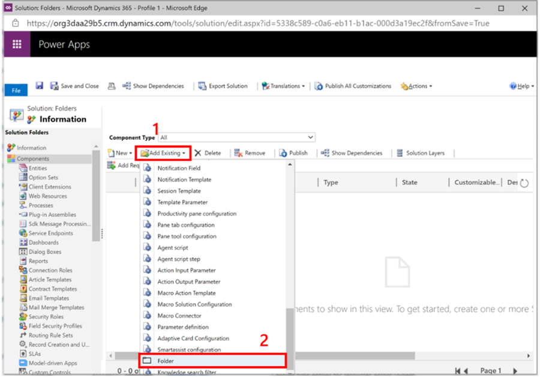

    2. Select the folders you want to include in your export, and then select **OK**.

       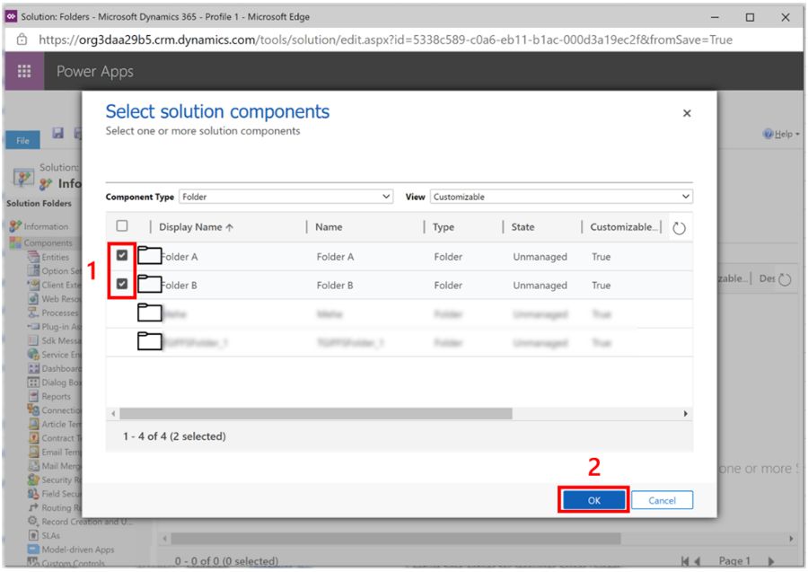

       > [!NOTE]
       > If you select a folder that includes subfolders, you'll need to select the parent folder and the child folder individually. However, if you select a subfolder, the parent folder will automatically be added to the list that will be exported. 

5. To export your solution:  

    1. Select **Save**.

    2. Select **Export Solution**.  

       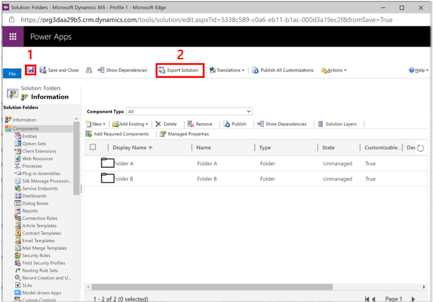
       
    3. Select **Next**.

       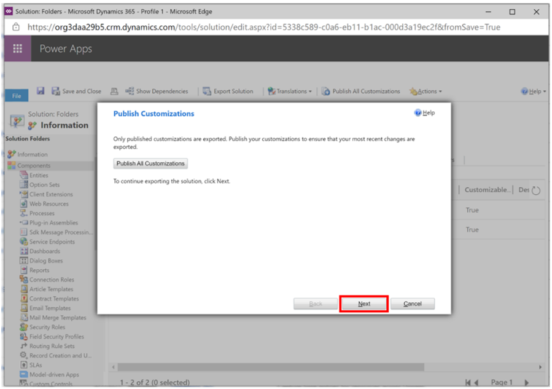
       
    4. Select **Next**.

       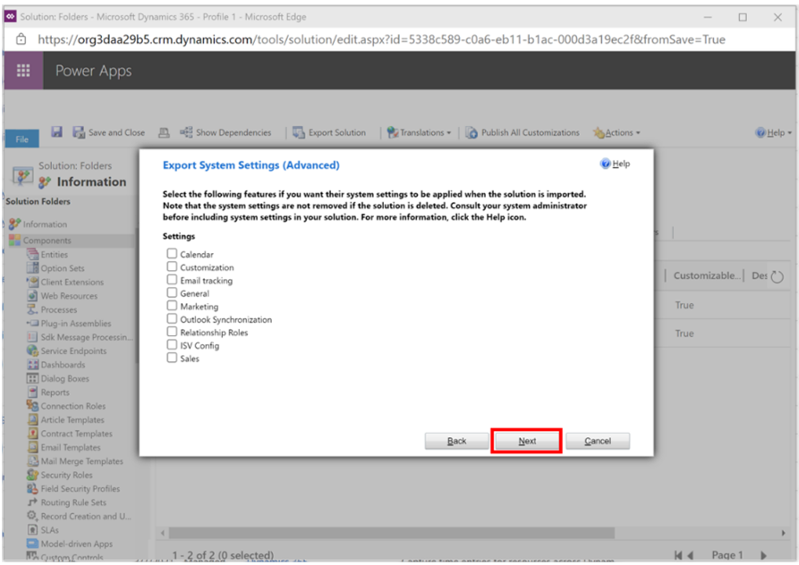
       
    5. Select between a managed and an unmanaged solution, and then select **Export**.

       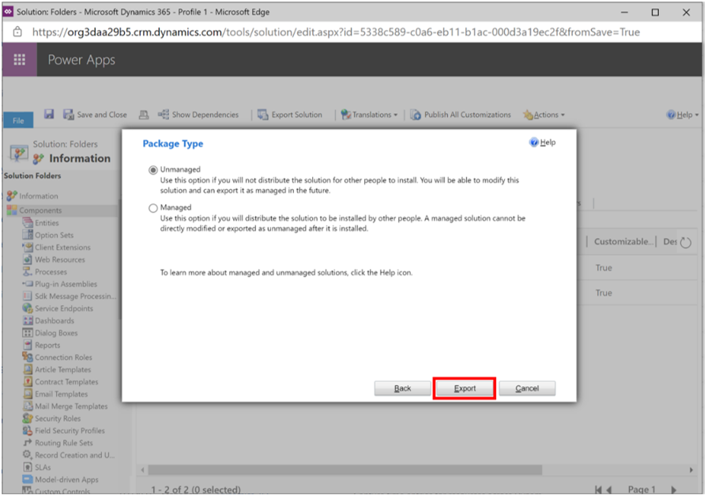
       
       > [!NOTE]
       > Select a managed solution if you want the rows to be permanently tied to the solution. This means that if you delete the solution, the rows that were imported as part of the managed solution will be deleted as well (including any guides saved under the folders, since deletion of a folder is cascading). This will also prevent you from re-exporting the rows. On the other hand, if an unmanaged solution is deleted from the environment, the rows will persist. 

7. Once the export is ready, it should automatically download as a .zip file. This might take a while. 

    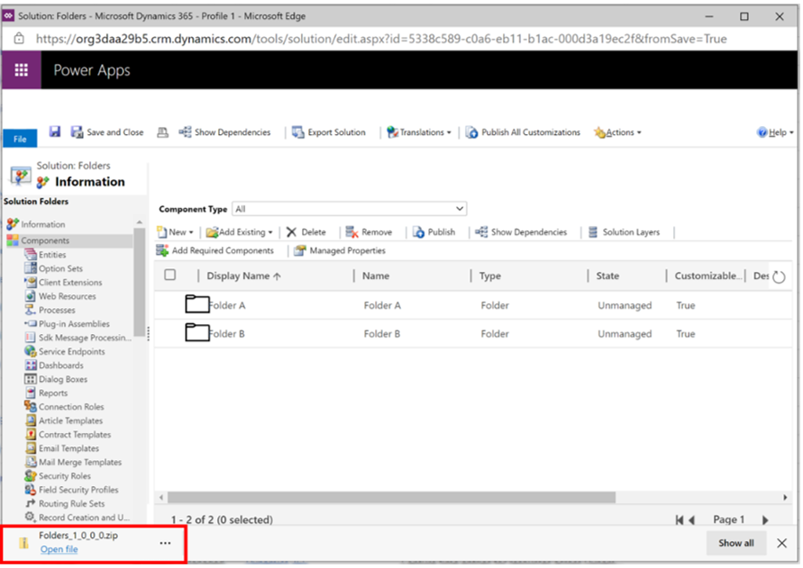
      
    > [!NOTE]
    > Deactivated folders will appear in the list to be exported. They can be imported into a new environment and will remain inactive there as well.
      
### Import the folders

1. Go to [make.powerapps.com](https://make.preview.powerapps.com/) and **ensure you are in the environment where you want to import the folders**. You can check this in the top right corner of the screen under **Environment**.      

2. In the left navigation pane, select **Solutions**, and then select **Switch to classic**.

    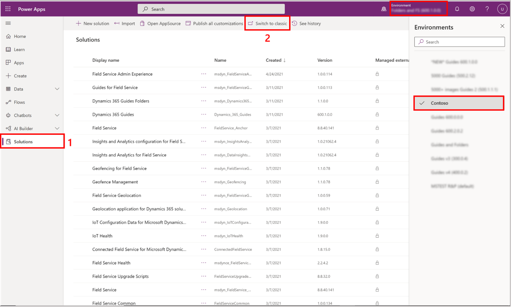

3. At the top of the screen, select **Import**, and then select **Choose File**.  

    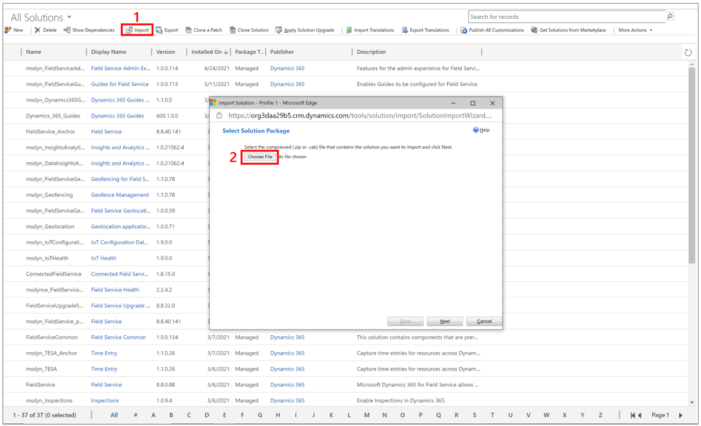

4. Find the .zip file you just downloaded when exporting the folders, select it, and then select **Open**.  

5. Select **Next**.  

    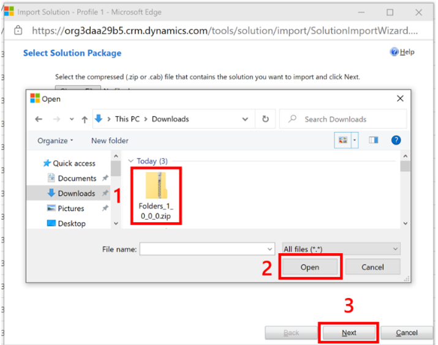

6. Select **Import**.  

    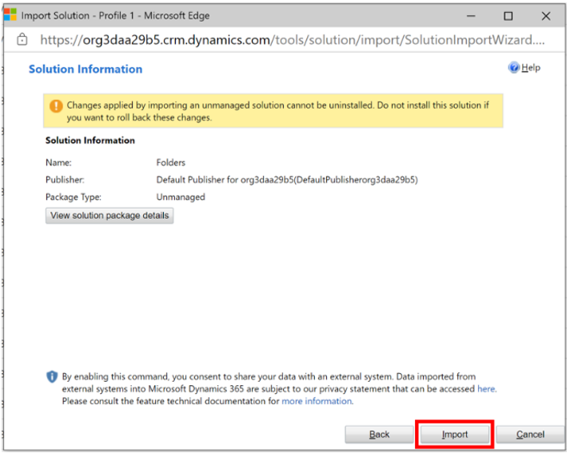

    After your solution has been imported, you should see it in the list, as shown below.
 
    

[!INCLUDE[footer-include](../includes/footer-banner.md)]     

