# Export and import Dynamics 365 Guides folders between environments

You can export the folders you have created in Microsoft Dynamics 365 Guides and import them into another environment to recreate your file structure. The guides, 3D 
content, and media associated with these folders will not be included in this process. However, you can use the Migration Tool script to migrate this content after 
you’ve imported your folders.  

> [!NOTE]
> If you export and import your folders first, and then migrate the content, the relationships between the folders and the content will be reconstructed.

## Prerequisites 

- You must be a system administrator to access the Power Platform admin center.  

- You must have Dynamics 365 Guides solution version 600.1.0.0 or later.  

We also highly recommend [backing up the contents](https://docs.microsoft.com/power-platform/admin/backup-restore-environments#create-a-manual-backup) of both environments before starting the export/import process. 

## Export the folders

1. Go to [make.powerapps.com](https://www.make.powerapps.com), and then sign into the environment that contains the folders you want to export. 

2. In the left navigation pane, select **Solutions**. 

    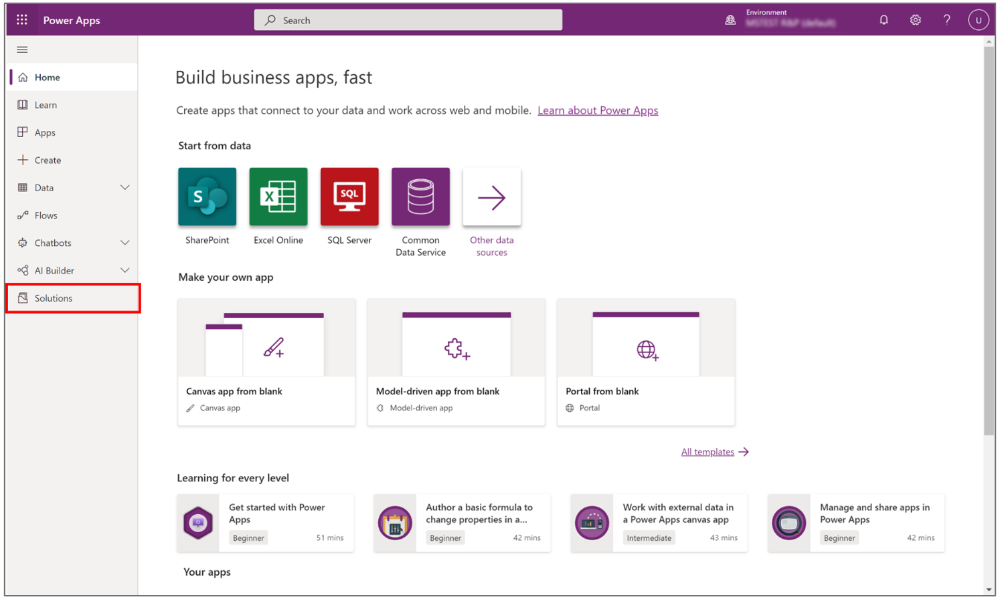

3. Create a new solution by doing the following:  

    1. In the command bar, select **New solution**.  

    2. Enter a display name. This will be the name of your solution.  

    3. Select **Default Publisher for {orgid}** from the drop-down menu.  

    4. Select **Create**.  

       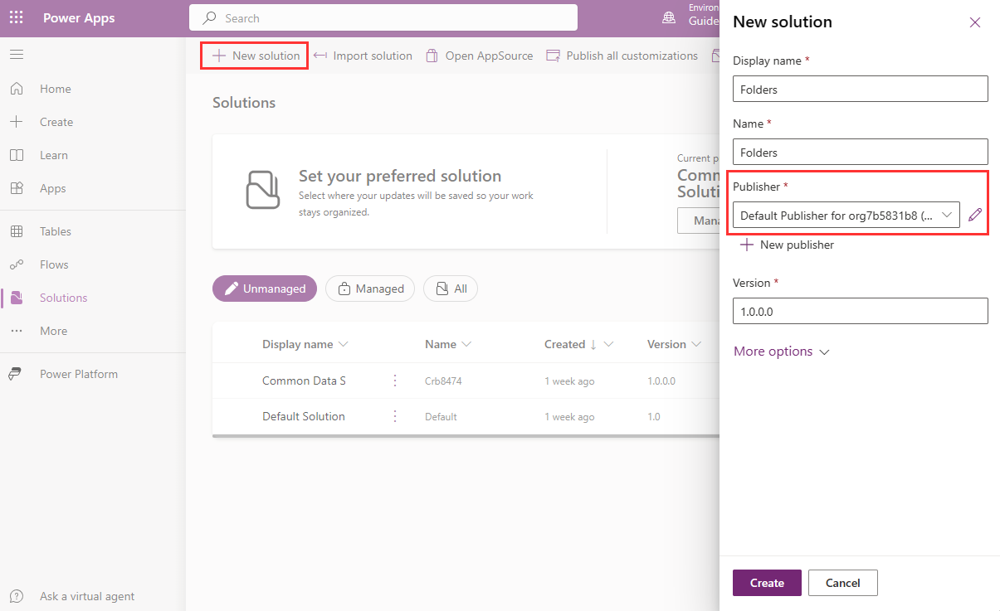

4. Add the folders as components of your solution:  

    1. Select the solution you just created.  

    2. Select **Edit**.  

       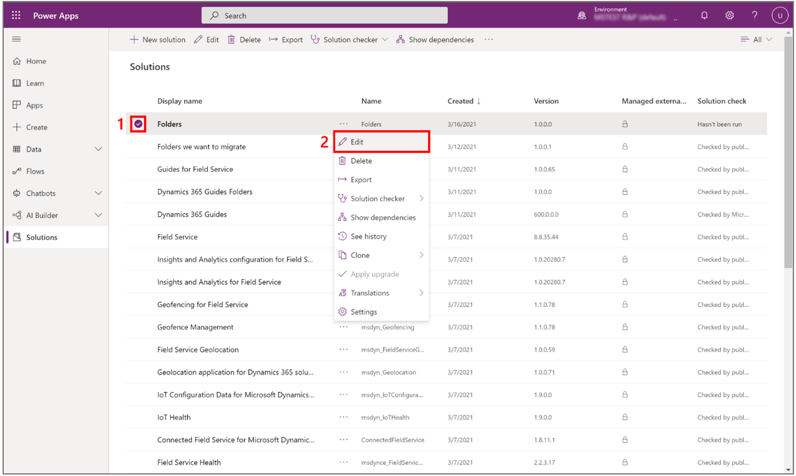

    3. Select **Add existing** > **Folder**.  

       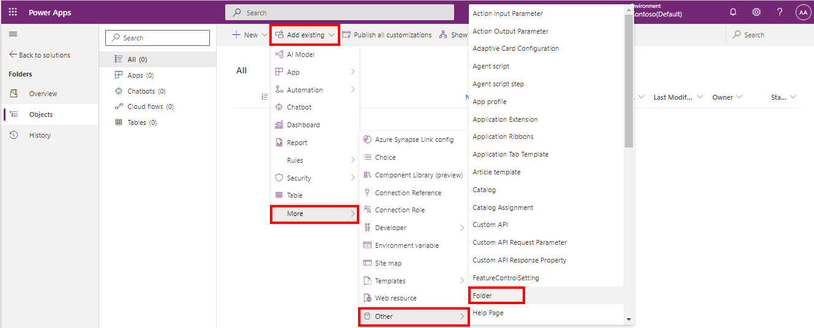

    4. Select the folders you want to include in your export, and then select **Add**.  

       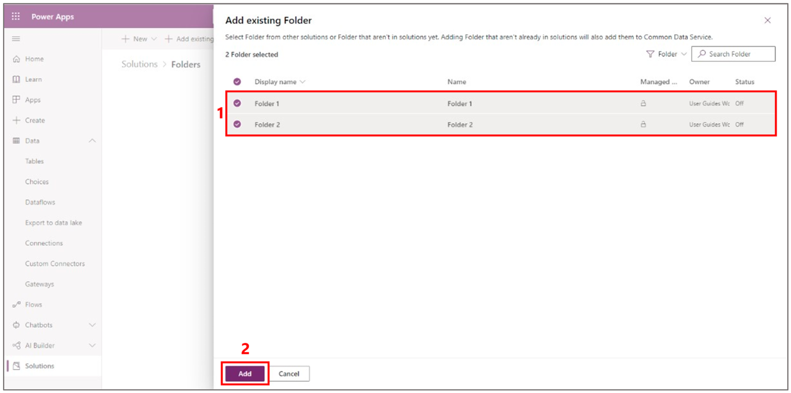
 
       > [!NOTE]
       > If you select a folder that includes subfolders, you'll need to select the parent folder and the child folder individually. However, if you select a subfolder, the parent folder will automatically be added to the list that will be exported. 

5. To export your solution:  

    1. Select **Export**, and then select **Next**. 

       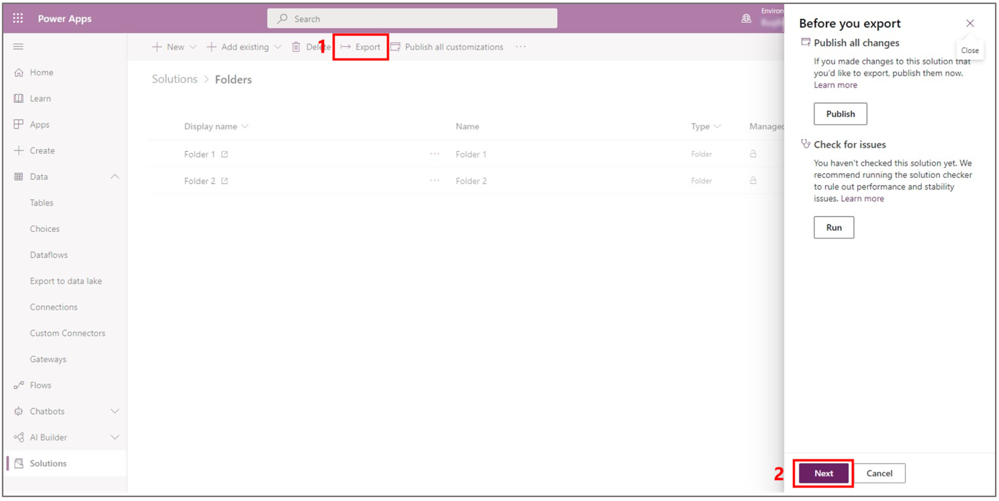

    2. Select between a managed and an unmanaged solution, and then select **Export**.  

       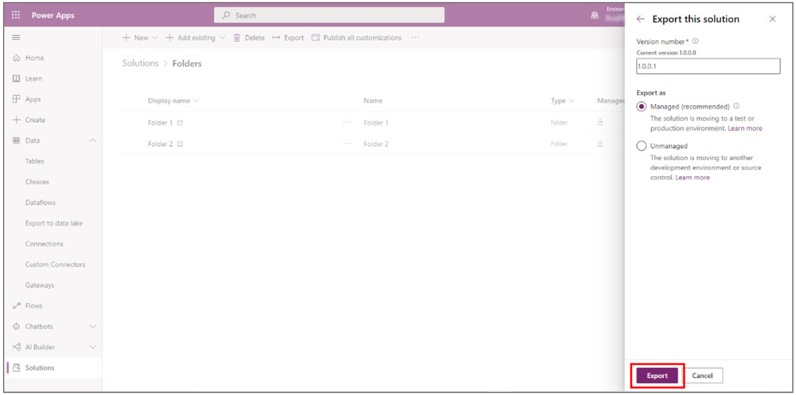
       
       > [!NOTE]
       > Select a managed solution if you want the rows to be bundled with the solution. This means that if you delete the solution, the rows that were imported as part of the managed solution will be deleted as well (including any guides saved under the folders, since deletion of a folder cascades to its children). On the other hand, if you delete an unmanaged solution from the environment, the rows will persist.

    3. Once the export is ready, it should automatically download as a .zip file and you’ll see a green notification saying it has been exported successfully. This might take a while.   

       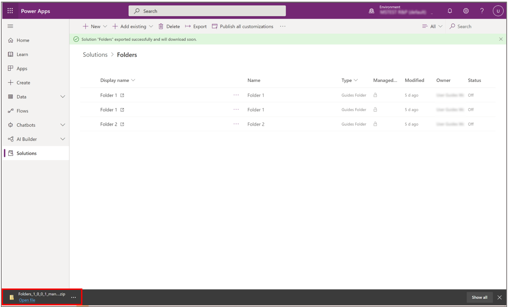
      
       > [!NOTE]
       > Deactivated folders will appear on the list to be exported.
      
### Import the folders

1. Go to make.powerapps.com and **ensure you are in the environment where you want to import the folders**. You can check this in the top right corner of the screen under **Environment**.  

    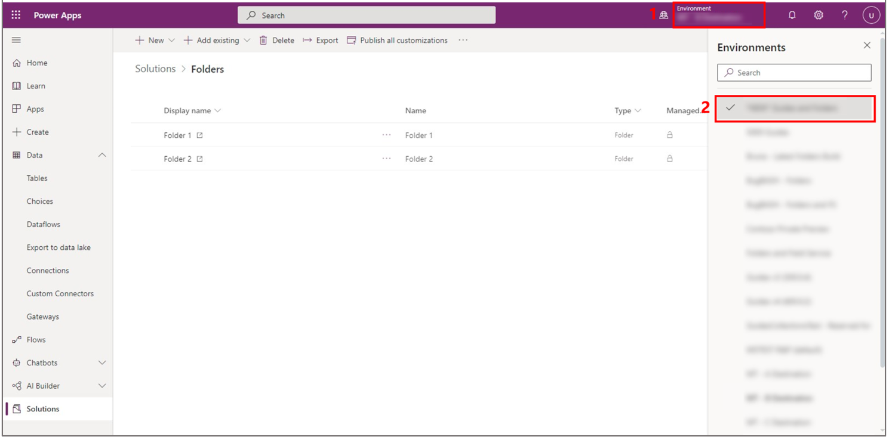

2. In the left navigation pane, select **Solutions**.  

3. In the command bar, select **Import**, and then select **Browse**.  

    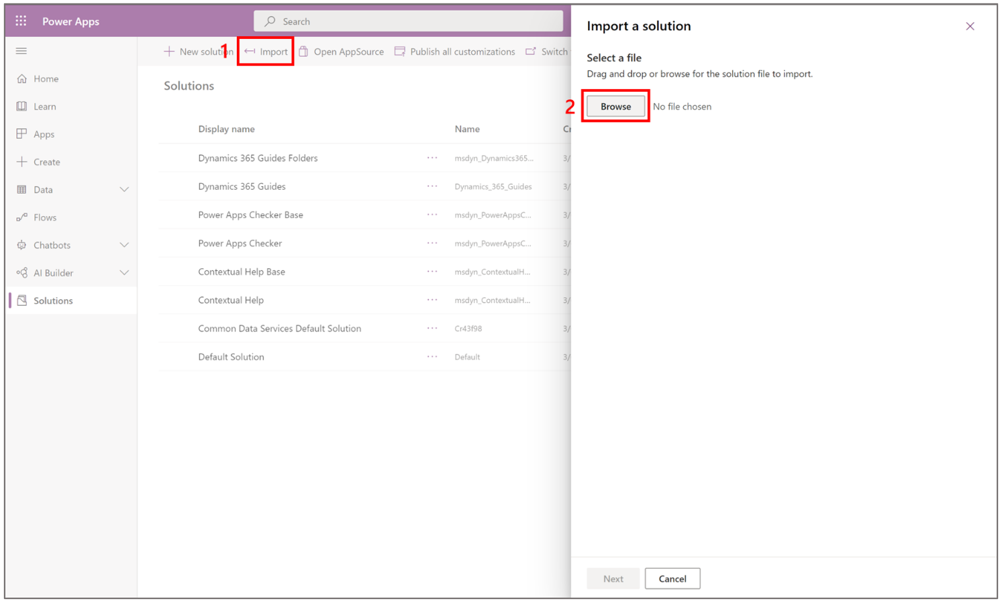

4. Find the .zip file you just downloaded when exporting the folders, select it and then, select **Open**.  

    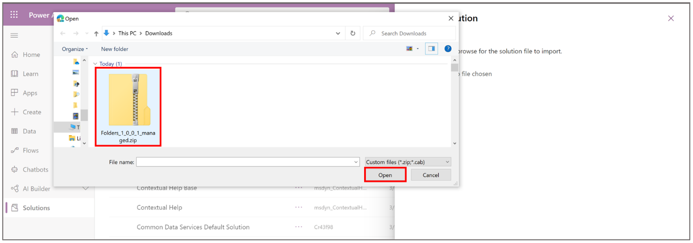

5. Select **Next**.  

    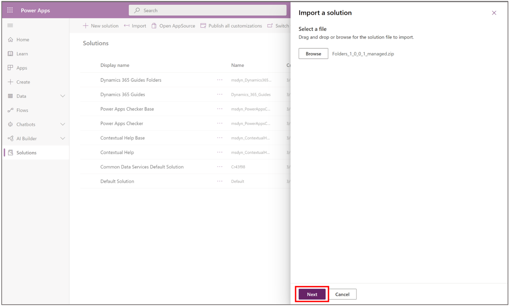

6. Select **Import**.  

    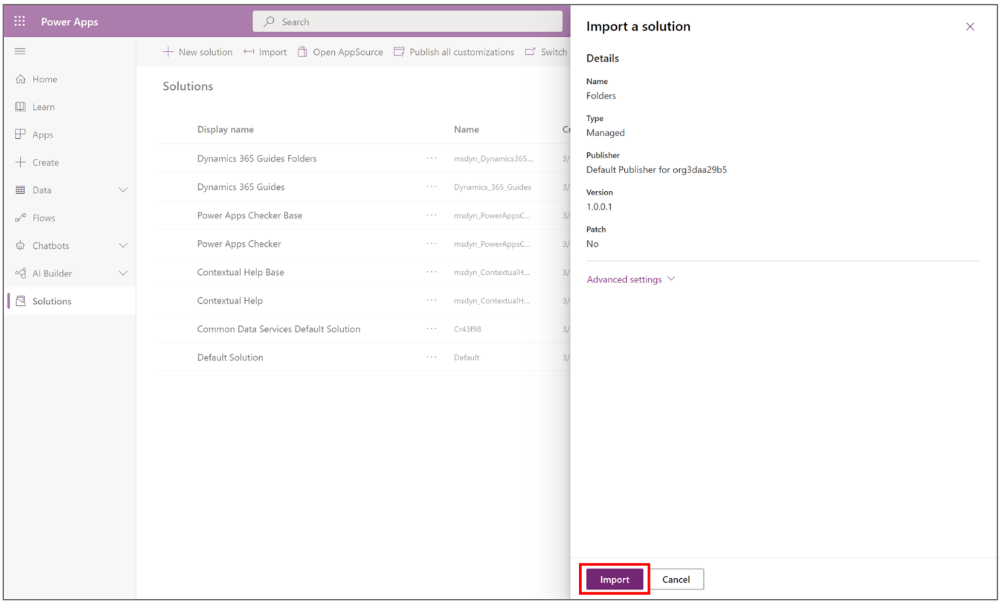

    Once the import is ready, you should see a notification stating that the solution has been successfully imported. This might take a few minutes.
 
    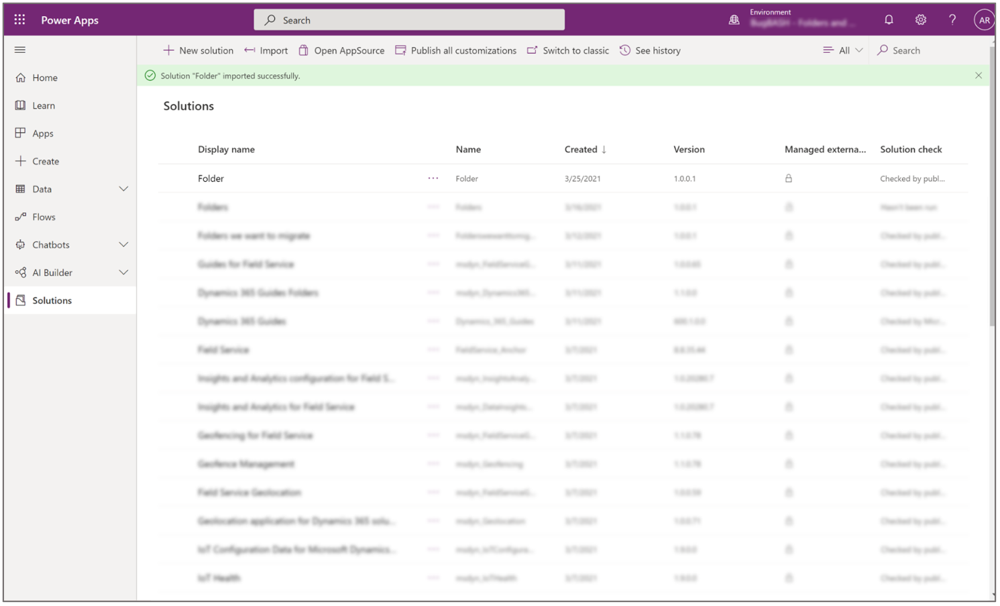

### Known issues 

If you try to import a solution with missing parent folders, and children folders still reference these parents, you'll see the error below. Select **Download details**  to see a detailed error message.

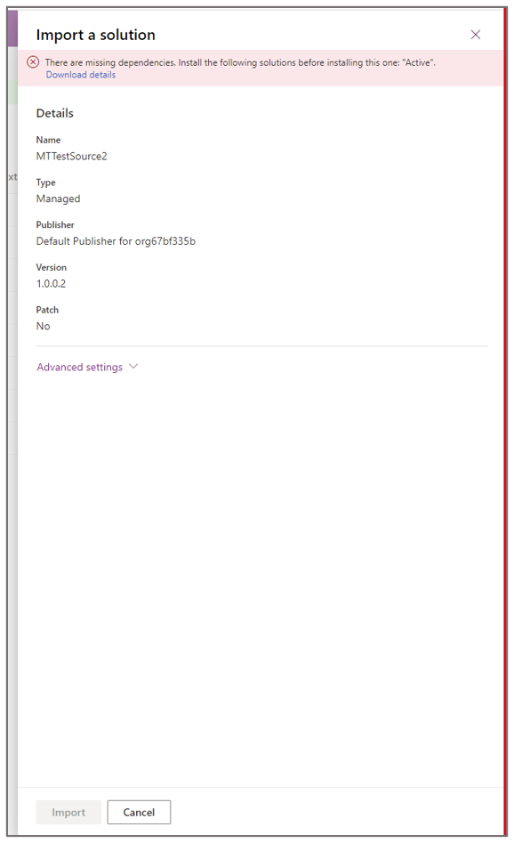
 
The download details will look something like this:

**Log.txt** 

[{"SolutionValidationResultType":"Error","Message":"The following solution cannot be imported: MTTestSource2. Some dependencies are missing. The missing dependencies are : <MissingDependencies><MissingDependency><Required key=\"0\" type=\"msdyn_MRFolder\" solution=\"Active\" id=\"{3a309204-0f89-eb11-a812-000d3a4f7b30}\" /><Dependent key=\"1\" type=\"msdyn_MRFolder\" id=\"{e8d4da0b-0f89-eb11-a812-000d3a4f7b30}\" /></MissingDependency></MissingDependencies> , ProductUpdatesOnly : False","ErrorCode":-2147188707,"AdditionalInfo":null}] 
 
> [!NOTE]
> If you delete duplicate folders, make sure to refresh your screen after a successful deletion.   

      

