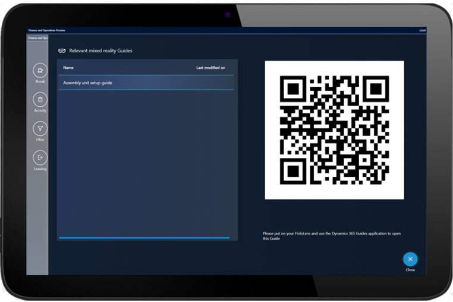
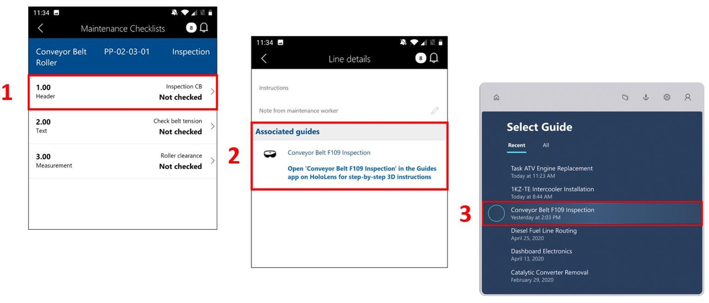

# Integrate Dynamics 365 Supply Chain Management with Dynamics 365 Guides

You can integrate Microsoft Dynamics 365 Supply Chain Management with Dynamics 365 Guides in two ways:

- Through production processes

- Through asset management

## Production processes

When you integrate production processes from Supply Chain Management, first-line workers can benefit from mixed-reality guides in various areas of their work, such as assembly, service, operations, certification, and safety.

You can attach guides to various aspects of production control. Here are some examples:

- [Resources](/dynamics365/supply-chain/production-control/instruction-guides-in-production-overview#resources)

- [Resource groups](/dynamics365/supply-chain/production-control/instruction-guides-in-production-overview#resource-groups)

- [Released products](/dynamics365/supply-chain/production-control/instruction-guides-in-production-overview#released-products)

- [Formulas](/dynamics365/supply-chain/production-control/instruction-guides-in-production-overview#formulas)

- [Formula versions](/dynamics365/supply-chain/production-control/instruction-guides-in-production-overview#formula-versions)

- [Bills of material (BOMs)](/dynamics365/supply-chain/production-control/instruction-guides-in-production-overview#bom)

- [BOM versions](/dynamics365/supply-chain/production-control/instruction-guides-in-production-overview#bom-versions)

- [Routes](/dynamics365/supply-chain/production-control/instruction-guides-in-production-overview#routes)

- [Route versions](/dynamics365/supply-chain/production-control/instruction-guides-in-production-overview#route-versions)

- [Route operation relations](/dynamics365/supply-chain/production-control/instruction-guides-in-production-overview#route-operation-relations)

When a first-line worker selects a job on the shop floor through Supply Chain Management, the job card shows [the relevant guides](/dynamics365/supply-chain/production-control/instruction-guides-in-production-overview#logic). When the worker selects a specific guide, a QR code for that guide is shown. The worker can then use their HoloLens to scan the QR code. At that point, Dynamics 365 Guides is opened and shows the required instructions. 

 
[Learn more about how to integrate Dynamics 365 Guides with various aspects of production control](/dynamics365/supply-chain/production-control/instruction-guides-in-production-overview#logic).

## Asset management

You can integrate the **Asset Management** module in Supply Chain Management with Dynamics 365 Guides to take advantage of mixed-reality guides in your day-to-day service and maintenance workflows. If a guide is associated with an Asset Management work order, when a worker opens the work order's Maintenance Checklist in the Finance and Operations (Dynamics 365) mobile app (1), the line details show that a guide is available (2). The worker can then find and open the guide in the Dynamics 365 Guides HoloLens app (3).

[Learn more about how to integrate asset management with Dynamics 365 Guides](/dynamics365/supply-chain/asset-management/asset-management-guides-integration).

## See also

[Integrate Dynamics 365 Field Service with Dynamics 365 Guides](field-service.md)

[!INCLUDE[footer-include](../includes/footer-banner.md)]