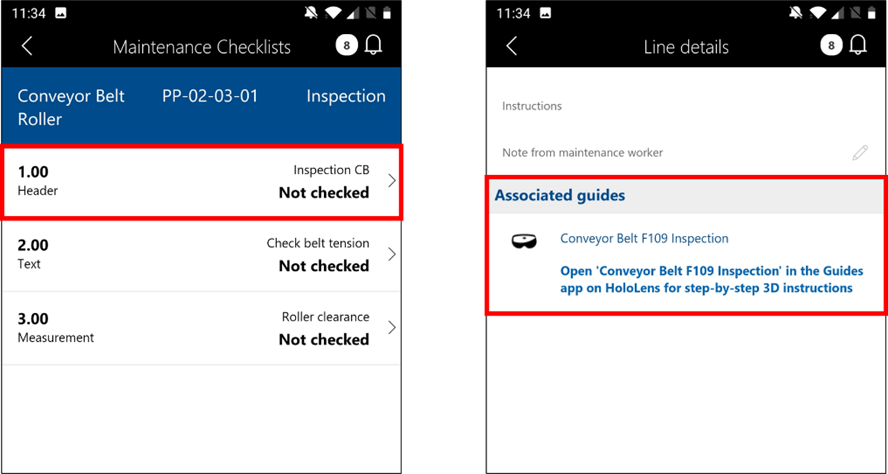

# Integrate Dynamics 365 Supply Chain Management (Asset Management module) with Dynamics 365 Guides

You can integrate the Asset Management module from Microsoft Dynamics 365 Supply Chain Management with Dynamics 365 Guides to take 
advantage of mixed-reality guides in your day-to-day service and maintenance workflows. When a guide is associated with an 
Asset Management work order, the worker can see that a guide is available through the work order’s maintenance checklist in the 
Finance and Operations (Dynamics 365) mobile app. The worker can then find and open the guide from the Dynamics 365 Guides HoloLens app.

 

[Learn more about integrating Asset Management with Dynamics 365 Guides]()

## See also

[Integrate Dynamics 365 Field Service with Dynamics 365 Guides]()
