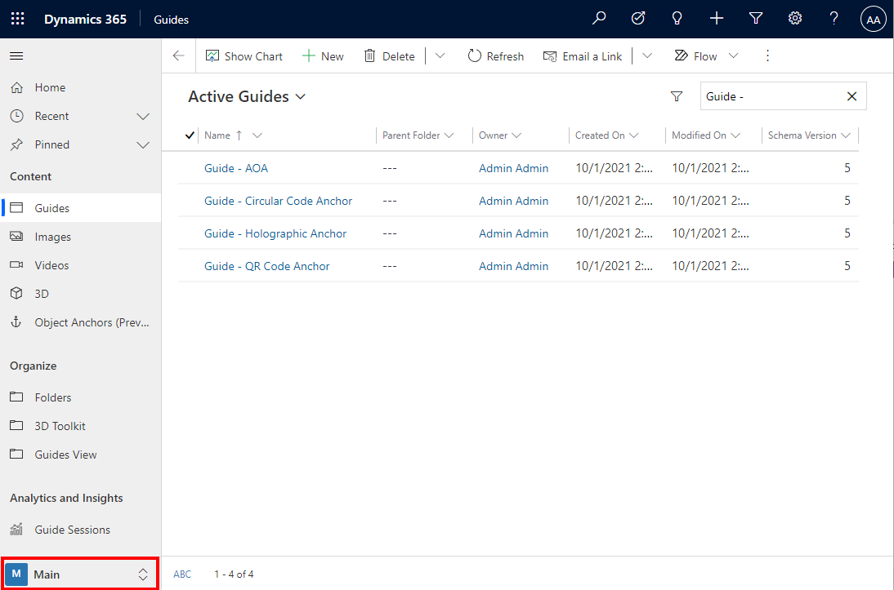
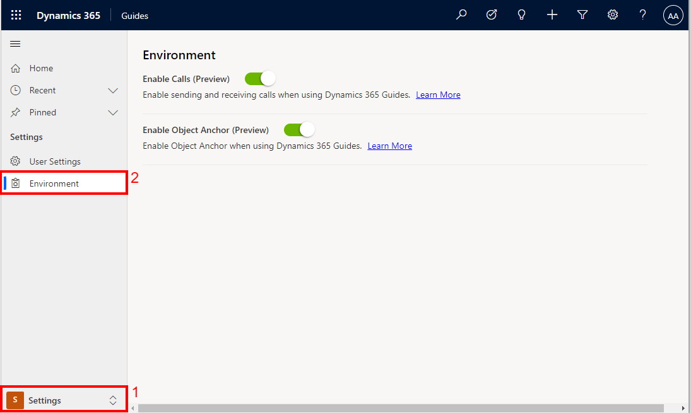

# Enable calling in a Dynamics 365 Guides Environment 

When enabled, a Dynamics 365 Guides HoloLens user can make a one-to-one call. Remote collaborators can join the call using Microsoft Teams desktop application or mobile application.  In a call, remote collaborators can see everything seen by the Hololens user – including holograms and the real world behind the holograms.

If you're an admin for Microsoft Dynamics 365 Guides, you can enable or disable calling for all guides accessed by a user within a Dynamics 365 Guides Environment.  Enabling or disabling calling by environment is useful when operators or authors do not need to work with remote collaborators.  Or if it is preferred that HoloLens users are not able to start a call and allow remote collaborators to see everything that they see while working in Dynamics 365 Guides.  

## Settings

1. Sign in to the instance by using your admin or author credentials.

    > [!TIP]
    > To find the URL for the instance, select the **Analyze** tab in the PC app. The URL is shown in the **Instance URL** field at the bottom of the page. Copy this URL, and paste it into the address bar of your web browser.
    >
    > 

2. In Power Apps, select the **Guides** app tile.

    
    
3.	In the left pane, use the area picker to select **Settings** to view all setting for the instance.

    

4.	At the left of the screen, select **Environment** to access settings for the current environment. The **Enable Call** toggle can be used to enable or disable Dynamics 365 Guides Calling for the Environment if the user has Administrator permissions.

     

5.	When a user tries to start a call while working in an environment with the Dynamics 365 Guides App where calling is disabled, the user will see an error message: 
 "**Your admin may have disabled calling or you may not have a Microsoft Teams or Remote Assist license**"

## See also

[Calling in Dynamics 365 Guides ](create-guide.md)

[Set up Dynamics 365 Guides / Calling Licensing and Product Requirements](admin-export-import-folders.md)

[!INCLUDE[footer-include](../includes/footer-banner.md)]
