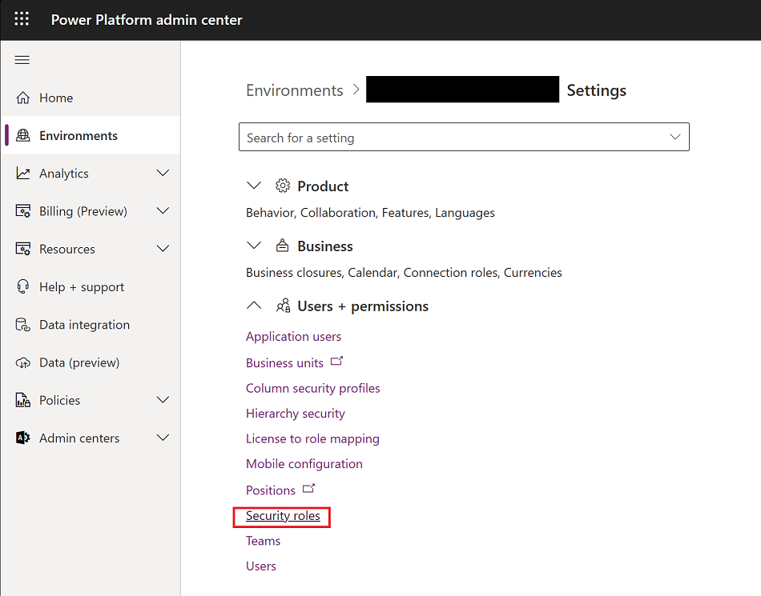
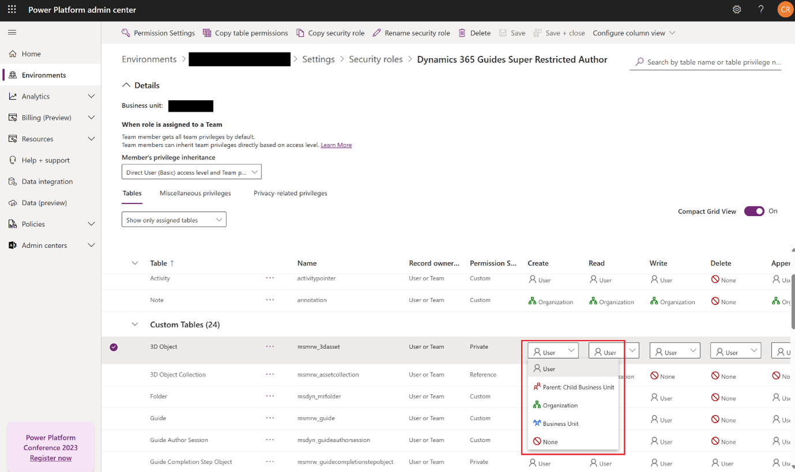

# Restrict access to assets

To restrict access to certain assets (3D parts, images, videos, and object anchors) creat a [new security role](/power-platform/admin/assign-security-roles) in the Power Platform admin center.

> [!IMPORTANT]
> We don't recommend restricting access to assets as the restricted user can't access any items in the Toolkit nor create Azure Object Anchors to anchor a guide.

## Prerequisites

- You must have Admin permission.

- You must have an active Dynamics 365 Guides license. For more information, see [Buy a subscription or sign up a free trial](setup-step-one.md).

- The latest Dynamics 365 Guides solution must be installed. For more information, see [Update to the latest solution](upgrade.md).

- You must have access to the Microsoft Power Platform admin center and have full admin privileges.

## Restrict access to an asset

1. Open the [Power Platform admin center](https://admin.powerplatform.microsoft.com/environments), select the Guides solution in the **Environments** page, and then select **Settings**.

    

1. In the **Settings** page, select **Security roles**. Select **New**.

1. Name the new role and fill out the appropriate information. Under **Custom Tables**, select the asset type (3D object, images, videos, or object anchors). Set the permissions on **Create**, **Read**, **Write**, **Append** and **AppendTo** to **User**.  

   > [!TIP]
   > For Write access, **Write**, **Append** and **AppendTo** are required.

    

1. Select **Save**.