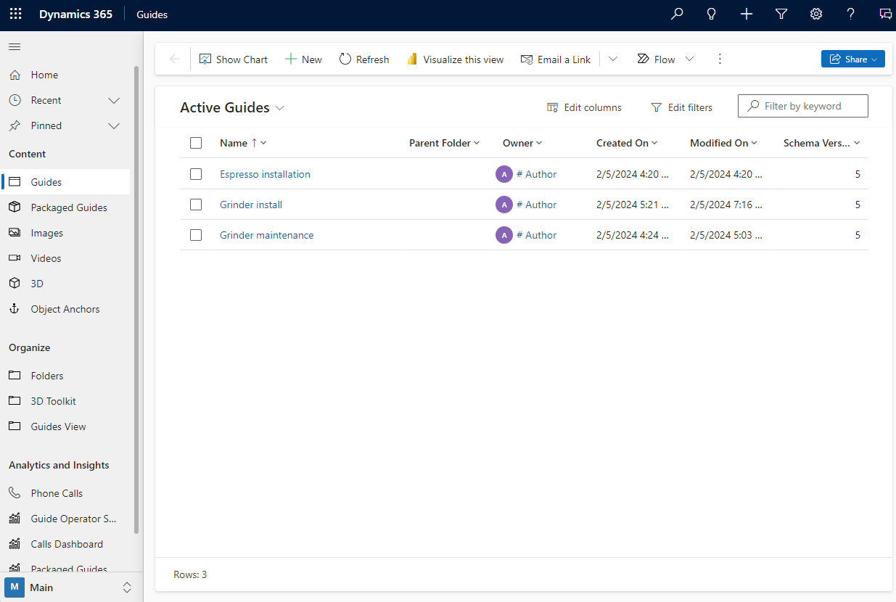
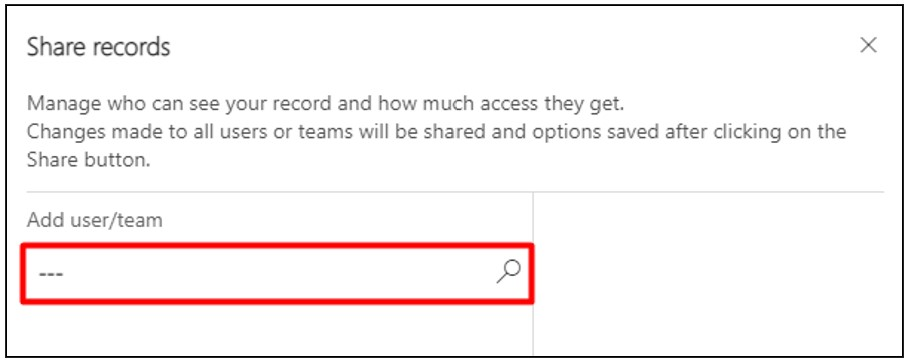
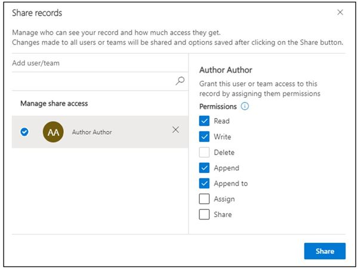
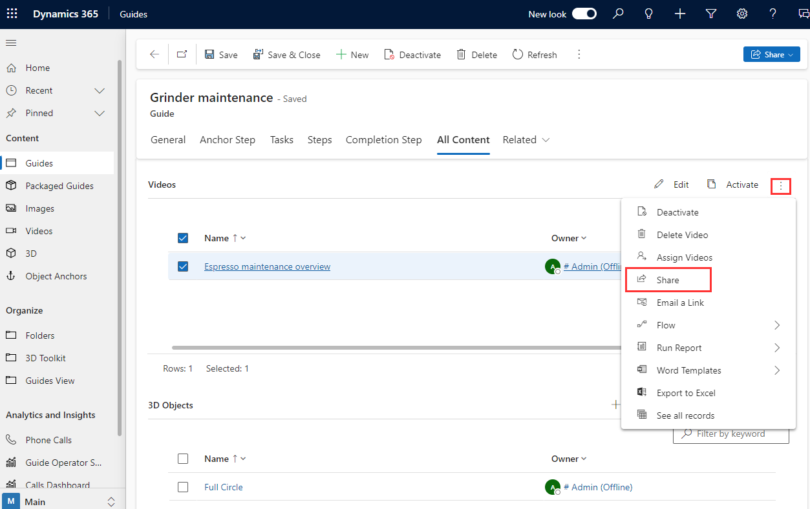

# Share a guide in Dynamics 365 Guides

In Microsoft Dynamics 365 Guides, you can share a guide [by creating an access team](admin-access-teams.md). After creating the access team, you can share the guide with the  team as described in this article.

In rare cases, you might want to share a guide with a specific user who is not a member of a team by using the Share option. The Share option is also described in this article.

## Share a guide with an access team

1. In the PC authoring app, sign in to the Dynamics 365 instance that includes the guide.

2. Select the **Analyze** tab, and then under **Instance URL**, select **Copy**, and then paste the value into the address bar of a web browser.

    

3. Sign in, and then in the left pane of the Power Apps screen, select **Guides** to open the model-driven app.

    

4. In the **Share records** page, use the Search box to search for and select the appropriate team or user name.

     
    
5. Under **Manage share access**, select the team, then select specific permissions:

   - For operators, select **Read** permissions (and **AppendTo** if you want to [collect operations data](analytics-overview.md)).
   - For authors, select **Read**, **Write**, and **AppendTo** permissions.

    
    
6. Select **Share**. 

> [!TIP]
> When you share a guide, the content (images, videos, and 3D objects) associated with the guide is not automatically shared. You can use the **All Content** tab in the Guides model-driven app to do bulk operations, such as sharing content. 
>
>  

## See also

- [Create an access team](admin-access-teams.md)
- [Assign an Operator or Author role to an individual user](assign-role.md)
- [Assign roles in bulk by using Active Directory groups](admin-assign-role-groups.md)
- [Restrict access to an environment by using security groups](admin-security.md)

[!INCLUDE[footer-include](../includes/footer-banner.md)]

