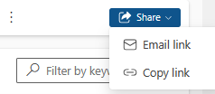
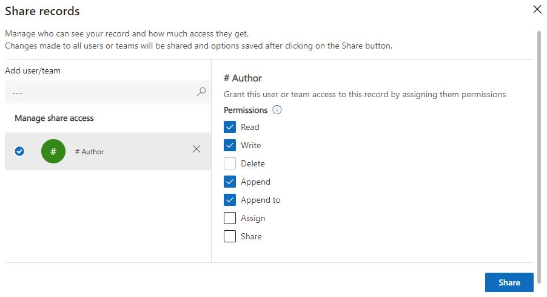

# Share a guide or folder in Dynamics 365 Guides

You can share a guide or a folder through the model-driven app. For more information, see [Guide content management.](admin-content-mgmt.md)

## Share a folder

By organizing all guides and assets a user might need into a folder, you can share the folder rather than having to share the guide or the assets individually.

> [!NOTE]
> By default, Authors and Restricted authors have access to all assets (3D parts, images, videos, and object anchors). Although not recommended, admins can restrict access by creating a new security role. See [Restrict access to assets.](admin-restrict-access-assets.md)

1. [Open the model-driven app](open-model-driven-app.md) in Guides.

1. In the left pane, select **Folders** to view the list of folders in the environment.

1. Select the desired folder, and then at the top right of the screen, select **Share** > **Copy link**.

    

1. Share the link with the appropriate users.

## Share a guide

You can share a guide with other users if you're an administrator or if you have the Share privilege. Share a guide with a specific user or an [access team](admin-access-teams.md).

> [!IMPORTANT]
> [Assigning ownership of a guide](admin-access-assign.md) to a user or team is the preferred method for controlling who can use specific guides. Sharing a guide does not change ownership of the guide.

1. [Open the model-driven app](open-model-driven-app.md) in Guides.

1. Find the guide that you want to share, select the check box next to the guide name, and then select **Share**.

    

1. In the **Share records** page, use the search box to search for and select the appropriate team or user name.

1. Under **Manage share access**, select the team, and then select specific permissions:

   - For operators, select **Read** permissions (and **Append to** if you want to [collect operations data](analytics-overview.md)).
   - For authors, select **Read**, **Write**, **Append** and **Append to** permissions.

    

1. Select **Share**.

   > [!NOTE]
   > When you share a guide, the content (images, videos, and 3D objects) associated with the guide is not automatically shared. To share the contents, go to the next step.

1. To share the contents, go to the **All Content** tab. Select the contents you want to share and then **More (ellipsis ...)** button, and then select **Share**.

    

## Next steps

- [Assign an Operator or Author role to an individual user](assign-role.md)
- [Assign roles in bulk by using Active Directory groups](admin-assign-role-groups.md)
- [Restrict access to an environment by using security groups](admin-security.md)

[!INCLUDE[footer-include](../includes/footer-banner.md)]
