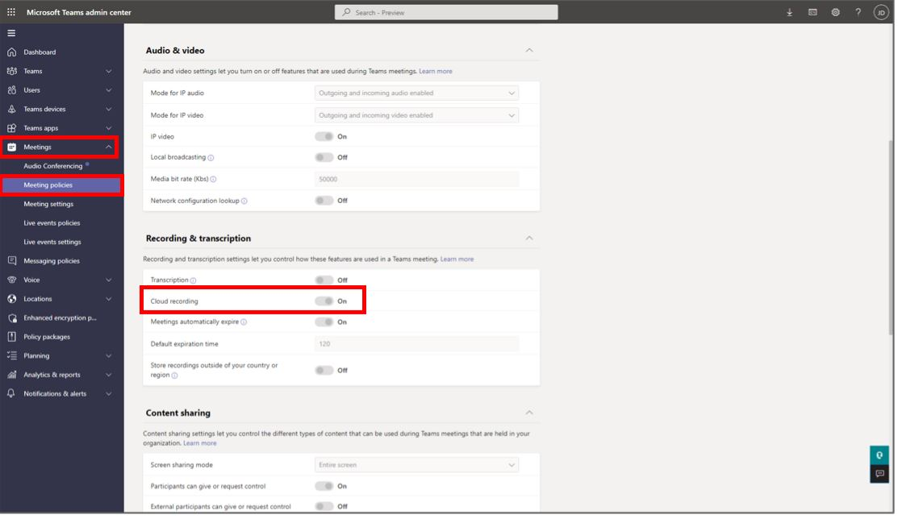
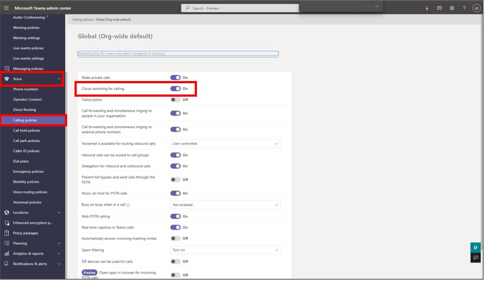
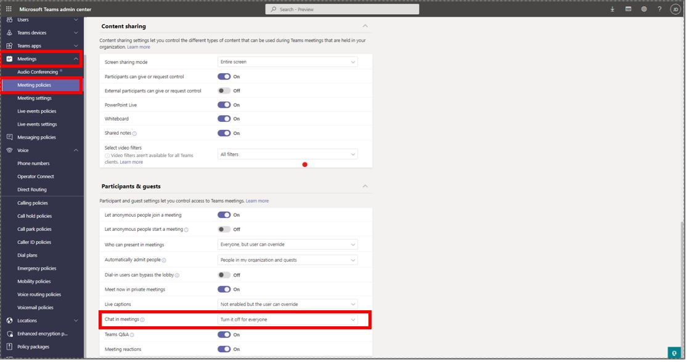
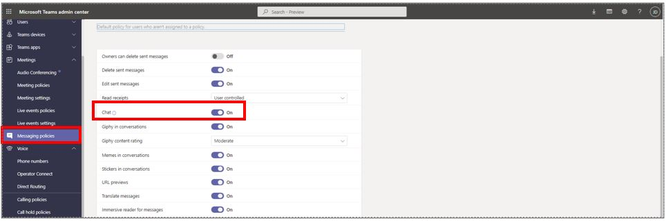
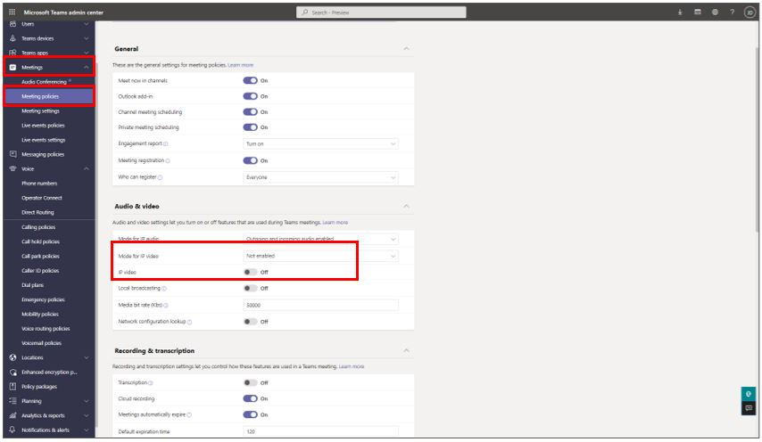
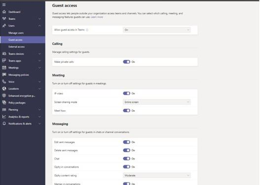
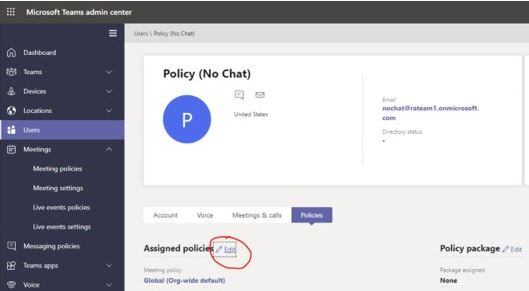
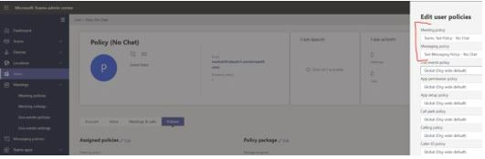

# Teams policies supported by Dynamics 365 Guides

Microsoft Dynamics 365 Guides supports the following Microsoft Teams policies and capabilities:

- **Recording policy.** Turn off recordings for meetings and one-to-one calls.
- **Chat policy.** Turn off the ability to chat in meetings and one-to-one calls.
- **Video policy.** Remove access to video calls (calls are audio only).

## Turn off the ability to record calls

### In meetings

To access the recording policy for meetings:

1. Go to https://admin.teams.microsoft.com/.
2. On the left side of the screen, select **Meeting policies**.
3. Create a new policy or edit an existing policy.
4. In the **Audio & video** section, turn off the **Allow cloud recording** setting. 

    
    
5. Save the new or modified policy.
6. Assign the policy to a user.
7. Verify that the policy is working as expected in Teams desktop. 

### In one-to-one calls

1. Go to https://admin.teams.microsoft.com/.
2. On the left side of the screen, select **Voice** > **Calling policies**. 
3. Create a new policy or edit an existing policy.
4. Turn off the **Cloud recording for calling** setting. 

    
    
5. Save the new or modified policy.
6. Assign the policy to a user.
7. Verify that the policy is working as expected in Teams desktop. 

## Turn off the ability to chat

### In meetings

1. Go to https://admin.teams.microsoft.com/.
2. On the left side of the screen, select **Meeting > Meetings policies**.
3. Create a new policy or edit an existing policy.
4. Scroll down to the **Participants & guests** section.
5. In the **Allow chat in meetings** field, select **Disabled** to turn off the ability to chat. 

    
    
5. Save the new or modified policy.
6. Assign the policy to a user.
7. Verify that the policy is working as expected in Teams desktop. 

### In one-to-one calls

1. Go to https://admin.teams.microsoft.com/.
2. On the left side of the screen, select **Messaging policies**.
3. Create a new policy or edit an existing policy.
4. Turn off the **Chat** setting. 

    
    
5. Save the new or modified policy.
6. Assign the policy to a user.
7. Verify that the policy is working as expected in Teams desktop. 

## Turn off the ability to see video 

1. Go to https://admin.teams.microsoft.com/.
2. On the left side of the screen, select **Meetings > Meeting policies**.
3. Create a new policy or edit an existing policy.
4. In the **Audio & video** section:
    - In the **Mode for IP video** section, select **Disabled**
    - Turn off the **Allow IP video** setting.

    
    
5. Save the new or modified policy.
6. Assign the policy to a user.
7. Verify that the policy is working as expected in Teams desktop.

## Policies for guest users

Users you [invite as guests](add-add-guest-user.md) have limited scope of access by design. For example, guest users cannot start call recordings by default. Other access is imposed through policy. 

### Access guest policies

1. Go to https://admin.teams.microsoft.com/.
2. On the left side of the screen, select **Guest access**.
3. Create a new policy or edit an existing policy.
4. Make your changes.

    

5. Save the new or modified policy.
6. Assign the policy to a user.
7. Verify that the policy is working as expected in Teams desktop.

## Assign a policy to a selected user

1. Go to https://admin.teams.microsoft.com/.
2. On the left side of the screen, select **Users**, and then select the user you want to modify policies for.
3. Next to **Assigned policies**, select the **Edit** button.

    
    
4. On the right side of the screen, in the **Meeting policy** and/or the **Messaging policy** fields, enter the name of the policy.

    
    
5. Select **Apply**.
6. Verify that the policy is working as expected in Teams desktop.
