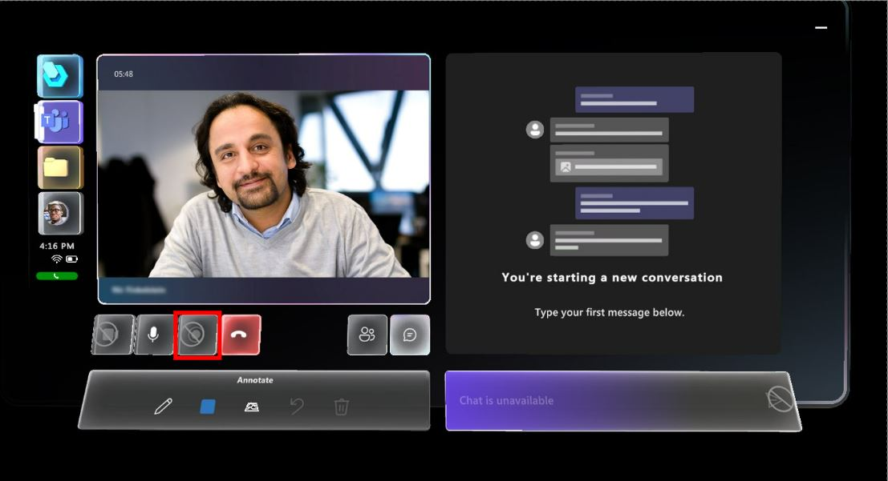
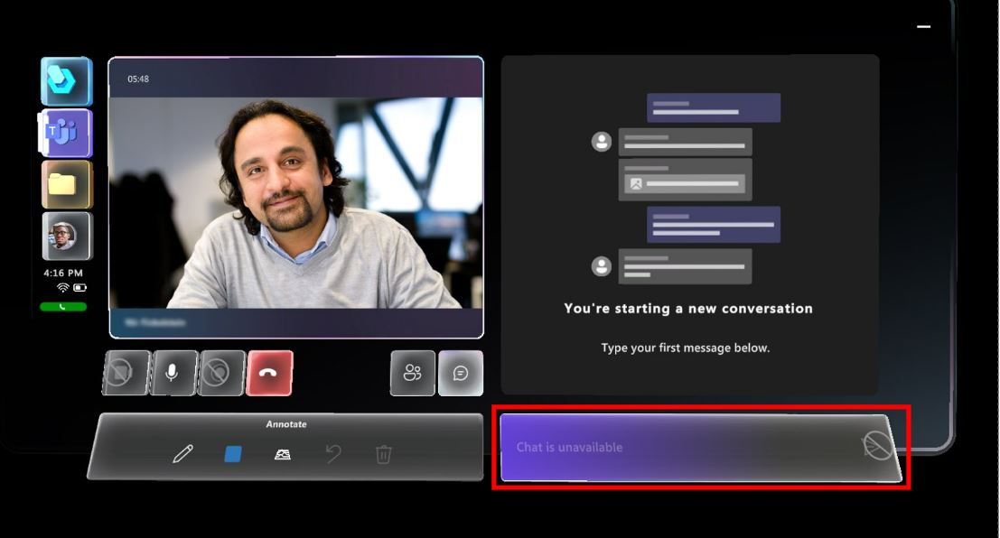
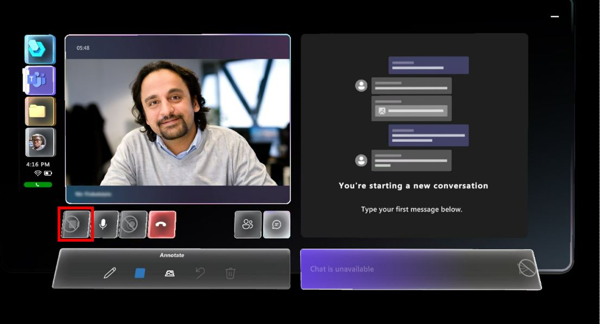

# Teams policies supported by Dynamics 365 Guides

Microsoft Dynamics 365 Guides supports the following Microsoft Teams policies and capabilities:

- **Recording policy.** Turn off recordings for meetings and one-to-one calls.
- **Chat policy.** Turn off the ability to chat in meetings and one-to-one calls.
- **Video policy.** Remove ability to receive video calls (calls are audio only).

## Turn off the ability to record calls

When you turn off the ability to record calls, the **Recording** button is unavailable.

> [!NOTE]
> By default, [Guest users](admin-add-guest-user.md) cannot record calls. 

### Turn off the ability to record in meetings

1. Go to https://admin.teams.microsoft.com/
2. On the left side of the screen, select **Meetings > Meeting policies**.
3. Create a new policy or edit an existing policy.
4. In the **Audio & video** section, turn off the **Cloud recording** setting. 

    
    
5. Save the new or modified policy.
6. [Assign the policy to a user](#assign-a-policy-to-a-user).
7. Verify that the policy is working as expected in Teams desktop. 

### Turn off the ability to record in one-to-one and group calls

1. Go to https://admin.teams.microsoft.com/
2. On the left side of the screen, select **Voice** > **Calling policies**. 
3. Create a new policy or edit an existing policy.
4. Turn off the **Cloud recording for calling** setting. 

    
    
5. Save the new or modified policy.
6. [Assign the policy to a user](#assign-a-policy-to-a-user).
7. Verify that the policy is working as expected in Teams desktop. 

## Turn off the ability to chat

When you turn off the ability to chat, the HoloLens user sees the "Chat is unavailable" message in the chat message box and a no-entry symbol appears on the right side of the message box.

### Turn off the ability to chat in meetings

1. Go to https://admin.teams.microsoft.com/
2. On the left side of the screen, select **Meetings > Meeting policies**.
3. Create a new policy or edit an existing policy.
4. Scroll down to the **Participants & guests** section.
5. In the **Chat in meetings** field, select **Turn it off for everyone**. 

    
    
5. Save the new or modified policy.
6. [Assign the policy to a user](#assign-a-policy-to-a-user).
7. Verify that the policy is working as expected in Teams desktop. 

### Turn off the ability to chat in one-to-one and group calls

1. Go to https://admin.teams.microsoft.com/
2. On the left side of the screen, select **Messaging policies**.
3. Create a new policy or edit an existing policy.
4. Turn off the **Chat** setting. 

    
    
5. Save the new or modified policy.
6. [Assign the policy to a user](#assign-a-policy-to-a-user).
7. Verify that the policy is working as expected in Teams desktop. 

## Turn off the ability to receive video 

When you turn off the ability to receive video, the **Video** button. 

### Turn off video

1. Go to https://admin.teams.microsoft.com/
2. On the left side of the screen, select **Meetings > Meeting policies**.
3. Create a new policy or edit an existing policy.
4. In the **Audio & video** section:
    - In the **Mode for IP video** field, select **Not enabled**.
    - Turn off the **IP video** setting.

    
    
5. Save the new or modified policy.
6. [Assign the policy to a user](#assign-a-policy-to-a-user).
7. Verify that the policy is working as expected in Teams desktop.

## Policies for guest users

Users you [invite as guests](admin-add-guest-user.md) have limited scope of access by design. For example, guest users cannot start call recordings by default. You can restrict other access capabilities through policy. 

### Access guest policies

1. Go to https://admin.teams.microsoft.com/
2. On the left side of the screen, select **Guest access**.
3. Create a new policy or edit an existing policy.
4. Make your changes.

    

5. Save the new or modified policy.
6. [Assign the policy to a user](#assign-a-policy-to-a-user).
7. Verify that the policy is working as expected in Teams desktop.

## Assign a policy to a user

1. Go to https://admin.teams.microsoft.com/
2. On the left side of the screen, select **Users**, and then select the user you want to modify policies for.
3. Next to **Assigned policies**, select the **Edit** button.

    
    
4. On the right side of the screen, in the **Meeting policy** and/or the **Messaging policy** fields, enter the name of the policy.

    
    
5. Select **Apply**.
6. Verify that the policy is working as expected in Teams desktop.

## FAQ on Teams policies

### Can a policy be applied to a device or an app?

No, policies can only be applied to users or groups.

### Do one-to-one policies also apply to group calls?

Yes, one-to-one policies also apply to group calls, but meetings have their own policy.

### When are policies applied

Policies are applied when the user signs in. After making a policy change, the user will need to sign out and back in or close and open the app to apply the policy change. 

