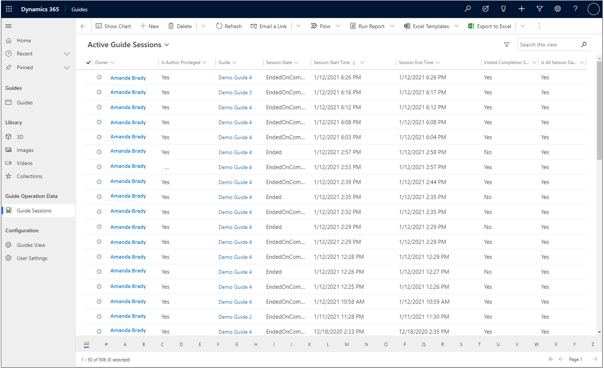
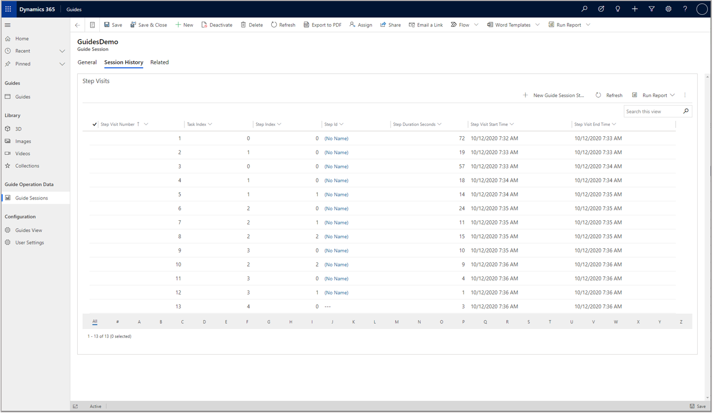

# What data is collected in Dynamics 365 Guides and how can you use it?

When an operator uses the Microsoft Dynamics 365 Guides HoloLens app in Operate mode, each interaction that moves the operator forward, backward, or out of the guide is recorded, together with the date and time of the interaction. This information is stored in two tables in the Microsoft Dataverse in your Dynamics 365 environment: 

- Guide Session

- Guide Session Step Visit  

## Guide Session table 

Each row in the Guide Session table corresponds to an operation of a guide in HoloLens Operate mode, whether completed from beginning to end of the guide or involving just a few steps. Information about the guide session, such as start and end time, total operating time, and different options to define completion (for example, was the completion step visited or what percentage of steps did the operator visit) are also recorded. For more information, [see the Guides table (entity) reference](developer-entity-reference.md).

## Guide Session Step Visit table 

Each row in the Guide Session Step Visit table corresponds to an operator’s visit to a step in HoloLens Operate mode. Information is recorded for each step visit such as start and end time and step operating time. If an operator visited a step multiple times, perhaps by navigating backward and forward in the guide, each visit would result in a separate row in this table. For more information, [see the Guides table (entity) reference](developer-entity-reference.md). 

## What can you do with the data? 

Storing data about the operations of your guides in easy-to-access Microsoft Dataverse tables gives you the flexibility to analyze and integrate this data into your workflows in ways that make sense for your business. You can get started by:

- Using the [Guides Analytics Power BI templates](analytics-guide.md)

- Building your own custom integrations with this data. 

Here are some examples of what you can do: 

- **Monitor completion status of a guide and trigger workflows.** The Guide Session table includes measurements of guide completion status that you can use with Microsoft Power Automate to, for example, send notifications when an operator has completed a guide. Given that there are many ways to define whether a guide session is complete, the Guide Session table provides two different measurements that you can use individually or together as appropriate for your use case:

    - The first guide completion measurement is stored in the **Percent Of Steps Visited** column and is calculated by taking the number of unique visited steps in a session and dividing by the total number of steps in the guide. This measurement is particularly useful for linear guides in which you expect operators to visit every step. 
    
    - The second completion measurement is stored in the **Visited Completion Step** column and defines whether a completion step was visited during the guide session. If the guide has multiple completion steps, this will be a **Yes** value if any one of the completion steps was visited during the session.  

- **Analyze session and step times to optimize process.** By analyzing operating times across all guide sessions and steps, you can identify processes that are taking more than a given target time or have high time variability or outliers that may indicate areas for process improvement. The [Guides Analytics Power BI templates](analytics-guide.md) can help you get started with these analyses. 

   > [!TIP]
   > When the HoloLens app is suspended manually or due to inactivity, the current step visit is ended and a new step visit is created once the app resumes. This means that app suspension time is not included in the values of the **Step Duration Seconds** column. These step visit durations for a session are summed together and recorded in the Guide Session table’s **Active Session Duration Seconds** column. As a result, the **Active Session Duration Seconds** values do not include any app suspension time and offer a higher quality measurement of operation time than the simple difference between session start and end time stamps.   

## Getting started 

**Guides model-driven app.** You can use the Guide Sessions view in the Guides model-driven app to inspect guide sessions. To access the model-driven app, sign in to Microsoft Power Apps and go to the **Apps** tab. 

Double-clicking on an individual session row in this view provides more details about the session as well as access to a **Session History** tab that contains information about individual step visits.  

**Guides Analytics Power BI templates.** You can start analyzing your guide session and step visit data with the [Guides Analytics Power BI templates](analytics-guide.md). For information on setting up Guide Analytics, see [Set up Guides Analytics reports](analytics-ga-setup.md).  

## See also

- [Can I opt out of storing Guides operations data in the Microsoft Dataverse?](data-opt-out.md) 

- [Guides table (entity) reference](developer-entity-reference.md)

- [Overview of analyzing guides created with Dynamics 365 Guides](analytics-overview.md)

- [Overview of Guides Analytics Power BI templates](analytics-guide.md)

- [Set up Guides Analytics reports](analytics-ga-setup.md)

- [Take a tour of Guides Analytics reports](analytics-ga-reports.md)

- [Share Guides Analytics reports](analytics-ga-share-reports.md)

 
