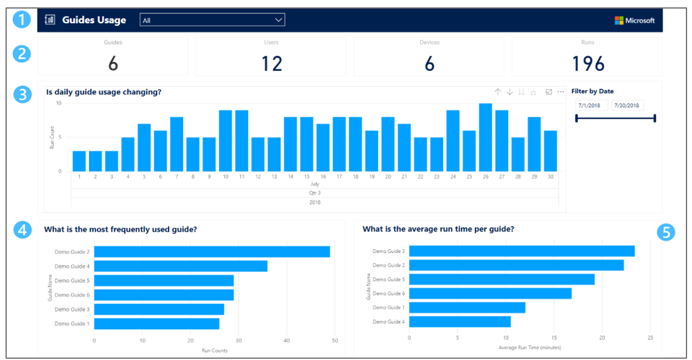
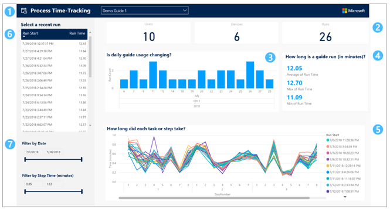
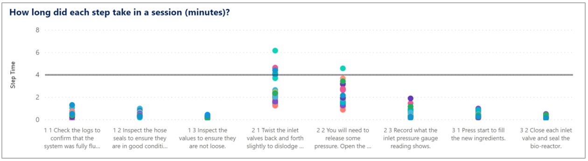

# Take a tour of Guides Analytics reports for Dynamics 365 Guides

Dynamics 365 Guides comes with two Power BI reports that you can use to analyze guide usage in your organization:

- Guide Usage report

- Process Time-tracking report

Once you have [set up and saved the Guides Analytics Template](analytics-ga-setup.md) on your computer, open [!include[pn-power-bi](../includes/pn-power-bi.md)] Desktop, and then open your saved 
report. [!include[pn-power-bi](../includes/pn-power-bi.md)] Desktop has a **File – Open – Recent** items list that's convenient for finding your previously 
opened reports.  

Both the Guides Analytics Template and Guides Analytics Demo files contain both reports.

## Guides Usage report

The Guides Usage report provides an overview of all the guides used in your organization. The following graphic illustrates the parts of the report.

 
 
1.	Which guides are included in the report?

    Use the drop-down menu to select which guides are used to generate the visuals and statistics in the report. Changing the selection in this drop-down menu changes 
    the values in all parts of the report. By default, the **All** option is selected to give you an overview of all your organization's guides.
   
2.	Use the summary statistics to quickly answer the following questions:

    - **Guides.** How many guides have been used by at least one operator to date? 
   
    - **Users.** How many users have operated at least one guide to date? 
   
    - **Sessions.** How many sessions have been completed to date? 
   
3.	Is daily guide usage changing? 

    The bar chart of session counts (y-axis) per day (x-axis) allows you to see trends such as increasing, decreasing, or stable daily guides usage. 
    
    > [!TIP]
    > Use drill up/drill down. By default, this chart shows the session counts per day. However, you can use Power BI’s drill-up functionality to summarize session counts 
    at the month or year level. [Learn more about how to use Drill mode in a Power BI visual](https://docs.microsoft.com/power-bi/consumer/end-user-drill).   

4.	Which guides have the most sessions, longest or shortest session times, or were operated most recently? 

    This table displays the following information per guide: current number of tasks and steps, the latest start time, the total number of sessions, as well as the maximum 
    and minimum session time observed to date. By default, this table is sorted by guide name, but you can select a column header to sort by that field. For example, 
    select **Max session time** to quickly find which guide has the longest session time. 
       
5.	Filters. There are situations in which you might want to filter the report to show just a subset of sessions. For example:

    - **Filter on a date range.** The date filter is useful for exploring guides usage on a particular date or across a time window of interest.

    - **Filter on completion status.** There are many ways to define whether a guide session is “complete”. For example, it may be important that the operator visited a 
    completion step. Alternatively, you may want to check that a minimum percentage of steps were visited in the session. You can filter on these items separately or 
    together. 

    - **Filter on role.** In most cases, you’ll want to filter guides by Operator role. You may want to filter by Author when you’d like to see data from sessions where an 
    Author is previewing their guide and experiencing it as an operator would.    
    
> [!IMPORTANT]
> If sessions have any missing data, they're not included in the Guides Analytics reports. For example, sessions that are currently in progress or that are comprised solely 
of visits to the alignment step will not be included. On rare occasions, session data can be lost due to connectivity or other technical issues, resulting in one or more 
step visits not being correctly recorded or the guide session being interrupted. In these cases, the session is excluded from the reports.

## Process Time-Tracking report

Use the Process Time-Tracking report to analyze step-level run-time data for a single guide. The following graphic illustrates the parts of the report.

 
1.	Which guides are included in the report?

    Use the drop-down menu to select a single guide. Changing the selection in the drop-down menu changes the values in all 
   parts of the report to correspond to data for that single guide. 
   
2.	Use the summary statistics to quickly answer the following questions: 

    - **Users.** How many users have operated this guide at least once? 
   
    - **Sessions.** How many total sessions of this guide have been completed to date? 
    
    - **Avg. session time.** What is the average session time for this guide?
   
3.	How long are individual steps on average? 

    This table shows you the tasks and steps for the selected guide. You can select the average step time or standard deviation (**Time SD**) column to quickly find the longest/shortest 
    steps or steps with most/least variability in time (standard deviation). If a step is visited multiple times in the same session, the total time spent on that step will 
    be used in the step average calculation. Select a row of this table to filter all the visuals in the report to just that step.
    
    Note that the report does not provide times for alignment and completion steps.
    
    > [!TIP]
    > - To sort by multiple columns, hold the Control key down while you select to add another column to the sort order. This is useful if you want to sort by task and step 
    number. [Learn more about how to change the sort order in a Power BI report](https://docs.microsoft.com/power-bi/consumer/end-user-change-sort).   
    > - To use multiple rows as filters, hold down the Shift key while you select each row. [Learn more about how to multi-select data elements in Power BI Desktop](https://docs.microsoft.com/power-bi/create-reports/desktop-multi-select).
    
4. How many minutes do sets of steps take on average?

   This stacked bar chart lets you quickly see differences in time per task, which can be valuable when trying to balance operation time across tasks. Each stacked bar corresponds to a task in the guide. The colored bars within each stack represent the steps of that task, ordered from the first step at the bottom to last step at the top. The height of each colored bar indicates the average operating time for that step and a repeating set of colors is used to distinguish them. The total stack height reveals the time for each task, which is also displayed numerically above each stack. You can make time comparisons between a subset of steps of interest by selecting steps within the steps table described above. These row selections in the steps table will filter all other charts in the report.
   
5.	Which sessions are the longest/shortest? 

    This table shows all the operator sessions for the selected guide. It includes information about each session’s total time, the percentage of all steps in the guide 
    that were visited at least once, and whether or not at least one completion step was visited. This table is helpful for finding the longest/shortest sessions or 
    investigating the completion status of individual sessions. Select a row of this table to filter all the visuals in the report to just that session. See the tips in the 
    previous step for sorting by multiple columns or using multiple rows as filters.
   
6.	How long did each task or step take? 

    This dot plot shows the time in minutes (y-axis) for each step of a guide (x-axis) to give you a sense for which steps take the most time and which steps have the most 
    variability in time. If a step is visited multiple times in the same session, the sum of the step visit times is displayed. Each guide session is shown in a separate 
    color. Sessions may have the same color if there are many sessions displayed. 
    
       
    
    > [!TIP]
    > - Use drill up/drill down. By default, this chart shows the time per step. However, you can use Power BI’s drill-up functionality to summarize time at the task level. [Learn more about how to use Drill mode in a Power BI visual](https://docs.microsoft.com/power-bi/consumer/end-user-drill).
    > - Add a constant line. To easily compare step times to a standard target time, you can add a constant line to your step time dot plot. [Learn more about how to use the Analytics pane in Power BI](https://docs.microsoft.com/power-bi/transform-model/desktop-analytics-pane).      
   
7.	Filters. There are situations in which you might want to filter the report to show just a subset of sessions. For example: 
   
     - **Compare versions of a guide.** The date filter is particularly useful if you made a revision to your guide (for example, added 
   or removed a step) and you want to show data for a given version of the guide that can be identified based on the date the guide 
   was created or edited. 
   
    - **Filter on completion status.** There are many ways to define whether a guide session is “complete”. For example, it may be important that the operator visited a 
    completion step. Alternatively, you may want to check that a minimum percentage of steps were visited in the session. Guides provides these measures and you can use 
    them separately or together to filter sessions in the Process Time-Tracking report. 
   
    - **Filter on role.** In most cases, you’ll want to filter guides by Operator role. You might want to filter by Author when you’d like to see data from sessions where 
    an Author is previewing their guide and experiencing it as an operator would.

     - **Filter out the outliers.** Unusually long step times can stretch the y-axis of the time-per-step line chart, which can make the 
   majority of data difficult to see. Use this slider to set the range of step times you want to visualize across the report so you 
   can ignore the outliers.  
   
> [!IMPORTANT]
> If sessions have any missing data, they're not included in the Guides Analytics reports. For example, sessions that are currently in progress or that are comprised solely 
of visits to the alignment step will not be included. On rare occasions, session data can be lost due to connectivity or other technical issues, resulting in one or more 
step visits not being correctly recorded or the guide session being interrupted. In these cases, the session is excluded from the reports.

## See also

- [Overview of Guides Analytics Power BI templates](analytics-guide.md)

- [Set up Guides Analytics reports](analytics-ga-setup.md)

- [Share Guides Analytics reports](analytics-ga-share-reports.md)

- [Overview of analyzing and integrating Dynamics 365 Guides operations data](analytics-overview.md)

- [What data is collected and how can you use it?](analytics-data-collected.md)

