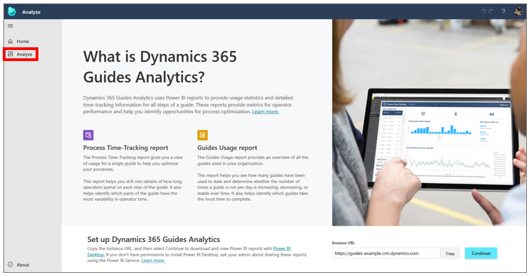
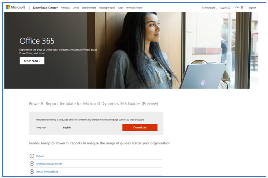
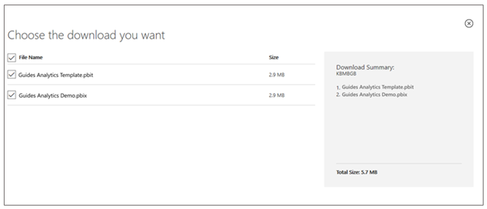
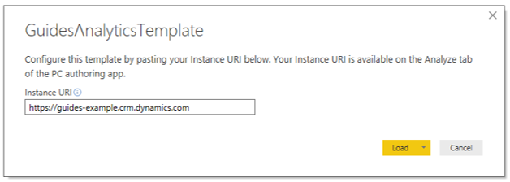
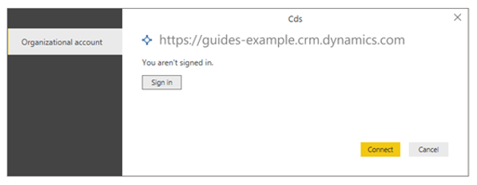
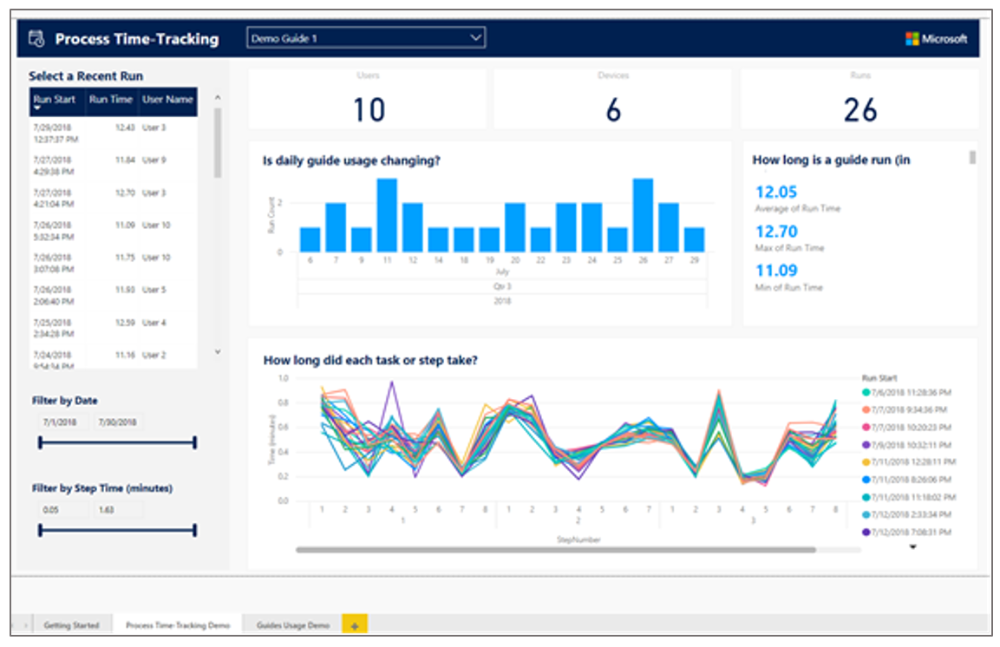

# Set up Guides Analytics reports for Dynamics 365 Guides

You can set up [Guides Analytics Power BI reports](analytics-guide.md) for Microsoft Dynamics 365 Guides through the PC authoring app.

> [!NOTE]
> Guides Analytics requires the freely available [Power BI Desktop application](https://powerbi.microsoft.com/get-started/). Talk to your admin if you don't have permission 
to install [!include[pn-power-bi](../includes/pn-power-bi.md)] Desktop on your computer.   The latest Guides Analytics Power BI report templates require Guides solution version 500.3.1.2 or later. If you have an earlier solution version, you can [download the previous version of Guides Analytics Power BI report templates](https://www.microsoft.com/en-us/download/details.aspx?id=102670).

1.	In the [!include[pn-dyn-365-guides](../includes/pn-dyn-365-guides.md)] PC authoring app, select the **Analyze** tab, copy the highlighted Instance URL text, and then 
select **Continue** to go to the [Microsoft Download Center](https://aka.ms/guidesreport). 
   
          
 
2.	In the [!include[cc-microsoft](../includes/cc-microsoft.md)] Download Center, select **Download**. 

     

    You'll be prompted to choose the files to download: 

     - **Guides Analytics Template.** You can configure this [!include[pn-power-bi](../includes/pn-power-bi.md)] template file to display 
     [!include[pn-dyn-365-guides](../includes/pn-dyn-365-guides.md)] time-tracking data from within your organization. 
   
     - **Guides Analytics Demo.** You can use this [!include[pn-power-bi](../includes/pn-power-bi.md)] file to view an example data set. It does not require any 
     configuration and lets you get an overview of Guides Analytics reports before you even create your first guide.  

     We recommend downloading both files. 

        
  
3.	Open the downloaded Guides Analytics Template.pbit file with [!include[pn-power-bi](../includes/pn-power-bi.md)] Desktop. Use your 
[!include[pn-dyn-365-guides](../includes/pn-dyn-365-guides.md)] username and password if you're prompted to sign in to [!include[pn-power-bi](../includes/pn-power-bi.md)].  
 
4.	When prompted, paste the Instance URL into the text box as shown here. This is the same Instance URL you copied from the **Analyze** tab in the PC authoring app in step 1. 

     
 
     You might see the following error message saying you aren't signed in: 
  
     

     In that case, select **Sign in**, and enter your [!include[pn-dyn-365-guides](../includes/pn-dyn-365-guides.md)] username and password to connect the template 
     to your organization's secure [!include[pn-dyn-365](../includes/pn-dyn-365.md)] environment. 

5.	You should now see the template populated with data from your own guides. If you haven't operated any guides yet, your reports might appear blank. The reports are 
described in detail in [Take a tour of Guides Analytics reports](analytics-ga-reports.md). 
 
     
 
6.	Save the configured reports to a convenient place on your computer for later use. 

7.	Select **Refresh** on the **Home** ribbon to update your reports with the most recent [!include[pn-dyn-365-guides](../includes/pn-dyn-365-guides.md)] data. 

## See also

- [Overview of Guides Analytics Power BI templates](analytics-guide.md)

- [Take a tour of Guides Analytics reports](analytics-ga-reports.md)

- [Share Guides Analytics reports](analytics-ga-share-reports.md)

- [Overview of analyzing or integrating Dynamics 365 Guides operations data](analytics-overview.md)

- [What data is collected and how can you use it?](analytics-data-collected.md)

[!INCLUDE[footer-include](../includes/footer-banner.md)]
