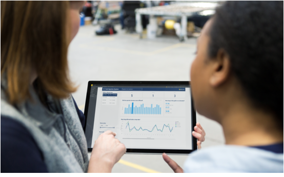

# Overview of analyzing and integrating Dynamics 365 Guides usage data

> [!IMPORTANT]
> We recently identified an issue with an update where Dynamics 365 Guides operator sessions data (for both authors and operators) has not been saved to Microsoft Dataverse. Users may notice that session data was not being recorded as early as October 15, depending on region. [Learn more](known-issues-hololens-app.md)

When operators use the Microsoft Dynamics 365 Guides HoloLens app, data about app and guide usage is automatically stored in your private and secure Dynamics 365 environment where it can be analyzed in either of the following ways:

- Using the [Guides Analytics Power BI templates](analytics-guide.md)

- Integrated into your own custom workflows. For example, you could create a custom workflow in Microsoft Power Automate or by using third-party visualization tools or systems.

### How it works

#### 1. Sign in to Dynamics 365 Guides

Data for all users is automatically stored in the [MR Apps Session table](analytics-data-collected.md). 

#### 2. Author a guide in the PC or HoloLens app

Data for all authors is automatically stored in the [Guide Author Session table](analytics-data-collected.md). 

#### 3. Operate a guide

**Next** and **Back** button interactions are recorded to determine the time spent on each step. Operator data is automatically stored in the [Guides Session table](analytics-data-collected.md). 

#### 4. Trigger alerts or visualize data

Use the Power Platform to analyze and act on your data.

> [!NOTE]
> Guides operations data is intended to help supervisors and managers derive insights regarding operational efficiencies and usage of Dynamics 365 Guides. This feature is not intended for use in making (and should not be used to make) decisions that affect the employment of an employee or group of employees, including compensation, rewards, seniority, or other rights or entitlements. Customers are solely responsible for using Dynamics 365, this feature, and any associated feature or service in compliance with all applicable laws, including laws relating to accessing individual employee analytics and monitoring. Customers are encouraged to have a mechanism in place to inform their users that analytics relating to their guides usage is collected. 

## See also

- [What data is collected and how can you use it?](analytics-data-collected.md)
- [Overview of Guides Analytics Power BI templates](analytics-guide.md)
- [Set up Guides Analytics reports](analytics-ga-setup.md)
- [Take a tour of Guides Analytics reports](analytics-ga-reports.md)
- [Share Guides Analytics reports](analytics-ga-share-reports.md)

[!INCLUDE[footer-include](../includes/footer-banner.md)]
