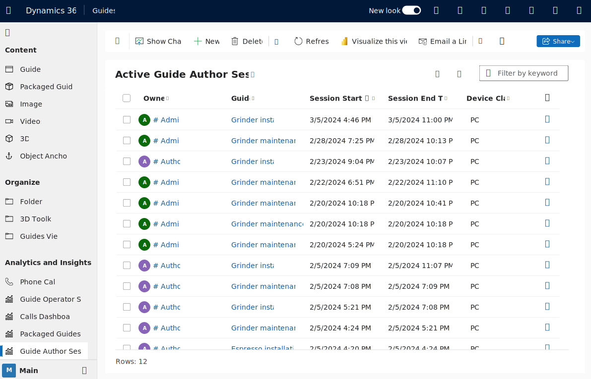

# Overview of analyzing and integrating Dynamics 365 Guides usage data

When operators use the Microsoft Dynamics 365 Guides HoloLens app, data about the app and guide usage is automatically stored in your private and secure Dynamics 365 environment. This data can be analyzed in either of the following ways:

- Using the [Guides Analytics Power BI templates](analytics-guide.md).

- Integrating into your own custom workflows. For example, you could create a custom workflow in Microsoft Power Automate or by using third-party visualization tools or systems.

Data capture has the following limitations:

- Data isn't collected if an operator is working in offline mode.

- Data might be lost if an internet connection is intermittent.

For best data capture results after an intermittent internet connection is restored, wait for data to be uploaded to Microsoft Dataverse before closing the app.

## How it works

- Sign in to Dynamics 365 Guides: Data for all users is automatically stored in the [MR App Session table](#mr-app-session-table).

- Author a guide in the PC or HoloLens app: Data for all authors is automatically stored in the [Guide Author Session table](#guide-author-session-table).

- Operate a guide: **Next** and **Back** button interactions are recorded to determine the time spent on each step. Operator data is automatically stored in the [Guide Session table](#guide-session-table) and the [Guide Session Step Visit table](#guide-session-step-visit-table).

- Trigger alerts or visualize data: Use Power Platform to analyze and act on your data.

  

> [!NOTE]
> Guides operations data is intended to help supervisors and managers derive insights regarding operational efficiencies and usage of Dynamics 365 Guides. This feature is not intended for use in making (and should not be used to make) decisions that affect the employment of an employee or group of employees, including compensation, rewards, seniority, or other rights or entitlements. Customers are solely responsible for using Dynamics 365, this feature, and any associated feature or service in compliance with all applicable laws, including laws relating to accessing individual employee analytics and monitoring. Customers are encouraged to have a mechanism in place to inform, and if necessary collect consent from their users that analytics relating to their guides usage is collected.

### MR App Session table

Dynamics 365 Guides includes an MR App Session table that you can use to determine the overall usage of the product in your organization. Use this table to help you determine where to assign Dynamics 365 Guides licenses.

The MR App Session table stores a record whenever a user signs into an environment. The table stores the following information: when the user signed in, the session type (sign-in or suspend, which tracks when a user resumes using the device), device class (PC or HoloLens), and the User ID. For more information, see the [Microsoft Dataverse table (entity) reference](developer-entity-reference.md).

> [!NOTE]
> Data in the MR App Session table is accessible by admin users or by scripted actions that act as admin users.

### Guide Author Session table

Each row in the Guide Author Session table corresponds to a HoloLens or PC app interaction with a guide in Authoring mode. Information about the session, such as User ID, guide name, start time, end time, and device class is recorded. For more information, see the [Microsoft Dataverse table (entity) reference](developer-entity-reference.md).

### Guide Session table

Each row in the Guide Session table corresponds to an operation of a guide in HoloLens Operate mode: whether from beginning to end of the guide or involving just a few steps. Information about the guide session is also recorded. For example: start and end time, total operating time, and different completion options. For more information, see the [Microsoft Dataverse table (entity) reference](developer-entity-reference.md).

> [!IMPORTANT]
> When a user **enters a Completion step**, that information is logged in the Guide Session table. This is different from the RunEnd event in the [Guide Event table](developer-entity-reference.md#dynamics-365-guides-tables), which is generated when an **operator closes a guide**.

### Guide Session Step Visit table

Each row in the Guide Session Step Visit table corresponds to an operator’s visit to a step in HoloLens Operate mode. Information is recorded for each step visit such as start and end time and step operating time. If an operator visited a step multiple times, perhaps by navigating backward and forward in the guide, each visit would result in a separate row in this table. For more information, see the [Microsoft Dataverse table (entity) reference](developer-entity-reference.md).

## What can you do with the data?

With the data stored in Microsoft Dataverse tables, you can analyze and integrate this data into your workflows in ways that make sense for your business. You can get started by:

- Using the [Guides Analytics Power BI templates](analytics-guide.md).

- Building your own custom integrations with this data.

Here are some examples of what you can do:

- **Monitor completion status of a guide and trigger workflows.** The Guide Session table includes measurements of guide completion status that you can use with Microsoft Power Automate to trigger workflows. For example, send notifications when an operator has completed a guide. The Guide Session table provides two different measurements that you can use individually or together as appropriate for your use case.

  - **Percent Of Steps Visited**: calculated by taking the number of unique visited steps in a session and dividing by the total number of steps in the guide. This measurement is useful for linear guides in which you expect operators to visit every step.

  - **Visited Completion Step**: defines whether a completion step was visited during the guide session. If the guide has multiple completion steps, this value is **Yes** if any one of the completion steps was visited during the session.  

- **Analyze session and step times to optimize process.** By analyzing operating times across all guide sessions and steps, you can identify processes that are taking more than a given target time or have high time variability. Your analysis might indicate areas for process improvement. The [Guides Analytics Power BI templates](analytics-guide.md) can help you get started with these analyses.

   > [!TIP]
   > When the HoloLens app is suspended manually or due to inactivity, the current step visit ends. A new step visit is created once the app resumes. The app suspension time is not included in the values of the **Step Duration Seconds** column. These step visit durations for a session are summed together and recorded in the Guide Session table’s **Active Session Duration Seconds** column. As a result, the **Active Session Duration Seconds** values do not include any app suspension time and offer a higher quality measurement of operation time than the simple difference between session start and end time stamps.

## Get started

To get started, use one of the following options:

- [Guides model-driven app](model-driven-app-overview.md). Under **Analytics and Insights**, use the **Active Guide Sessions** view to inspect guide sessions.

  

  Double-click on an individual session row to see more details about the session and access the **Session History** tab that contains information about individual step visits.  

  

- [Guides Analytics Power BI templates](analytics-guide.md). To set up Guide Analytics, see [Set up Guides Analytics reports](analytics-ga-setup.md).  

## See also

- [Overview of Guides Analytics Power BI templates](analytics-guide.md)
- [Set up Guides Analytics reports](analytics-ga-setup.md)
- [Take a tour of Guides Analytics reports](analytics-ga-reports.md)
- [Share Guides Analytics reports](analytics-ga-share-reports.md)

[!INCLUDE[footer-include](../includes/footer-banner.md)]
