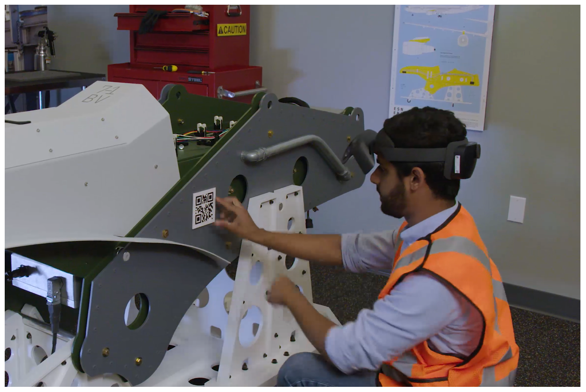

# Anchor your holograms to the real world in Dynamics 365 Guides

When you create a guide with the [!include[cc-microsoft](../includes/cc-microsoft.md)] [!include[pn-dyn-365-guides](../includes/pn-dyn-365-guides.md)] PC app, one of the first steps is to select an anchoring method. When you anchor a guide, you spatially synchronize it with your real-world environment (for example, a factory floor). Anchors help holograms determine where they are in the real world. You must create an anchor for your guide before it will work on [!include[pn-hololens](../includes/pn-hololens.md)].

It's crucial to ensure that holograms are aligned as precise as possible. If holograms are misaligned, your instructions may show actions at incorrect locations, which can result in operator confusion or damage to parts.

## Three ways to anchor a guide

There are three ways to anchor a guide:

- **QR code anchor (recommended)**. When you use a QR code anchor, you align your guide by gazing at a printed QR code anchor that's attached to a physical object in the real world. QR code anchoring is recommended, because it's the most accurate method, and you can print the anchor at different sizes. 

    > [!NOTE]
    > QR code anchoring isn't available on HoloLens 1 devices.

- **Circular code anchor**. When you use a circular code anchor, you align your guide by gazing at a printed circular code anchor that's attached to a physical object in the real world. 

- **Holographic anchor**. When you use a holographic anchor, you align your guide to a digital 3D hologram that's overlaid on a physical object in the real world. You might have to use a holographic anchor if:

    - It isn't feasible to attach a QR code anchor or circular code anchor because the guide is authored in a different location than where the parts are.

    - It isn't feasible to attach a QR code anchor or circular code anchor because of moving parts.

    - You can't guarantee that the placement of the QR code anchor or circular code anchor will be the same every time.

    - A part is too small to attach a QR code anchor or circular code anchor.

## Overall process for creating anchors

Ragardless of which type of anchor you want to create, you always start with the Anchor wizard in the PC app. Use the following links to learn how to create different types of anchors in the PC app.

- [Create a QR code anchor](pc-app-anchor-qr-code.md)

- [Create a circular code anchor](pc-app-anchor-circular-code.md)

- [Create a holographic anchor](pc-app-anchor-holographic.md)

After creating the anchor in the PC app, you use the HoloLens app to anchor your guide in the real world, whether you're an author or operator. Use the following links to learn how to anchor a guide, depending on whether you're an author or an operator:

- [Anchor a guide if you're an author](hololens-app-anchor.md)

- [Anchor a guide if you're an operator](operator-anchor.md)

### How HoloLens establishes anchor position, scale, and orientation

During scanning, the forward-facing camera on [!include[pn-hololens](../includes/pn-hololens.md)] is used to measure the horizontal and vertical distances on the anchor. This information is combined with the actual anchor values that are stored internally in the application (49.2 mm and 32.8 mm) to establish the anchor's precise position, scale, and orientation in space.

[!include[pn-dyn-365-guides](../includes/pn-dyn-365-guides.md)] includes an additional correction method that lets users improve the alignment by manually overriding any offset that is generated by the variability of the acquired image and anchor size. For more information, see [Ensuring accurate placement of holograms for circular code anchors](known-issues-hololens-app.md#how-do-i-address-hardware-offset-in-hololens-1-devices-to-ensure-accurate-placement-of-holograms-for-circular-code-anchor-alignment).

## Factors that affect anchoring accuracy

The following factors can affect the accuracy of the anchor and/or user perception of the alignment:

- **Interpupillary distance (IPD) setting.** IPD is the distance between the center of the user's pupils. Because different users might have different IPDs, it's crucial that the appropriate IPD be set, so that [!include[pn-hololens](../includes/pn-hololens.md)] can adapt its display. An incorrect IPD setting can cause inaccurate perception. It can also cause instability of holograms in space. 

To calibrate your IPD on **HoloLens 2** make sure to go through the eye calibration app when prompted. This will not only calibrate IPD but will also auto-correct hologram position in case the device moves on the user's head. 

To calibrate your IPD on **[!include[pn-hololens](../includes/pn-hololens.md)] 1**, [use the HoloLens Calibration app](https://docs.microsoft.com/windows/mixed-reality/calibration).

- **Pre-scanning the environment.** [!include[pn-hololens](../includes/pn-hololens.md)] actively scans its environment for visible features to map its surroundings. This scan occurs whenever the device is turned on and a user is signed in. It occurs regardless of whether you're in the [!include[pn-hololens](../includes/pn-hololens.md)] shell or running apps. [!include[pn-hololens](../includes/pn-hololens.md)] constantly improves the accuracy of these maps as it scans the environment from different viewpoints and stores the maps on the device. Holograms are placed in relation to these maps. The more accurate the map, the more accurate the hologram placement.

    Before [!include[pn-dyn-365-guides](../includes/pn-dyn-365-guides.md)] is used on a [!include[pn-hololens](../includes/pn-hololens.md)] that hasn't been used in a particular environment, have the user put on the [!include[pn-hololens](../includes/pn-hololens.md)], sign in to the device, and walk around the space where hologram instructions have been placed or will be placed. Although the user can perform this step from the [!include[pn-hololens](../includes/pn-hololens.md)] shell, we recommend that the **Start** menu be hidden, so that the user can see the space as he or she walks around. By walking at a leisurely pace while slowly looking up and down, the user will give the device an opportunity to find features and construct accurate maps. This process is called "pre-scanning," because it's done before you run [!include[pn-dyn-365-guides](../includes/pn-dyn-365-guides.md)]. You must complete this process only once for each environment, because [!include[pn-hololens](../includes/pn-hololens.md)] stores the maps that it creates on the device and remembers the spaces that it has scanned.

    Very dark or very bright environments, or environments that include very reflective surfaces (mirrors), dark surfaces, or featureless surfaces, negatively affect the ability of [!include[pn-hololens](../includes/pn-hololens.md)] to recognize the space. If [!include[pn-hololens](../includes/pn-hololens.md)] can't correctly recognize the space, hologram position and stability are affected in turn.

- **Impact of device positioning on [!include[pn-hololens](../includes/pn-hololens.md)] 1.** [!include[pn-hololens](../includes/pn-hololens.md)] uses a novel display technology to project images in the user's field of vision, creating holograms. On [!include[pn-hololens](../includes/pn-hololens.md)] 1, the way that users wear a device on their head has a huge impact on the perceived position of the holograms. The best way to understand this point is to adjust the device positioning while you align holograms to their physical counterparts in [!include[pn-dyn-365-guides](../includes/pn-dyn-365-guides.md)]. Notice how the alignment of holograms is affected when you shift the device left and right, up and down, or forward and backward. Users should wear the device in a consistent way, and they should understand that subtle shifts in device positioning might not feel different but can cause significant changes in perceived hologram locations. On [!include[pn-hololens](../includes/pn-hololens.md)] 2, issues with device positioning are addressed through eye tracking.

## What's next?

[Create a QR code anchor in the PC app](pc-app-anchor-qr-code.md) 
[Create a circular code anchor in the PC app](pc-app-anchor-circular-code.md) 
[Create a holographic anchor in the PC app](pc-app-anchor-holographic.md) 
[Change from one anchoring type to another in the PC app](pc-app-anchor-change-type.md) 
[Anchor your guide as an author in the HoloLens app](hololens-app-anchor.md) 
[Anchor your guide as an operator in the HoloLens app](operator-anchor.md) 

