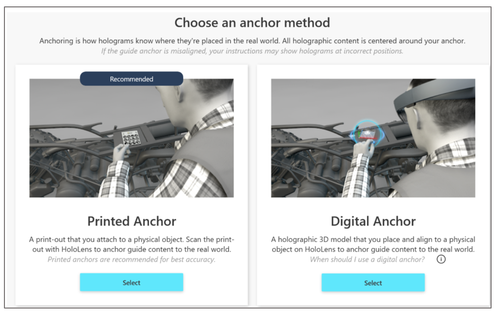
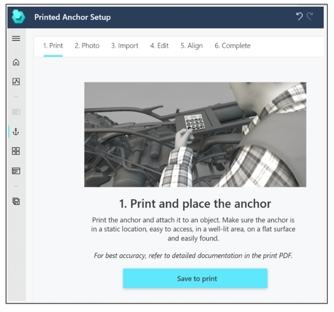
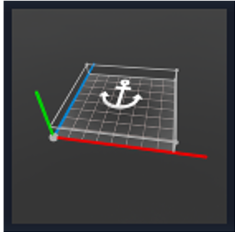

# Choose an anchoring method for your guide

After you name your guide, you’ll see the **Outline** page and a prompt to create an anchor.

- Select **Set your anchor now** to display the **Choose an anchor method** screen.

## How anchoring works and types of anchors

Anchoring is used to spatially sync your instructions to the real world. When you anchor your guide, your instructions coincide 
with the space they live in and become meaningful. Your content is centered around this anchoring point.

There are two types of anchors:

- With a **printed anchor** (recommended), you attach a printed marker to a physical object in the real world. After creating the guide, 
to anchor the guide in the real world, you gaze at the marker using [!include[pn-hololens](../includes/pn-hololens.md)].

- With a **digital anchor**, you import a 3D representation (such as a CAD model or scanned model), and then lay that representation directly over a physical object in the real world. After creating the guide, to anchor it in the real world, 
you use a gesture.

**It’s extremely important to ensure that anchoring is correct and as precise as possible.** If anchoring is not correct, your 
instructions can cause operator confusion and potentially costly damage. For example, an operator could drill a hole in the wrong 
place or assemble the wrong part. 

Printed anchors provide more accuracy. You might want or need to use a digital anchor, however, for any of the 
following reasons:

- It might not be feasible to attach a printed anchor because the authoring is done in a location different than where the parts are located.

- It might not be feasible to attach a printed anchor due to moving parts.

- You can’t guarantee that the placement of the printed anchor will be the same every time.

- A part is too small to attach a printed anchor to.

> [!NOTE]
> For best accuracy, use the **same** printer anchor for authoring and operating. 

## Anchor your guide by using a printed anchor

Using a printed anchor involves three basic steps:

1.	Print out a marker.

2.	Attach the marker to a physical object in the real world.

3.	Gaze at the marker to anchor the guide.

To print the marker:

1.  In the **Choose an anchor method** screen, in the **Printed Anchor** section, choose **Select**.

    

2.  In the **Print and place the anchor** screen, select **Save to print** to save the marker.pdf file to your PC.

    

3.	Open the marker.pdf file on your PC in Adobe Acrobat Reader.

4.	On the **File** menu, select **Print**.

5.	Under **Page Sizing & Handling**, select the **Actual size** option.

    

4.	Print the last page of the document on matte stock (glossy materials can affect scanning). 

5.	After printing, make sure the marker spacing matches the measurements shown in the following illustration:

    
 
> [!NOTE]
> If the marker spacing is not within +/- 0.1 mm, select the **Custom Scale** option in the **Print** dialog box, and then change the 
percentage to compensate for the size discrepancy. For example, if you print the marker, and the result is 49 mm, you need to 
change the scale to 100.4% to get 49.196 mm, which would be within tolerance. You might also need to adjust the hardware offset in Hololens 1 devices to ensure accurate placement of 3D content. [Learn more about adjusting for hardware offset](https://docs.microsoft.com/dynamics365/mixed-reality/guides/known-issues#uploading-new-3d-models-with-names-matching-any-of-the-pre-packaged-models-in-the-3d-toolkit-will-overwrite-the-files-in-the-3d-toolkit).

### Best practices for printed anchors

Keep the following in mind when working with printed anchors:

- **Size.** Make sure that your printed anchor is the exact size indicated in this document. Incorrect anchor size causes guide misalignment. 

  - Some applications and printers might change the size of the image.
  
  - If the printed anchor is larger than indicated, [!include[pn-hololens](../includes/pn-hololens.md)] interprets the scale difference in distance. This causes the anchor to be identified as closer than it really is. 
  
  - Printing from the .pdf file (as described earlier in this topic) is the best way to ensure that the anchor is not resized. 
  
- **Location.** Place the anchor in a location on the physical object in a location that’s easy to access and out of the way.

  - Anchor placement should ideally be central to the steps being done.
  
  - Content placed farther away from the anchor will be less accurate.
  
  - Place the anchor where operators can quickly rescan to realign at any time.
  
  - Take a photo or video to document the anchor placement, and add it to the guide instructions to increase operator confidence. To capture a photo or video from [!include[pn-hololens](../includes/pn-hololens.md)], see [Mixed reality capture](https://docs.microsoft.com/windows/mixed-reality/mixed-reality-capture).
  
- **Scanning angle.** Make sure you’re facing the anchor straight on at the correct distance when gazing at it. 

  - Scanning from an angle can cause misalignment.
  
  - Ideal scanning range is from 60 to 80 cm.

### How HoloLens establishes anchor position, scale, and orientation

When scanning, the forward-facing camera on [!include[pn-hololens](../includes/pn-hololens.md)] is used to measure the horizontal and vertical distances on the anchor. 
This information is combined with the actual anchor values stored internally in the application (49.2 mm and 32.8 mm, as indicated 
in the preceding illustration) to establish the anchor's precise position, scale, and orientation in space.

## Anchor your guide using a digital anchor

Digital anchoring involves two basic steps:

1.	Using the PC authoring app, import a 3D representation of a physical object. This could be a CAD model used to create the physical object or a scanned model after fabrication. If you don't have a 3D representation, you can skip this step and use the preset 3D model included in [!include[pn-dyn-365-guides](../includes/pn-dyn-365-guides.md)].

2.	Using [!include[pn-hololens](../includes/pn-hololens.md)] Author mode, place the 3D digital representation directly over a physical part.

To import a 3D representation: 

1.	Open the PC authoring app.

2.	On the right side of the screen, select the **Import** command. 

3.	In the **Open** dialog box, select the 3D representation that you want to use, and then select **Open**.

    This adds the 3D representation to the **3D parts** section of the library.
    
4.	In the library, select **3D parts**, and then drag your 3D representation to the digital anchor box. If you don't want to select a digital anchor at this time, select **Next**. The guide will be created with a preset 3D model that looks like this:

    
   
> [!NOTE]
> It’s a good practice to take a photo or video of the base physical object and location and upload the photo or video to the 
**digital anchor** reference box. To capture a photo or video from [!include[pn-hololens](../includes/pn-hololens.md)], see [Mixed reality capture](https://docs.microsoft.com/windows/mixed-reality/mixed-reality-capture). You might also want to customize the instructions in the **Operator instructions** box to provide more specific directions.

When you switch to [!include[pn-hololens](../includes/pn-hololens.md)] authoring, you'll use a gesture to place the 3D representation directly over the physical object in your work environment.

### Best practices for digital anchors

- **Size.** Select a digital anchor that’s not too small or too big. 

  - Medium-size digital objects are best. Very small or very large holograms are difficult to manipulate. 
  
  - Shoebox size or slightly larger is ideal.
  
- **Placement.** Choose a digital anchor that’s as close to the center of the work being done as possible. The farther you place digital content away from the digital anchor, the less accurate it becomes.

- **Shape.** Select a digital anchor that has a non-uniform or uncommon shape. Unusual shapes are easiest to align to.

  - Avoid objects that are mirrored. This can cause 180-degree misalignment.
  
  - Pick shapes that have clear edges and corners to help orient your content properly.
  
- **Recognizable.** Select a digital anchor that’s obvious, easily recognizable, and easy for the operator to find. Make sure that they can access the object without any obstructions.

- **Alignment direction.** Always align the digital anchor to your physical object from the same direction. This maximizes repeatability for operators.

  - Placement from different perspectives can cause misalignment.
  
  - Always look at it from multiple angles to ensure the digital anchor is aligned to the physical object.

## Ensure accuracy of anchors (alignment)
Independent from the method used for anchoring, these additional factors can impact the accuracy of the alignment and/or user perception of the alignment:

- **Interpupillary distance (IPD) setting.** The IPD is the distance between the center of the user’s pupils. It’s crucial to set the appropriate IPD to enable [!include[pn-hololens](../includes/pn-hololens.md)] to adapt its display because different users might have different IPDs. An incorrect IPD setting can result in a wrong perception of holograms in space as well as instability of holograms. [Use the HoloLens Calibration app to calibrate your IPD](https://docs.microsoft.com/en-us/windows/mixed-reality/calibration). 

- **Pre-scanning the environment.** [!include[pn-hololens](../includes/pn-hololens.md)] actively scans its environment for visible features  to create maps of its surroundings. This happens whenever the device is turned on and a user is signed in. It’s independent of whether you’re in the [!include[pn-hololens](../includes/pn-hololens.md)] shell or running apps. [!include[pn-hololens](../includes/pn-hololens.md)] constantly improves the accuracy of these maps as it scans the environment from different viewpoints and stores them on the device. Holograms are placed in relation to these maps. The more accurate the map, the more accurate the hologram placement.
Before using [!include[pn-dyn-365-guides](../includes/pn-dyn-365-guides.md)] on a [!include[pn-hololens](../includes/pn-hololens.md)] that’s unfamiliar with its environment, the user should put on the [!include[pn-hololens](../includes/pn-hololens.md)], sign into the device, and walk around the space where hologram instructions are placed or will be placed. This can be done while the user is in the [!include[pn-hololens](../includes/pn-hololens.md)] shell, but we recommend the user hide the **Start** menu to see the space as they walk around. Walking at a leisurely pace while slowly looking up and down will give the device the opportunity to find features and construct accurate maps. This is called "pre-scanning" because it’s done before you run [!include[pn-dyn-365-guides](../includes/pn-dyn-365-guides.md)]. You only need to do this once for each environment because [!include[pn-hololens](../includes/pn-hololens.md)] stores the maps it created on the device and remembers the spaces it has scanned.

   Very dark or very bright environments, or environments that include very reflective surfaces (mirrors), dark surfaces, or featureless surfaces, cause a negative impact on [!include[pn-hololens](../includes/pn-hololens.md)]’s capability to recognize the space, which will impact hologram position and stability.

- **Impact of device positioning.** [!include[pn-hololens](../includes/pn-hololens.md)] uses a novel display technology to project images in the user’s field of view, which creates holograms. The way a user wears a device on their head has a huge impact on the perceived position of the holograms. 

   The best way to understand this is to adjust the device positioning while aligning holograms to their physical counterparts in [!include[pn-dyn-365-guides](../includes/pn-dyn-365-guides.md)]. Observe how the alignment of holograms is affected when you shift the device left and right, up and down, and when you slide the display forward and backward. Users should wear the device in a consistent way and understand that subtle shifts in device positioning might not feel different but can lead to significant changes to perceived hologram locations.
