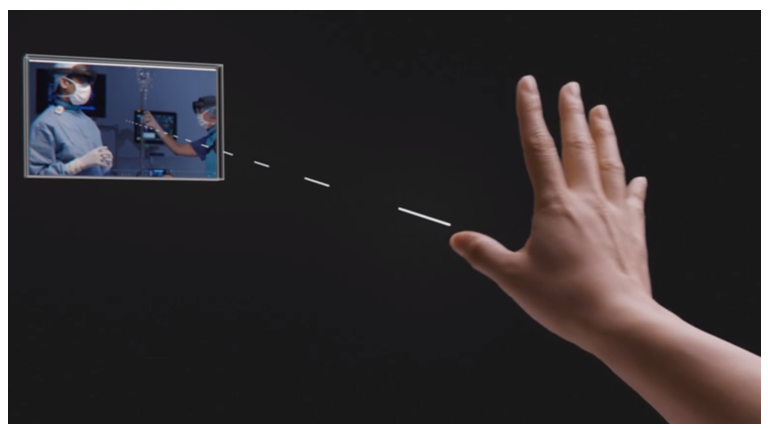
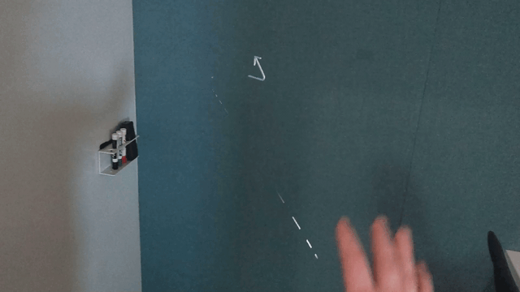

# HoloLens 2 gestures for authoring and navigating in Dynamics 365 Guides

Hand-tracking in Microsoft [!include[pn-hololens](../includes/pn-hololens.md)] 2 provides instinctual interactions for authors. You can select and position holograms by using direct touch, just as if they were real objects. You can also use hand rays to interact with holograms that are out of reach.

> [!NOTE]
> If you're using HoloLens 1, see [Authoring and navigating gestures for HoloLens 1](authoring-gestures.md).

## Basic actions and gestures to know

To author or navigate in [!include[pn-hololens](../includes/pn-hololens.md)] 2, you must know how to do these actions and gestures:

- **Touch**. With [!include[pn-hololens](../includes/pn-hololens.md)] 2 and [!include[pn-dyn-365-guides](../includes/pn-dyn-365-guides.md)], you can reach out and touch or grab holograms. This approach is the easiest and most intuitive way to author guides. As the following animation shows, when [!include[pn-hololens](../includes/pn-hololens.md)] sees your hand, a floating pointer (similar to a mouse pointer) appears near the tip of your index finger to help you target elements.

    

    > [!IMPORTANT]
    > Use touch interaction to work with parts that you've placed in the world. In [!include[pn-dyn-365-guides](../includes/pn-dyn-365-guides.md)], instruction cards (Step cards) are meant to be kept out of the way so that they are out of reach for touch interaction.

- **Hand ray**. To use a hand ray, hold your hand in front of you, with your palm facing away. A laser pointer (hand ray) appears. After you target an item with your hand ray, you can act on that target in different ways, as described later in this topic.

    

- **Gaze**. If the item has a selection box or circle (gaze/dwell button), you can select the item by gazing at it. The item is selected when the box or circle is filled. Often, you will use gaze and air tap together. When you gaze, turn your whole head, not just your eyes. The pointer will follow.

    

- **Air tap**. Hold your hand straight out in front of you in a loose fist, point your index finger straight up toward the ceiling, tap your finger down, and then quickly raise it back up again.

    

- **Air tap and hold**. Start by air tapping, but keep your finger down instead of raising it back up.

### Gesture frame

It's also important to know about the gesture frame. [!include[pn-hololens](../includes/pn-hololens.md)] 2 has sensors that can see a few feet to each side of you. When you use gestures, you must keep them inside that frame. Otherwise, [!include[pn-hololens](../includes/pn-hololens.md)] won't see them. As you move around, the frame moves with you. When your hand is inside the frame, a hand ray will appear from your palm. If [!include[pn-hololens](../includes/pn-hololens.md)] can't see your hands, and you're looking at a user interface (UI) element, you'll see the gaze pointer in the center of your display.

## Work with close-up UI elements and holograms by using touch

For close-up UI elements and holograms, you can just reach out and touch or grab them with your hands. When your hand gets close enough to touch or grab a hologram, a visual appears around the control to let you know what that control does.

### Select a button

- Push the button with your index finger.

### Select a hologram

- Touch the hologram with your index finger. The controls will appear.

    

### Move a hologram

- Grab the large white sphere in the center of the controls with your hands, and move it where you want. The sphere will light up based on where your index finger is in relation to it.

    

### Rotate a hologram

- Pinch one of the blue spheres (rotation controls), and rotate it the way that you want. Arrows appear around the rotation controls to show which direction they can be rotated.

    **Left/right rotation**

    

    **Up/down rotation**

    

    **Free rotation**

    

### Change the size of a hologram

- Pinch the blue dial (**Scale** control) on the right side of the part. A slider track appears above and below the **Scale** control to show scaling up or down.

    

### Edit a hologram

- Touch the **Edit hologram** button with your finger, and then touch the command that you want.

    

## Work with far-away UI elements and holograms by using hand rays and gaze

You can use hand rays to work with UI elements and holograms from a distance. You can use gaze to work with the instruction card from a distance, but you can't use it to manipulate holograms.

> [!TIP]
> When you author a guide, if your hand is visible, hand rays are enabled and gaze is disabled. To use gaze, place your hands at your sides, so that the [!include[pn-hololens](../includes/pn-hololens.md)] 2 device can't see them.

### Select a button or UI element with a hand ray

1. Point your hand ray at the object to target it.

2. Follow one of these steps:

    - Air tap to select the object.

    - If there is a selection box or circle, hold your hand ray on it until it's selected.

        

### Manipulate a hologram by using a hand ray

1. Point your hand ray at the object to target it. Controls appear around the hologram.

    

2. Follow one of these steps:

    - To move the hologram, air tap and hold the hand ray, move the hologram where you want it, and then release.

        

    - To rotate the hologram, air tap and hold one of the blue spheres, rotate the hologram, and then release.

        **Left/right rotation**

        

        **Free rotation**

        

    - To change the size of a hologram, air tap and hold the **Scale** control. While you hold the control, move it up or down along the slider track.

        

    - To edit the hologram, air tap the **Edit** button, and then air tap the selections that you want.

        

### Select an item on the instruction card by using gaze

1. Put your hands at your sides, and gaze at the button or UI element.

2. Continue to gaze until the button is filled.

    

## Open the Start menu

On HoloLens 2, you can use either one hand or two hands to open the **Start** menu. If you're ever unsure what to do, opening the **Start** menu is a good way to get reoriented.

### Open the Start menu with one hand

1. Hold out one of your hands with the palm facing up, and look at your wrist. You should see a holographic Microsoft Windows logo.

2. With the hand that you're holding out, touch your index finger to your thumb in a pinching motion.

### Open the Start menu with two hands

1. Hold out one of your hands with the palm facing up, and look at your wrist. You should see a holographic Windows logo.

2. With the index finger of your other hand, touch the Windows logo.

     [Watch a video about opening the Start menu with two hands](https://www.microsoft.com/videoplayer/embed/RE3Wxng)

## Need a tutorial on gestures?

For a tutorial on some basic gestures, open the **Start** menu, and then select **Tips**. This action closes the [!include[pn-dyn-365-guides](../includes/pn-dyn-365-guides.md)] app.

## See also

[HoloLens 2 gestures for operating (navigating) a guide](operator-gestures-HL2.md) 
[Calibrate your HoloLens 2 device](operator-calibrate-HL2.md) 
[HoloLens 1 gestures for authoring and navigating a guide](authoring-gestures.md) 
[HoloLens 1 gestures for operating (navigating) a guide](operator-gestures.md)

[!INCLUDE[footer-include](../includes/footer-banner.md)]