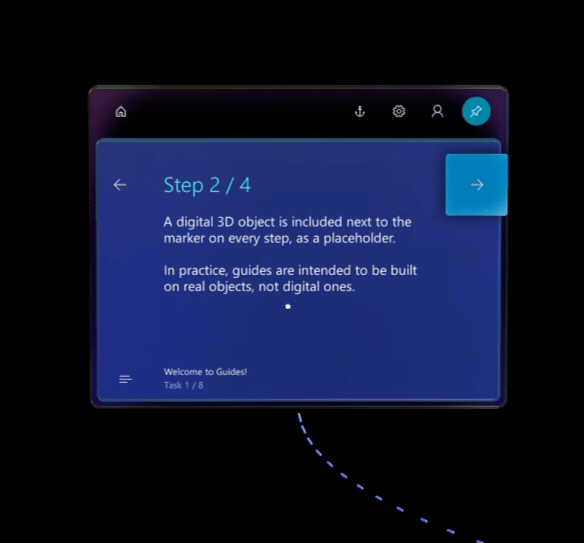

# HoloLens 1 gestures for authoring and navigating in Dynamics 365 Guides 

To author and navigate through a guide in [!include[cc-microsoft](../includes/cc-microsoft.md)] [!include[pn-dyn-365-guides](../includes/pn-dyn-365-guides.md)], you'll use gaze and a few gestures.

> [!IMPORTANT]
> In Dynamics 365 Guides version 502.2011.28001 (December 8, 2020 release) and later, HoloLens operating system version 10.0.17134 (Redstone 4) is no longer supported. This version of the operating system is used only on HoloLens 1. HoloLens 1 customers must upgrade to HoloLens version 10.0.17763 or later to continue to receive the latest updates. Work with your IT admin to update your HoloLens operating system. If you choose not to upgrade, you can continue to use the current version of Dynamics 365 Guides that is already installed on the device. However, HoloLens version 10.0.17763 or later is required to install Dynamics 365 Guides on any new or refactored HoloLens 1 device. 

## Gaze
The easiest way to get around a guide is to gaze at an item (menu or button, for example). If the item has a selection box or circle (gaze/dwell button), you can select the item just by gazing at the button hit zone. The item is selected when the box or circle is filled. 

 
In other cases, you use gaze to target an item, and then act on that selection by using a gesture. When you gaze, turn your whole head—not just your eyes. The cursor will follow. 

## Gestures
This section lists the most important gestures to know when working with [!include[pn-dyn-365-guides](../includes/pn-dyn-365-guides.md)].

### Bloom 
The bloom gesture opens the **Start** menu or the **Quick Actions** menu, depending on which version of HoloLens you're using. Most of the time, you only need to use the bloom gesture once to get to **Start**, but sometimes you'll need to use it twice. If you're not sure what to do at any time, the bloom gesture is a good way to get reoriented. 

To do the bloom gesture: 
1.	Hold out your hand with your palm up and your fingertips together. 
2.	Open your hand.

 
### Air tap
Use air tap, along with gaze, to select holograms and any gaze/dwell buttons. To do an air tap:
1.	Gaze at a hologram.
2.	Hold your hand straight out in front of you in a loose fist, then point your index finger straight up toward the ceiling. You don't need to raise your whole arm—keep your elbow low and comfortable.
3.	Tap your finger down, then quickly raise it back up again.

 
### Air tap and hold
Use air tap and hold to move, rotate, or scale holograms when authoring. To air tap and hold, start with an air tap, but keep your finger down instead of raising it back up again. 

### The gesture frame
[!include[cc-microsoft](../includes/cc-microsoft.md)] [!include[pn-hololens](../includes/pn-hololens.md)] has sensors that can see a few feet to either side of you. When you use gestures, you need to keep them inside that frame, or [!include[pn-hololens](../includes/pn-hololens.md)] won't see them. As you move around, the frame moves with you. When your hand is inside the frame, the cursor looks like a ring. When [!include[pn-hololens](../includes/pn-hololens.md)] can't see your hand, the cursor changes to a dot.

## Need a tutorial on gestures?
For a tutorial on some basic gestures, close [!include[pn-dyn-365-guides](../includes/pn-dyn-365-guides.md)] by blooming and selecting **Mixed Reality Home**, use the bloom gesture to go to **Start**, and then select **Learn Gestures**. If you're having trouble with gestures, see [HoloLens and holograms: FAQ](https://support.microsoft.com/help/13456/hololens-and-holograms-faq).

## See also

[Overview of authoring a guide](authoring-overview.md) 
[Overview of operating a guide](operator-overview.md)

