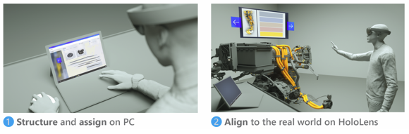

# Overview of authoring a guide in Dynamics 365 Guides
 
If you're ready to start creating a guide with [!include[cc-microsoft](../includes/cc-microsoft.md)] [!include[pn-dyn-365-guides](../includes/pn-dyn-365-guides.md)], you're in the right place! 

To create a guide, you use two apps:

- **PC app.** You start with the PC application. Use this application to create the guide, choose an anchoring method, 
add tasks and steps, write the instructions for your steps, and assign different types of assets to support those steps. 
Supporting assets include:

    - Your custom 3D models

    - 3D models from the 3D toolkit (arrows and numbers, for example)

    - 2D media (images and videos)

- **[!include[pn-hololens](../includes/pn-hololens.md)] app in Author mode.** After creating the guide with the PC app, use the [!include[pn-hololens](../includes/pn-hololens.md)] app in Author mode to test the flow of your guide, place your holograms in the real world, add holographic dotted lines to show operators where to focus, and add styles for 3D objects (warning or caution, for example).

    > [!TIP]
    > You can use both apps to edit the same guide simultaneously for the fastest workflow. Create the structure and text in the PC app, do the 3D placement in the HoloLens app, and then work back and forth until you have your guide just the way you want it. 

    
    
     >[!NOTE]
     > You can [add a guest user in Dynamics 365 Guides](add-users.md#add-a-guest-user) for users that have an Azure Active Directory account but aren't members of your organization. Guest users can only operate guides in the HoloLens app; they can't author guides in the PC or HoloLens apps.

Ready to jump in? Choose one or more of these links to get underway:

-  [Watch a video about PC authoring](https://aka.ms/pcauthor)
-  [Overview of authoring a guide with the PC app](pc-app-overview.md)
-  [Watch a video about HoloLens authoring (shows HoloLens 1 version)](https://aka.ms/hololensauthor)
-  [Overview of authoring a guide with the HoloLens app](hololens-app-overview.md)
-  [Gestures for authoring and navigating](authoring-gestures-HL2.md)
-  [How to make a great guide](great-guide.md)

[!INCLUDE[footer-include](../includes/footer-banner.md)]
