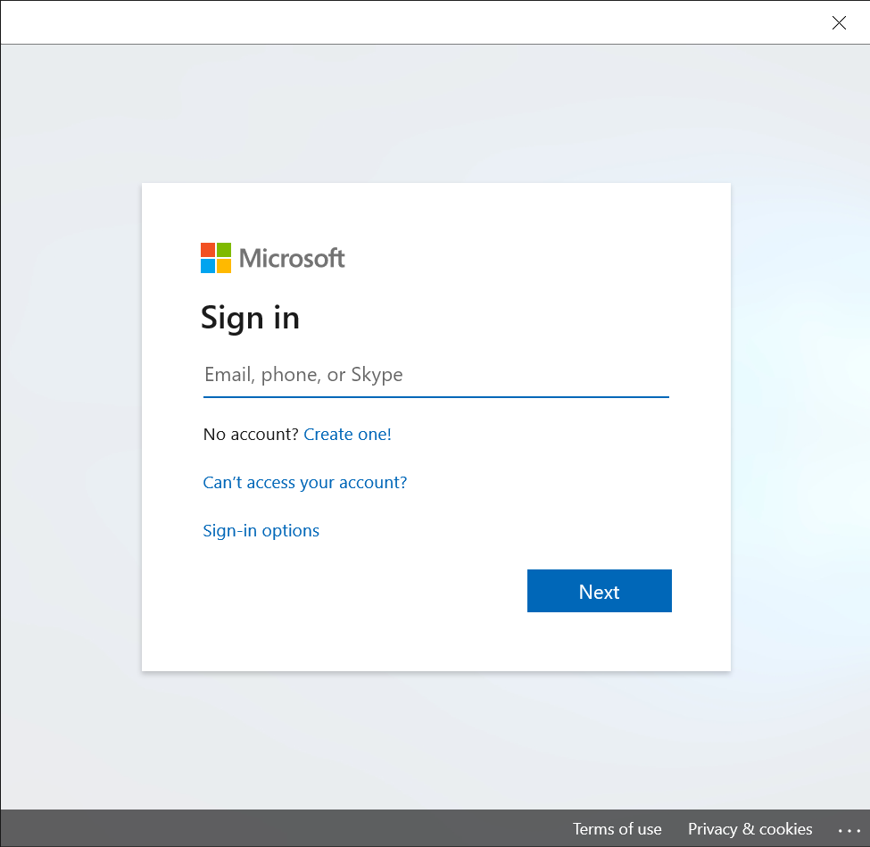

## Overview of Guides authoring

Welcome to Guides authoring! This User Guide covers everything you need to get started with Guides authoring. 

To create a guide, you’ll use two applications:

- **PC application.** You’ll start with the PC application. Use this application to create the guide, choose an alignment method, 
add tasks and steps, write the instructions for your steps, and assign different types of assets to support those steps. 
Supporting assets include:

  - 3D parts
  - 3D objects, such as objects from the 3D toolkit (arrows and numbers, for example)
  - 2D media (images and videos)
  
- HoloLens application in Authoring mode. After creating the guide with the PC application, use the HoloLens application in Authoring 
mode to test the flow of your guide, assign holographic tethers to show operators where to focus, place your holograms in the real 
world, and add styles to 3D objects (warning or caution, for example).

## Before you start

Before you get started with Guides authoring, you’ll want to understand your project and get organized. Here’s a quick checklist 
to start you out on the right foot:

- Gather as much content as you can before you begin creating your guide. This includes images, videos, and 3D content 
(if you have any), and the physical objects themselves (if feasible). Don’t worry if you don’t have any 3D content. 
Guides includes a 3D toolkit that you can use to get started.
- Make sure you understand the space, the assembly, and the workflow you’re authoring for. arrange for access to the space 
so you understand the real-world environment. You’ll also need access to the space to align the guide and place holograms later.
- Arrange for access to the space so you understand the real-world environment. You’ll also need access to the space to align 
the guide and place holograms later.
- A great way to start is to create a video of the assembly you want to show, or have someone (an expert in that process, 
for example) create one for you. You can refer to the video as you create your guide. If you’re using a video as a starting 
point, make sure it’s representative of the guide you want to create though. For example, are you creating a guide for an 
expert or a novice?

## Using media and 3D content to your advantage

As you consider the media and 3D content you want to use for your project, keep in mind that size matters greatly on HoloLens 
both for the quality of the experience and performance. It’s best to use high-fidelity assets where details matter and low-fidelity 
assets for high-level principles where details aren’t as important.

### Best practices for pictures (images)
- Images are best for quick reference, validation, or special techniques
- Pictures are a great and inexpensive way to orient an operator, so use lots of them.
- When taking pictures, make sure to take a picture of the whole object for overall context, as well as close-up pictures for precision.
- When taking pictures, also keep in mind the perspective of the operator. It’s helpful to take the picture from the same angle 
that the operator will use. 
- Pictures are very efficient for identifying specific patterns, shapes, or colors.
- For performance reasons, don’t use 4K/HD quality pictures. Total image size shouldn’t exceed 100 KB.

### Best practices for videos
- Videos are best for first-time users
- Keep videos short and focused on a single step.
- Overview videos don’t work well generally, because operators may think they’re supposed to do the assembly while they’re watching 
the overview video. 
- When filming video, make sure to show a wide angle for context and then a close-up of the actual work and hand motions.
- Effective videos “teach” how to do something. If you just take a video of someone on the floor doing a process they’re very 
familiar with, it’s likely that:
  - They’ll move too quickly.
  - They won’t talk through the tasks step-by-step.
  - They won’t teach the task the way management wants them to teach it.
- Videos are very effective for showing specific hand movements.
- Audio is very useful for step-by-step instructions. Watching someone do a task without audio doesn't provide as much context. Consider
using video captions, if available, for noisy environments.

### Best practices for 3D content
3D content is best for adding in-context clarity. Guides includes a 3D toolkit that includes 3D models that you can use to add 
clarity to your instructions. For example, the 3D toolkit includes arrows, hands, zones, and icons. These assets are already 
optimized for HoloLens. For more information, see Add 3D objects to support your steps.

You can also create and import your own custom 3D parts. If you use custom 3D parts, make sure to optimize it as much as possible 
before importing it to Guides. It’s also good to break up 3D parts as much as possible. For example, if you have a 3D model that 
shows a composite part for an engine, create separate 3D parts for all the individual pieces to better highlight the parts in a step.

## Setting up a folder structure
To organize content, you may want to create a folder structure with separate folders for text, 3D assets, images, and videos to make 
it easy to find and use the different types of assets.

 
### Naming your files 
When naming your content pieces, consider using standard prefixes so that all your assets are organized together in the library. 
For example:
- Atv_engine_01.png
- Atv_engine_video01.wmv

## Install, open, and sign in to the PC application
Ready to get started with Guides authoring? Use these instructions to install the app (if it’s not already installed) and to sign in.

### Install the app 
1.	On your Windows 10 PC, make sure you have the Windows 10 Fall Creators Update 1709 or later installed (build 10.0.16299 or later).
2.	Go to Start  > Microsoft Store  , and then search for “Guides.”

### Sign in to the app
1.	Launch the Guides application from the Start menu on your PC. 
2.	In the Welcome to Guides screen, choose Sign in.

 
3.	In the Sign in dialog box, select Work or school account, and then select Continue. 
4.	In the Sign in screen, enter the User account and password assigned to you by your organization. If you’re the administrator, these are the credentials you created when you signed up for the trial subscription.

 
5.	Select the instance you want to use if there’s more than one instance, and the select Continue.

 
## 6 steps to authoring in the PC application
You always start the authoring process for a guide in the PC application. Use the PC application to:
1.	Create the guide
2.	Choose an alignment method 
3.	Add the structure (the tasks)
4.	Add the steps included in each task
5.	Write the short text for each step
6.	Assign assets to support the steps

## A note about saving in Guides
The PC Authoring app and the HoloLens app are connected through the cloud, where your guide files and assets are stored. 
When you author a guide, all changes are saved on both the PC and HoloLens. This makes it easy to switch between devices. 
Autosave checks for changes every 4 seconds. 

For public preview, there are a few things to be aware of when syncing devices:
- As a best practice, always select Refresh before making edits on a guide when you switch between devices. This ensures you 
have the latest version of that file from the other device. 
- If the same version of the guide is open on the PC and HoloLens, the app will automatically refresh when it detects that you've 
made a change in the other app. For example, if you have a guide open on HoloLens and add a new step on the PC, the guide will 
automatically refresh on HoloLens. You may notice the refresh process. 
- When adding text in the PC applications, the auto publish only activates when you click outside the text box. If you add text 
to a step and keep your cursor in the text box and then make a change on HoloLens, you’ll lose the text you created on the PC when 
it updates with the changes from HoloLens. This issue will be addressed in our next release. 

## Create a new guide
1.	Open the Guides app.
2.	Select Create a new guide.
3.	Enter a name for the guide. If you’re planning to create multiple versions of the guide, you may want to add _v2, _v3, and 
so on as part of the name. 

## Choose an alignment method 
After you name your guide, you’ll see the **Choose an alignment method** screen. 

Alignment is used to spatially sync your instructions to the real world. When you align your guide, your instructions coincide 
with the space they live in and become meaningful. The alignment acts as the anchor that all your content is centered around.

- With Marker alignment (recommended), you attach a printed marker to a physical object in the real world. After creating the guide, 
to align the guide in the real world, you gaze at the marker using the HoloLens.
- With Manual alignment, you import a 3D representation (such as a CAD model or scanned model), and then lay that representation, 
called a “digital twin”, directly over a physical object in the real world. After creating the guide, to align it in the real world, 
you use a gesture.

It’s extremely important to ensure that the alignment is correct and as precise as possible. If alignment is not correct, your 
instructions can cause operator confusion and potentially costly damage. For example, an operator could drill a hole in the wrong 
place or assemble the wrong part. 

Marker alignment is recommended, because it’s more accurate. You may want or need to use manual alignment, however, for any of the 
following reasons:

- It may not be feasible to attach a marker because the authoring is done in a different location than where the parts are located.
- It may not be feasible to attach a marker due to moving parts.
- You can’t guarantee the placement of the marker will be the same every time.
- A part is too small to attach a marker to.

### Align your guide by using marker alignment
Marker alignment involves three basic steps:

1.	Print out a marker.
2.	Attach the marker to a physical object in the real world.
3.	Gaze at the marker to align the guide.

To print the marker:
1.	Ensure that the Marker.pdf file has been saved from the Marker setup page, and then open it in Adobe Acrobat Reader.
2.	On the File menu, select Print.
3.	Under Page Sizing & Handling, select the Actual size option.

4.	Print the last page of the document on matte stock as glossy materials can affect scanning. 
5.	After printing, make sure the marker spacing matches the measurements shown in the following illustration:

 
> [!NOTE]
> If the marker spacing is not within +/- 0.1mm, select the Custom Scale option in the Print dialog box, and then change the 
percentage to compensate for the size discrepancy. For example, if you print the marker and the result is 49 mm, you would need to 
change the scale to 100.4% to get 49.196 mm, which would be within tolerance.

#### Best practices for marker alignment
Keep the following in mind when working with marker alignment:

- Size. Make sure that your printed marker is the exact size indicated in this document. Incorrect marker size will cause guide misalignment. 
  - Some applications and printers may change the size of the image.
  - If the printed marker is bigger than indicated, HoloLens will interpret the scale difference in distance. This will cause the marker to be identified as closer than it really is. 
  - Note that printing from the pdf file (as described earlier in this section) is the best way to ensure that the marker is not resized. 
- Location. Place the marker in a location on the physical object that’s easy to access and out of the way.
  - Marker placement should ideally be central to the steps being done.
  - Content placed further away from the marker will be less accurate.
  - Place the marker where operators can quickly re-scan to realign at any time.
  - Take a photo or video to document the marker placement and add it to the guide instructions to increase operator confidence.
- Scanning angle. Make sure you’re facing the marker straight on at the correct distance when gazing at it. 
  - Scanning from an angle can cause misalignment.
  - Ideal scanning range is 60–80 cm.

#### How HoloLens establishes marker position, scale, and orientation
When scanning, the forward-facing camera on the HoloLens is used to measure the horizontal and vertical distances on the marker. 
This information is combined with the actual marker values stored internally in the application (49.2 mm and 32.8 mm as indicated 
in the illustration above) to establish the marker’s precise position, scale, and orientation in space.

Guides includes an additional correction method that enables the user to improve the alignment by manually overriding the offset 
that may be generated by the variability of the acquired image and marker size.

### Align your guide by using manual alignment
Manual alignment involves two basic steps:
1.	Using the PC Authoring app, import a 3D representation of a physical object. This could be a CAD model used to create the physical object or a scanned model after fabrication. 
2.	Using HoloLens Authoring mode, place the 3D digital representation directly over a physical part.

To import a 3D representation: 
1.	Open the PC Authoring app.
2.	On the right side of the screen, select the Import command. 
3.	In the Open dialog box, select the 3D representation that you want to use, and then select Open.
    This will add the 3D representation to the 3D parts section of the library.
4.	In the library, select 3D parts, and then drag your 3D representation to the Digital twin box in the lower-left side of the screen.

> [!NOTE]
> It’s a good practice to take a photo or video of the base physical object and location and upload the photo or video to the 
Digital twin reference box. You may also want to customize the instructions in the Operator instructions box to provide more specific 
directions.

To place the object in HoloLens:
1.	Open the guide in HoloLens Authoring mode.
2.	When prompted, use gestures to place the 3D representation directly over the physical object in your work environment.

#### Best practices for manual alignment
- Size. Select a digital twin that’s not too small or too big. 
  - Medium-size digital objects are best. Very small or very large holograms are difficult to manipulate. 
  - Shoebox size or slightly larger is ideal.
- Placement. Choose a digital twin that’s as close to the center of the work being done as possible. The further you place digital content away from the digital twin, the less accurate it becomes.
- Shape. Select a digital twin that has a non-uniform or uncommon shape. Unusual shapes are easiest to align to.
  - Avoid objects which are mirrored. This can cause 180-degree misalignment.
  - Pick shapes that have clear edges and corners to help orient your content properly.
- Recognizable. Select a digital twin that’s obvious, easily recognizable, and easy for the operator to find. Make sure they can access the object without any obstructions.
- Alignment direction. Always align the digital twin to your physical object from the same direction. This will maximize repeatability for operators.
  - Placement from different perspectives can cause misalignment.
  - Always look at it from multiple angles to ensure the digital twin is aligned to the physical object.

#### More about alignment
Independent from the method used for alignment, the following additional factors can impact the accuracy of the alignment and/or user perception of the alignment:

- Interpupillary distance (IPD) setting. The IPD is the distance between the center of the user’s pupils. It’s crucial to set the appropriate IPD to enable HoloLens to adapt its display as different users may have different IPDs. An incorrect IPD setting might result in a wrong perception of holograms in space as well as instability of holograms. Use the HoloLens Calibration app to calibrate your IPD (https://docs.microsoft.com/en-us/windows/mixed-reality/calibration). 
- Pre-scanning the environment. HoloLens actively scans its environment for visible features  to create maps of its surroundings. This happens whenever the device is turned on and a user is signed in. It’s independent of whether you’re in the HoloLens shell or running apps. HoloLens constantly improves the accuracy of these maps as it scans the environment from different viewpoints and stores them on the device. Holograms are placed in relation to these maps. The more accurate the map, the more accurate the hologram placement.
Before using Guides on a HoloLens that’s unfamiliar with its environment, the user should put on the HoloLens, sign into the device and walk around the space where holograms instructions are placed or will be placed. This can be done while the user is in the HoloLens shell, but we recommend the user hide the Start menu to see the space as they walk around. Walking at a leisurely pace while slowly looking up and down will give the device the opportunity to find features and construct accurate maps. We call this "pre-scanning" because it’s done before you run Guides. You only need to do this once for each environment as HoloLens stores the maps it created on the device and remembers the spaces it has scanned.
Very dark or very bright environments, or environments that include very reflective surfaces (mirrors), dark surfaces, or featureless surfaces, will cause a negative impact on HoloLens’s capability to recognize the space, which will impact hologram position and stability.
- Impact of device positioning. HoloLens uses a novel display technology to project images in the user’s field of view, creating holograms. The way a user wears a device on their head has a huge impact on the perceived position of the holograms. The best way to understand this is to adjust the device positioning while aligning holograms to their physical counterparts in Guides. Observe how the alignment of holograms is affected when you shift the device left and right, up and down, and when you slide the display forward and backward. Users should wear the device in a consistent way and understand that subtle shifts in device positioning may not feel different but can lead to significant changes to perceived hologram locations.

## Structure your guide in the Outline page
After you choose an alignment method, you’ll see the Outline page. This is where you create the framework for your guide by adding as many tasks and steps as you need. Tasks are groups of steps. Steps are the short, discrete work items that operators do to complete the task. Steps are the central building block that everything is built around in Guides.

When you open the Outline page for the first time, you’ll see that a single task and step is already created for you. 

  
To get started, enter a task name, and then start typing the instructions in the box for the first step. When you need to add a new step, select Add step. When you’re ready to add another task, select Add task. It’s that simple!

In reality, you’ll probably create most of your steps from inside the Step card (see the next section), but the Outline page provides a great way to map out your guide at the start, or to get an overall picture of the guide after you’ve added all your tasks and steps. You can also restructure your guide from the Outline page by dragging tasks and steps.

In addition to tasks and steps, the Outline page shows:
- The type of alignment you chose for the guide, along with customizable operator instructions.
- A special step called a Completion step that lets operators know when they’ve reached the end of the guide. The Completion step includes default text that you can customize as you see fit.

 
> [!NOTE]
> Whenever you start working on a guide, be sure to select refresh to ensure you have the latest version. 

### Best practices for the Outline page
- To provide overall context, add an Overview task at the start of the guide. This task would include just one step that describes what the guide is about. This is also a good place to list all the tasks that the guide covers. 
- Add a step at the beginning and end of each task to let the operator know when they’re starting something new or ending a task and to make the operator feel successful when they complete a task.
- Don’t be afraid to add lots of steps but remember to keep them short for best effect. 
- Consider adding steps that show individual tips and tricks. 
- Remember to refresh your guide when moving between PC and HoloLens, and be sure to click outside the text box when writing steps to activate autosave. 

Here’s the Outline page for the Example Guide to show what a completed Outline page looks like:

  
### Create steps and assign assets in the Step card page
You can create steps in the Outline page, but you’ll probably create most of your steps from the WYSIWYG Step card page.  and assign supporting assets for that step, like 3D content or media (images and videos). 

In the Step card page, you write your instructional text (make sure to keep it short!) and assign supporting assets for that step, like 3D content or media (image or video). 

To add 3D content or media to support a step: 

1. On the right side of the screen, select the label for the type of item you want to add (3D parts, Images, Videos, or 3D toolkit).

2. Drag the object to the appropriate box below the step text. For example, to add an image or video, drag the image or video to the Image or video box. To add a 3D part or an object from the 3D toolkit , drag it to one of the 3D parts boxes. 

  
When you view your guide on the HoloLens in Authoring mode, you’ll see all the assets that you associated with the steps, and can place the assets in their relevant spaces in the real world. For example, if you assign a pointer to a step in the PC application, you’ll align that pointer to the thing you want to point to in HoloLens authoring. What you see in the Step card page, is very similar to what you see on the HoloLens. 

#### Best practices for the Step card page
- It’s easy to add another step from the Step card page. Just select Add new step in the lower-right corner of the page. No need to go back to the Outline page. 
- Don’t be afraid to add lots of steps but keep the text short. Instruction text is limited to 280 characters per step to help keep the text short.
- Try to stick to one type of asset (image, video, or 3D object) per step. Too much media or 3D content can be overwhelming to the operator and too time consuming to absorb. Think about what type of content gets the point across best.
- Write your guide in casual human language for best results. Don’t use technical jargon that people don’t know or understand.
- Use descriptive words like “locate,” “find,” “get,” “go to”, “pick up,” “put down,” “insert,” “attach,” and “remove.”
- Adding a **NOTE** step is useful for quality checks. These types of steps can come before or after a step. Just make sure to put it in the right spot.
- Add a **WARNING** step for things that could be dangerous or cause a quality issue. When you move to Authoring mode on the HoloLens, you can add a style to reinforce the warning.
- Adding numbered small steps inside a step can sometimes help, but don’t be afraid to create separate steps for easier reading.
- When you’re done writing a step, be sure to click outside of the text box to activate autosave. 

#### Import your own custom 3D objects to add to the 3D parts list
You can import your own 3D objects to add to the 3D parts list, and then assign parts to a step. 

To import your own 3D objects:
1.	Select the Import command in the upper-right corner of the Step card screen. 
2.	Locate the 3D object you want to import, and then select Open.

### Add 3D objects from the 3D toolkit to support your steps
Guides comes with a library of pre-defined 3D objects included in the 3D toolkit that are optimized to work perfectly with HoloLens. Use objects from the 3D toolkit like any other asset to support your steps and get your point across. Having a ready-made library makes it easy to get started if your company doesn’t have any 3D content.

 
Here’s the complete list of 3D objects available in the 3D toolkit:

 
You add a 3D object from the 3D toolkit in the Step card page, and then place them in HoloLens Authoring mode. You can use the same object (instance) as many times as you like in a step.

To add an object from the 3D toolkit:
1.	Select the Library tab.
2.	Select the appropriate category of objects.

3.	Drag the object you want from the list to a 3D parts box below the Step card.
 
#### Best practices for 3D toolkit
- Use pointers to communicate simple spatial information like position, direction, and translation.
- Use the arrow when you want the operator to insert a part into something stationary (hand tightening a bolt into a tapped hole, for example). 
- Use one of the hand poses when you want the operator to use their hand in a specific way to influence or manipulate something. There are various poses for specific interactions such as Pull, Push, Pinch, Grab, and others. Combine these standards with arrows and/or icons to add additional meaning.
- Adjust the size of the pointer but never go below 1 cm. Otherwise, it can cause errors.

## Ready to test your guide out in the real world?
After you create your guide, select an alignment method, and create your tasks and steps, you’re ready to test things out on the HoloLens in a real-world environment. But before you switch to HoloLens authoring, make sure to close the Guides app on the PC. 

> [!Important]
> When working between PC and HoloLens be sure to select Refresh when starting work on a device to ensure you have the latest version of the guide. 

Don’t worry if your guide isn’t perfect before switching to HoloLens authoring. You can always go back to the PC application to edit and restructure your guide. In fact, we’ve found it’s generally a good idea to do a quick test of the flow on HoloLens, and then go back to the PC application to make changes before placing all your assets in HoloLens.

> [!Tip]
> If you’re creating multiple versions of the same guide, you may want to use the Save a Copy command on the File menu. This is great for guides that are similar but have a few different steps. You don’t have to start from scratch!

## Test your guide and assign content in HoloLens Authoring mode
The second major step in creating a guide takes place on the HoloLens application. In HoloLens Authoring mode, you:
1.	Align your guide to a marker or a digital twin, depending on the type of alignment you chose in the PC application.
2.	Test the flow of your guide.
3.	Add holographic tethers to visually tie your steps to physical objects in the real world.
4.	Place your holographic 3D content in their relevant spaces in the real world.
5.	Add styles (optional) to 3D content to add treatments such as a warning or caution.
 
## Install the HoloLens app
If you haven’t already installed the HoloLens app on your HoloLens device, you can install it from the Microsoft Store for Consumers.

### Install the HoloLens app.
1.	Make sure you have HoloLens build 10.0.14393.0 or later installed on your HoloLens. Build 10.0.14393.0 is the minimum that supports Guides. We recommend updating to newer versions when available. See Manage updates to HoloLens for instructions on using Windows Update for Business.
2.	On your HoloLens, use the bloom gesture to open the Home menu, and then open the Microsoft Store app and search for “Guides”.
3.	Select Install to download and install the Guides application.

### Sign in to the HoloLens app
If you sign in with a brand new HoloLens device, you’ll be prompted to walk through the Setup wizard. In the Setup wizard, you can sign in with an existing account or create a new one, depending on the version of Windows that you’re running. The Setup wizard will also walk you through steps to calibrate and prepare your HoloLens for use.

#### Calibrate your HoloLens
When placing holograms, it’s crucial to ensure the alignment is as close as possible. You can’t place holograms accurately if your HoloLens isn’t calibrated. Calibration is also recommended to improve the quality of the visuals or to calibrate visuals for a new user. It’s particularly important for authors to ensure that their IPD is set correctly. Otherwise, all operators using the guide will see misaligned holograms.

You can use the Calibration app that comes with HoloLens to set your IPD and ensure proper device fit. 

To set your IPD using the Calibration app:
1.	Do the bloom gesture to launch the Start menu.
2.	Air tap on Calibration to begin calibrating your HoloLens.
 
3.	Follow the instructions on your HoloLens.

> [!TIP]
> If you’re sharing a HoloLens device, learn about how you use the Windows Device Portal to avoid having to re-calibrate the HoloLens each time you switch users. 
 
### Open and sign in to HoloLens for the first time
After ensuring that your HoloLens is correctly calibrated, you can open the HoloLens application.
1.	Go to Apps.
 
2.	Select the down arrow.

3.	Launch the Guides application.
 
4.	On the welcome screen select Sign in. 
5.	In the Email and accounts screen, select Work or school account, and then select Continue. 
6.	In the Work or school screen, enter the email address sent to you by your organization. If you’re the administrator, use the credentials you created for the Trial subscription. 
 
7.	Select an instance to use if you have more than one instance, and then select Continue.
8.	In the Select Mode dialog box, gaze at the box to the right of Author until the box fills, which selects that item. 

 .
### Align your guide
The first thing you see when you open a guide is the alignment instructions you created in the PC Authoring application. The screen shot below shows the operating instructions created for the Example Guide that comes with Dynamics 365 Guides.
  
If you chose Marker alignment as the alignment method for the guide, the next step is to align the marker hologram with the printed marker you placed in the real-world environment. The marker hologram looks like this:
  
After aligning the guide, you’ll see the Marker found screen. Select the Confirm button to continue. 
   
> [!NOTE]
> If you chose Manual alignment as the alignment method for the guide, you’d align the hologram that matches the digital 3D representation that you placed in your real-world environment.

When you align your guide, the alignment information is stored on your HoloLens so you don’t have to realign the guide every time you open it. You can realign a guide at any time though if you feel the holograms are out of alignment. For more information, read about the Alignment button in the next section.

## Get oriented on HoloLens
After you align your guide, you’ll see the Step card. The Step card is the hub of everything you do with your guide and how you navigate in the app. The Step card is also what your operator will see when they use the guide. The Step card tags along with the operator to keep the instructions where they need them as they move around their work space.

Navigate through the guide by gazing at the Next Step and Go Back arrows. You can also use gestures such as air tap to navigate through a guide. 

At the top of the Step card screen, you’ll see three holographic buttons: Undo, Redo, and Save.
 
The Undo and Redo buttons work like Undo and Redo in any Microsoft Office program. There’s no limit to the number of times you can undo or redo. 

> [!NOTE]
> Changes are automatically saved as you author in HoloLens. Just be sure to select Refresh when you go back to the PC to ensure that you have the latest version of the guide.

The Step card also includes several other buttons and UI elements:
 
Here’s what each button or UI element is used for:

|Button|Name|Purpose|
|-----|------------|----------------------------------------------------------------------------------------------------------------|
||Home|Choose a different guide|
||Profile|Sign in and out|
||Settings|Access the following settings:  - Fit box. Use to make sure you’re wearing the HoloLens device correctly.  - Noise Cancellation.  - Dynamic Volume. Adjusts the volume dynamically based on noise in the environment. For example, if the environment is very noisy, the volume adjusts upward automatically.  - Build number. Shows the build you’re using.|
||Alignment|Realign your guide.|HoloLens can sometimes lose tracking. To fix this, you’ll need to realign the guide by gazing at the marker or digital twin again.|
||Pin|Lock the step card to a location.|Guides includes a feature called “tag-along.” Wherever you look, the Step card follows your gaze so you never have to worry where your instructions are. When you pin the step card, you turn off the tag-along feature. When tag-along is off, you can just grab the card and move it wherever you like.|
||Outline|Go to the Outline page.|Use the Outline page to quickly navigate around your guide.|
||Task Progress	|Shows where you are in the open task.|
||Media|This button shows that there’s a video or image attached to a step. The image or video opens automatically when the operator goes to the step. If they want to close the image or video, they can select the button.|

## Test the flow of your guide
Once you’re oriented on HoloLens, we recommend that you go through your whole guide to see how it flows. As you step through your guide, make note of things you want to change in the PC application. For example, you may need to move some steps around, add tasks or steps, or add more supporting assets. It’s generally best to make these changes in the PC application before you start placing holograms, tethers, and styles.

When you’re ready to make the changes in the PC application, make sure to close the HoloLens app before re-opening the PC app. Don’t keep both applications open at the same. 

## Place your holograms and add tethers
You’ve tested the flow of your guide and you’ve made changes in the PC application. Now you’re ready to move to the next stage of the authoring process—you’re ready to place your holograms and add tethers in the real world. 

### Place your holograms
In this stage of the process, you’ll walk through each step in your guide and place any assets that you associated with that step when you authored it in the PC application. For example, if you added a 3D part to support a step, you’ll place that part over its physical counterpart in the real world. If you added a 3D object from the 3D toolkit (an arrow or a number, for example), you’ll place that object in an appropriate place in the real world to draw the user’s focus. You can place the same 3D part or 3D object as many times as you want.

You don’t need to do anything to place images or videos associated with a step. They automatically appear when the operator goes to the step. They can select the Media button to close the image or video.

The 3D assets associated with each step appear below the Step card:
 
To place them in the real world: 
1.	Air tap an empty box under 3D parts.

2.	Air tap a category in the 3D toolkit (an arrow or hand, for example).

3.	Air tap the object you want to add.
    This item will be added to your bin. 

### Manipulating holograms
To place a hologram from one of your bins:
1.	Air tap a 3D asset to add it to your real world. It will appear in your world in front of the Step card.
2.	Raise your hand to the ready gesture and gaze at the 3D asset to select it. You can tell if it’s selected if the 3D selection sphere appears around it.
3.	Once the object is selected, air tap + hold anywhere on the selection sphere to pick up the 3D asset.
4.	Do one of the following to move the hologram:
    - To move it larger distances in any direction, move your hand quickly in the direction you want. By default, the hologram will move approximately the same distance your hand moves from the starting point of where you “grabbed” the hologram to where you stop. 
    - To make more precise adjustments, move your hand slowly or keep it stationary to enter precision mode. This slows down the movement speed so you can nudge the hologram where you want it.

>[!Tip]  
> You’ll know you’ve entered precision mode when the selection sphere turns blue
 
#### Rotate a hologram
It’s unlikely an asset will be at the correct orientation when you initially place or move it. Use the rotation adjustment knobs to rotate it the way you want.

To rotate a hologram:
- Air tap and hold on a rotation adjustment, and then do one of the following:
  - Use the up/down knob to rotate vertically.
  - Use the left/right knob to rotate horizontally.
  - Use the free-hand knob to rotate in any direction.

>[!Tip]
> Gazing at any of the gizmo knobs will let you know which direction the knob will rotate.

When rotating, it helps to think as if you are physically grabbing the knob and rotating around the object, like a wheel.
The following screen shots show how to use the different rotation knobs:
 
> [!Important]
> To manipulate holograms effectively, make sure that your HoloLens is calibrated properly. Learn more about calibration. 

#### Best practices for working with 3D content
- Make sure that the 3D content is not in the way of the operator doing the task. 
- Keep the field of view in mind when placing assets. If you put a hologram behind someone, it will be very hard to find. 
- Use 3D content sparingly and with a clear goal. Too much content can clutter the instructions and make it harder to follow.
- Remember that you can attach a tether to 3D content to make it more discoverable. See the next section to learn about tethers.

## Place tethers
You’ll typically place a tether for each Step card when you place your holograms. A tether visually links a Step card to the area where the operator needs to focus. It helps the operator find the content or understand what they’re supposed to be looking at in the real world. 

 

To place a tether:
1.	Tap and hold the “tether ball” below the Step card.
2.	Place it in the real-world location that you want.

#### Best practices for tethers
- Tether placement isn’t exact, so if you’re connecting a tether to a 3D object from the 3d toolkit, place the tether in the general area, and then place the 3D object (a number, for example) at the end of the tether. 
- To make a tether appear to be more precise, use a 3D object like a circle or arrow to show exactly where the tether is pointing.

## Add styles for emphasis
Use styles to provide visual cues for extra emphasis. For example, add the Warning style to show caution or the Avoid style to make sure an operator doesn’t do something that could cause harm. As your operators get used to the visual language provided by styles, it will speed up their learning process.

> [!Note]
> At this time, you can’t add styles from the PC application. They exist only in HoloLens. 

To place a style:
1.	Air tap a hologram you’ve already placed in the real world to select it.
2.	Air tap the Edit Hologram (. . .) button.

3.	Air tap Styles. 
 
4.	Select the style you want to use.
 
Here’s a list of styles included in Guides and when to use each:

|Style	|Purpose	|How it appears to the operator|
|---------------|-------------------|--------------------------------------------|
|Original|Restore to original appearance	|Default appearance|
|Pick up	|Tell the operator to pick up something	|Outline|
|Place	|Show the operator where to place something	|Dotted line|
|See-through 1	|Show something without obscuring the operator’s view	|Transparent 50%|
|See-through 2	|Layer one thing on top of another so the operator can see through two layers	|More transparent 25%|
|Warning	|Warn about a safety or quality concern	|Yellow and black striped|
|Avoid	|Show areas or things to avoid	|Red flashing|
|X-ray	|Show things that happen inside something	|Outline with transparent inside|
|Metal	|Provide a realistic metal finish for an object	|Metallic|

 
#### Best practices for styles
- Use style to reinforce actions.
- Use styles only for the purpose they were intended. When operators learn the visual language of styles, they’ll know that a particular style means a certain thing, which will speed up the learning process. 

## Gestures to know
To navigate through a guide, you’ll use gaze and a few gestures.

### Gaze
The easiest way to get around a guide is to gaze at an item (an app, menu, or button, for example). If the item has a selection box, you can select the item just by gazing at the button hit zone. The item is selected when the box is filled. 

 
In other cases, you use gaze to target an item, and then act on that selection by using a gesture. When you gaze, turn your whole head—not just your eyes. The cursor will follow. 

### Gestures
This section lists the most important gestures to know when working with Guides.

#### Bloom 
The bloom gesture opens the Start menu (or hides the Start menu). Most of the time, you only need to use the bloom gesture once to get to Start, but sometimes you'll need to use it twice. If you're not sure what to do at any time, the bloom gesture is a good way to get reoriented. 

To do the bloom gesture: 
1.	Hold out your hand with your palm up and your fingertips together. 
2.	Open your hand.
 
#### Air tap
Use air tap, along with gaze, to select apps and other holograms. To do an air tap:
1.	Gaze at a hologram.
2.	Hold your hand straight out in front of you in a loose fist, then point your index finger straight up toward the ceiling. You don’t need to raise your whole arm—keep your elbow low and comfortable.
3.	Tap your finger down, then quickly raise it back up again.
 
#### Air tap and hold
To air tap and hold, start with an air tap, but keep your finger down instead of raising it back up again.

#### The gesture frame
HoloLens has sensors that can see a few feet to either side of you. When you use gestures, you'll need to keep them inside that frame, or HoloLens won't see them. As you move around, the frame moves with you. When your hand is inside the frame, the cursor will look like a ring. When HoloLens can't see your hand, the cursor will change to a dot.

#### Need a tutorial on gestures?
For a tutorial on some basic gestures, use the bloom gesture to go to Start, and then select Learn Gestures. If you're having trouble with gestures, see HoloLens and holograms: FAQ.

## Glossary

### Air tap
Air tap is a type of gesture that’s equivalent to a “click” with a mouse. For more information on how to do an air tap, see Gestures to know.

### Alignment
You align a guide in HoloLens to make sure the content “lines up” with associated objects in the real world. Alignment is crucial and mandatory for creating any guide. For more information, see Align your guide.

### Asset
Asset is the collective term used to refer to the complete set of objects that you can add to a step to support that step. Assets include 2D objects (images and videos) and 3D objects (3D parts and objects from the 3D toolkit). 

### Author
The author is the person who creates a guide.

### Calibration
The HoloLens device must be calibrated correctly so that the guide aligns properly in the real world. Proper calibration is also necessary to place holographic objects in HoloLens Authoring mode. HoloLens includes a Calibration app that can be used by authors and operators for this purpose. Learn more about calibrating HoloLens.

### 3D toolkit
Guides comes with a set of 3D objects that you can use to get started right away. For example, there are 3D objects such as pointers and arrows that you add to a step to support that step.

### Digital twin
A digital twin is a 3D representation used for one type of alignment. You place the digital twin, which can be a CAD model or scanned model, directly over its counterpart in the real world, and then use a gesture to align the guide to the digital twin.

### Field of view
Field of view refers to the size of the HoloLens display where holograms show up. It’s important to keep the field of view in mind when placing holograms in a real-world environment.

### Fit box setting
Use the Fix box setting to make sure the HoloLens device fits properly. A proper fit is very important for alignment purposes.

### Gaze
Gaze refers to looking at a target with the HoloLens. After targeting an object with gaze, you typically act on it with a gesture.

### Gesture
Hand gestures enable operators to do actions in mixed reality. For more information, see Gestures to know.

### IPD
Interpupillary distance (IPD) is the distance between a user’s eyes. Different users have different IPDs. To align content correctly, the HoloLens needs to be calibrated for each user’s IPD. Learn more about calibrating HoloLens.

### Marker
A marker is a computer-generated visual used for one type of alignment. You gaze at the marker to align the guide with its spatial coordinates.

### Operator
The operator is the person that uses a guide to do a set of tasks. 

### Outline page
Use the outline page in the PC Authoring application to add tasks and steps. From the Outline page, you can get a sense of the whole guide and restructure tasks by dragging them from one place to another. The Outline page also includes customizable alignment instructions and a special step called the Completion step (also customizable).

### Step
A step is a short, discrete work item that an operator does to complete a task. Tasks are made up of steps. Steps are also the central navigation point in a guide.

### Step card
The Step card is the fundamental building block in Guides. You add text and supporting assets to a Step card in the PC Authoring application, and then place holograms associated with each step in a real-world environment in HoloLens Authoring mode. The operator works through each step to complete a task or series of tasks. Learn more about Step cards.

### Style
You can add a style to any 3D object to reinforce what you want the operator to do or know. Examples of styles include Pick up, Place, and Caution.

### Task
A task is a piece of work to be done or undertaken. A task is made up of steps that the operator must follow to complete the task. 

### Tether
A tether is a holographic link that ties a step visually to the area where you want the operator to focus. It helps the operator find content or understand what they’re supposed to be looking at in the real world. You can use a tether together with a 3D object, such as a holographic arrow or number. 

### 3D parts
3D parts are 3D content that you assign to a step to support that step. You assign 3D parts in the PC application, and then place the holograms in a real-world environment in HoloLens Authoring mode.

## Useful links for more information
For more information on Microsoft mixed reality apps and HoloLens documentation, see the following links:
- What is mixed reality?
- Windows mixed reality documentation
- Microsoft Dynamics 365 Layout
- Microsoft Dynamics 365 Remote Assist
- Connect to Wi-Fi on HoloLens
- Calibrate your HoloLens
- Using the Windows Device Portal
