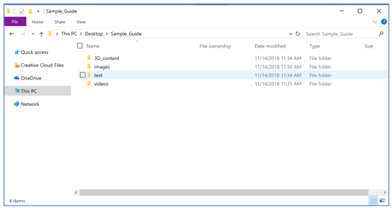

# Before you start authoring a guide in Dynamics 365 Guides (Preview)

[!INCLUDE [cc-beta-prerelease-disclaimer](../includes/cc-beta-prerelease-disclaimer.md)]
 
Before you start authoring in [!include[cc-microsoft](../includes/cc-microsoft.md)] [!include[pn-dyn-365-guides-preview](../includes/pn-dyn-365-guides-preview.md)], you'll want to understand your project and get organized. Here's a quick checklist to start you out on the right foot:

- Gather as much content as you can before you begin creating your guide. This includes images, videos, and 3D content 
(if you have any) and the physical objects themselves (if feasible). Don't worry if you don't have any 3D content. 
[!include[pn-dyn-365-guides](../includes/pn-dyn-365-guides.md)] includes a 3D toolkit that you can use to get started.

- Arrange for access to the space so you understand the real-world environment. You'll also need access to the space to anchor 
the guide and place holograms later.

- Make sure you understand the space, the assembly, and the workflow you're authoring for.

- A great way to start is to create a video of the assembly you want to show, or have someone (an expert in that process, 
for example) create one for you. You can refer to the video as you create your guide. If you're using a video as a starting 
point, make sure it's representative of the guide you want to create, though. For example, are you creating a guide for an 
expert or a novice?

## Use media and 3D content to your advantage

As you consider the media and 3D content you want to use for your project, keep in mind that size matters greatly on [!include[cc-microsoft](../includes/cc-microsoft.md)] [!include[pn-hololens](../includes/pn-hololens.md)], 
both for the quality of the experience and performance. It's best to use high-fidelity assets where details matter and low-fidelity 
assets for high-level principles where details aren't as important.

### Best practices for pictures (images)

- Pictures are:

  - Best for quick reference, validation, or special techniques.
  
  - A great and inexpensive way to orient an operator, so use lots of them. 
  
  - Very efficient for identifying specific patterns, shapes, or colors.
  
- When you take a picture:

  - Make sure to take a picture of the whole object for overall context, as well as a close-up for precision.
  
  - Keep in mind the perspective of the operator. It's helpful to take the picture from the same angle that the operator will use.

- For performance reasons, don't use 4K/HD quality pictures. **Total image size shouldn't exceed 100 KB.**

### Best practices for videos

- Videos are:

  - Best for first-time users.
  
  - Very effective for showing specific hand movements.
  
- Keep videos short and focused on a single step.

- Overview videos don't work well generally, because operators might think they're supposed to do the assembly while they're watching 
the overview video. 

- When filming video, make sure to show a wide angle for context as well as a close-up of the actual work and hand motions.

- Effective videos "teach" how to do something. If you just take a video of someone on the floor doing a process they're very 
familiar with, it's likely that:

  - They'll move too quickly.
  
  - They won't talk through the tasks step-by-step.
  
  - They won't teach the task the way management wants them to teach it.
  
- Audio is very useful for step-by-step instructions. Watching someone do a task without audio doesn't provide as much context. Consider
using video captions, if available, for noisy environments.

### Best practices for 3D content

3D content is best for adding in-context clarity. [!include[pn-dyn-365-guides](../includes/pn-dyn-365-guides.md)] includes a 3D toolkit of 3D models that you can use to add clarity to your instructions. For example, the 3D toolkit includes arrows, hands, zones, and icons. These assets are already optimized for [!include[pn-hololens](../includes/pn-hololens.md)]. For more information, see [Create steps and add 3D models or 2D media](create-steps-assign-media.md).

You can also create and import your own custom 3D parts using CAD models. [!include[pn-dyn-365-guides](../includes/pn-dyn-365-guides.md)] supports glTF, GLB, and FBX file formats. You can use a combination of third-party tools and the [!include[pn-dyn-365-import-tool](../includes/pn-dyn-365-import-tool.md)] to prepare your 3D models, or you can use the Import Tool's concierge service to have [!include[cc-microsoft](../includes/cc-microsoft.md)] convert and optimize the models for you. For more information on the Import Tool and preparing 3D models, see these topics:

- [Import Tool overview](https://docs.microsoft.com/dynamics365/mixed-reality/import-tool/)

- [Optimize your 3D models](https://docs.microsoft.com/dynamics365/mixed-reality/import-tool/optimize-models)

- [Best practices for 3D models](https://docs.microsoft.com/dynamics365/mixed-reality/import-tool/best-practices)

## Set up a folder structure

To organize content, you might want to create a folder structure with separate folders for text, 3D assets, images, and videos to make 
it easy to find and use the different types of assets.

 
### Best practices for file names

When naming your content pieces, consider using standard prefixes so that all of your assets are organized together in the library.

For example:

- atv_eng_01.png

- atv_eng_video01.wmv

## What's next?

[Overview of Dynamics 365 Guides authoring](authoring-overview.md) 
[Overview of authoring a guide in the PC application](pc-app-overview.md) 
[Overview of authoring a guide in the HoloLens app](hololens-app-overview.md)

[!INCLUDE[footer-include](../includes/footer-banner.md)]