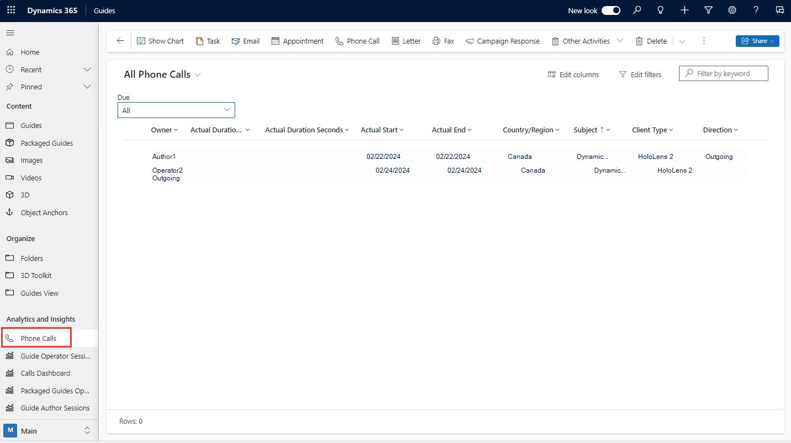

# View and access call data stored by Dynamics 365 Guides

When Microsoft Dynamics 365 Guides users make or receive calls in the HoloLens app, call information is stored in Microsoft Dataverse. Anyone who has access to make.powerapps.com or the Guides environment can view calling data in the Guides model-driven app. Users can view only their own calling data; administrators can view calling data from all users. 

Location data is only stored in Microsoft Dataverse if the user consents to store that data. Users are prompted to provide permission to store location data when they start the HoloLens app for the first time, but they're not required to store that data to use the HoloLens app. If a user chooses not to store location data, other calling information is stored, but location fields in the app will be empty. [Learn more about HoloLens app permissions](hololens-permissions.md)

> [!Note]
> This feature is intended to help supervisors and managers derive insights regarding operational efficiencies and usage of Dynamics 365 Guides. This feature is not intended for use in making — and should not be used to make — decisions that affect the employment of an employee or group of employees, including compensation, rewards, seniority, or other rights or entitlements. Customers are solely responsible for using Dynamics 365, this feature, and any associated feature or service in compliance with all applicable laws, including laws relating to accessing individual employee analytics and monitoring. End users will need to enable access from their device to phone call records and specifically consent to sharing location information before that information is shared and available. However, customers are also encouraged to have a mechanism in place to inform their users that analytics (such as call duration and location) relating to their communications are collected.

## View calling data

1. [Open the Guides model-driven app](open-model-driven-app.md).

2. On the left side of the screen, under **Analytics and insights**, select **Phone Calls**.

    

3. If you're a user, you can view your own call records. If you're an administrator, to view all call records, select the **All Phone Calls** view. 

## What data is stored and when

> [!NOTE]
> Dynamics 365 Guides stores call data in a persistent queue on the client. If the call data isn't uploaded the first time, Dynamics 365 Guides attempts to  upload the data three more times at different time intervals. This increases the reliability of data uploading.

Some of the fields listed below are not visible in the default form for the PhoneCall table, but the data is still available and can be accessed in any of the following ways:

- Using Advanced Find
- Browsing the data model in https://make.powerapps.com
- Doing your own customizations

### Data updated at the start of a call

The following data is updated at the start of the call: 

- CallId
- CallStart
- CallEnd (set to the same value as CallStart at the beginning of the call, and then updated at the end of the call)
- ClientType (possible values: **HoloLens**, **HoloLens 2**, **Android**, **iOS**)
- Subject (set to **Dynamics 365 Guides**)
- IsOutgoing
 
### Data updated soon after a call starts

The following data is updated soon (within 2-5 seconds) after the start of the call, but only if the user provided permission to store location data:

- City (the city where the call was placed)
- StateOrProvince
- Country
- Latitude
- Longitude 

### Data updated at the end of a call

The following data is updated at the end of the call, but only if the Dynamics 365 Guides app is in foreground:

- CallDurationMinutes (duration of the call in minutes)
- CallDurationSeconds
- CallEnd
- StateCode (set to **Completed** at the end of the call)
- StatusCode (set to **Made** or **Received**)

## Fields that don't have values in the Phone Calls form

You may notice that certain fields in the Phone Calls table aways appear empty (don't have displayed vallues). This includes the following fields:

- Call From
- Call To
- Phone Number
- Description
- Regarding

## See also

- [Call a remote collaborator](calling-start-call.md)
- [Join a scheduled meeting](calling-meetings.md)
- [Chat](calling-chat-file-sharing.md)
- [Record a call](calling-record-call.md)

