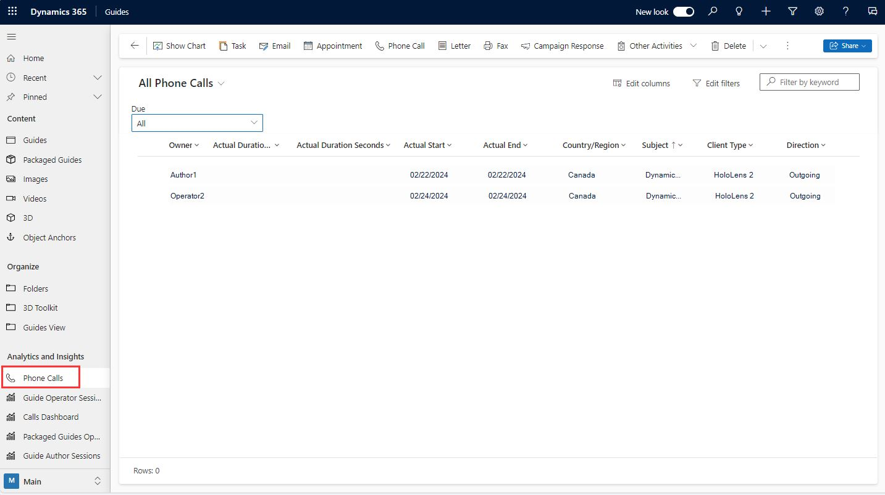

# View calling data stored by Dynamics 365 Guides

When Microsoft Dynamics 365 Guides users make or receive calls in the HoloLens app, call information is stored in Microsoft Dataverse. Anyone who has access to make.powerapps.com or the Guides environment can view calling data in the Guides model-driven app. Users can view only their own calling data; administrators can view calling data from all users. 

Location data is only stored in Microsoft Dataverse if the user consents to store that data. Users are prompted to provide permission to store location data when they start the HoloLens app for the first time, but they're not required to store that data to use the HoloLens app. If a user chooses not to store location data, other calling information is stored, but location fields in the app will be empty. [Learn more about HoloLens app permissions](hololens-permissions.md)

## View calling data

1. [Open the Guides model-driven app](open-model-driven-app.md).

2. On the left side of the screen, under **Analytics and insights**, select **Phone Calls**.

    

3. If you're a user, you can view your own call records. If you're an administrator, you can view all call records by selecting the **All** view. 
