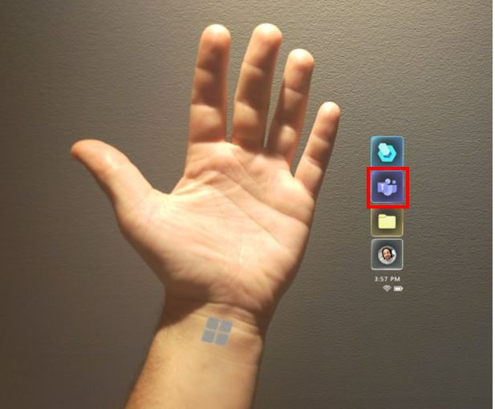
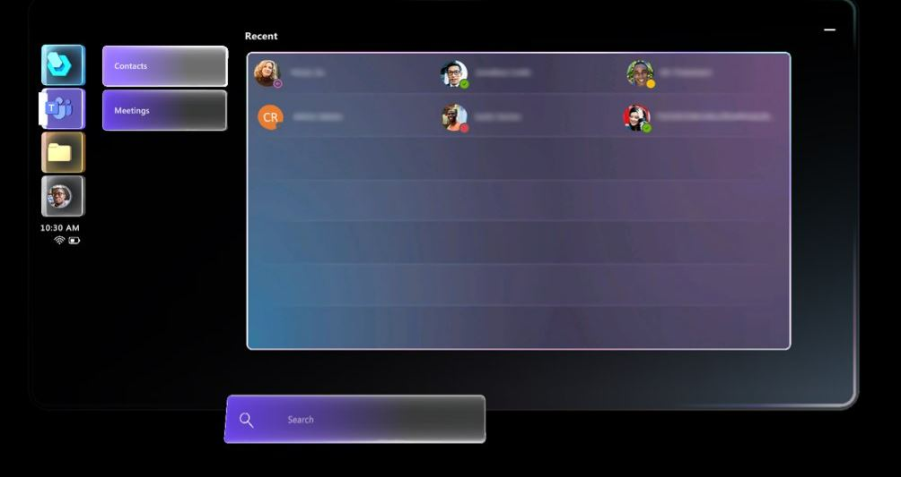
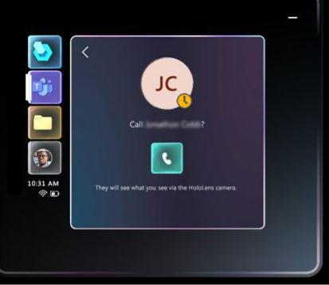
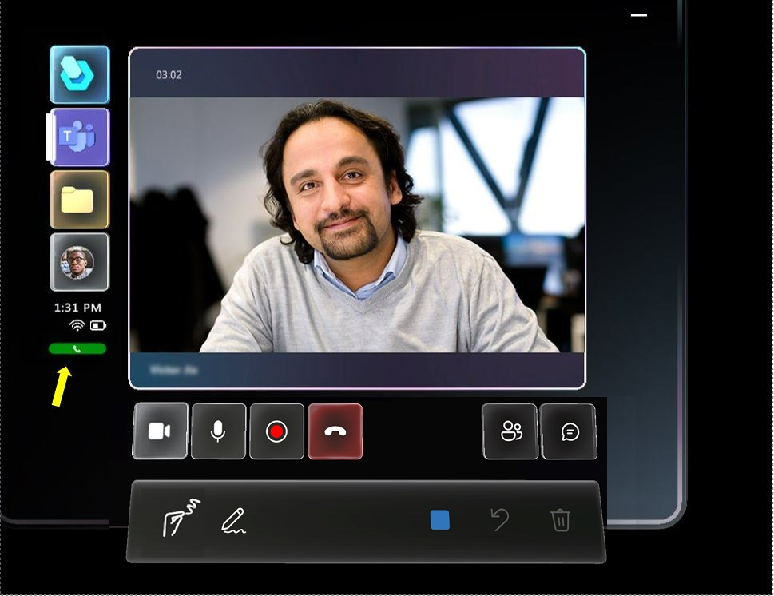
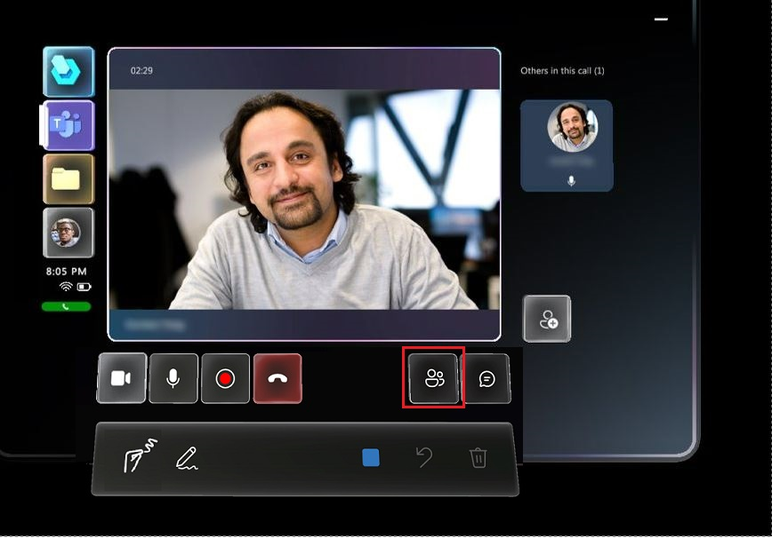
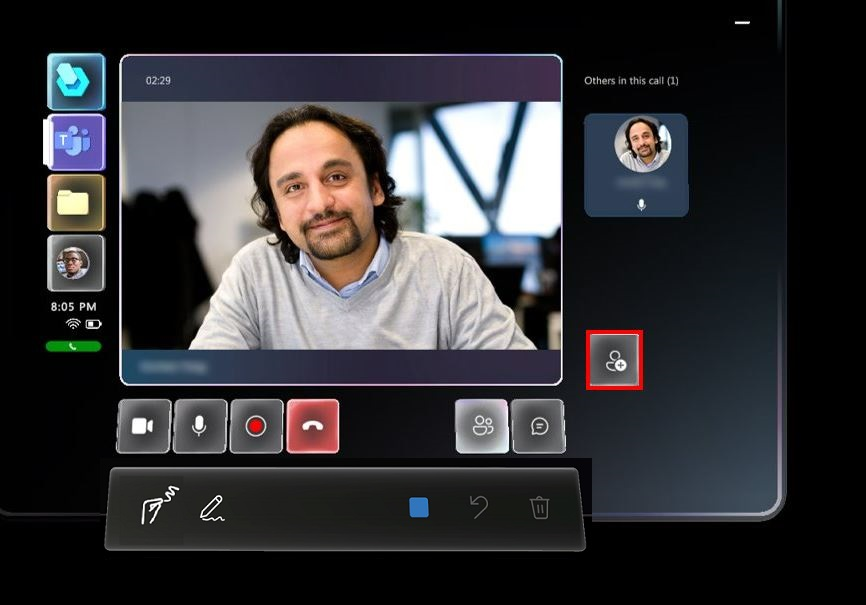
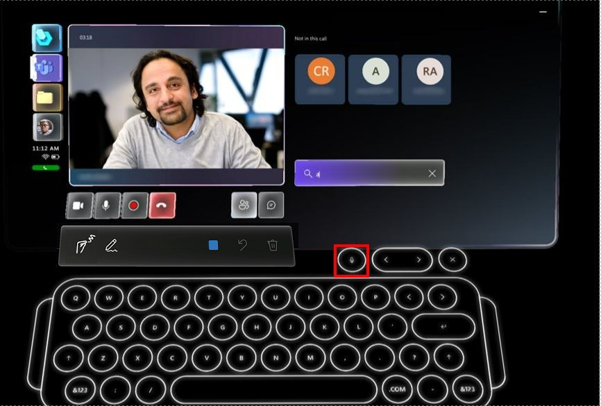

# Call a remote collaborator from Dynamics 365 Guides 

When you're working in Microsoft Dynamics 365 Guides on HoloLens, if you need help with a task in your world, you might want to call a remote collaborator on Microsoft Teams (desktop or mobile) or Dynamics 365 Remote Assist. 

Dynamics 365 Guides supports the following types of calls:  

- **One-to-one call**. A one-to-one call includes two participants. For example, if you need help with a machine that you're repairing, start a one-to-one call with a remote expert.

- **Group call**. A group call includes three or more participants. For example, if you're inspecting an asset in a one-to-one call but need a third person's expertise, any call participant can add the third person to form a group call. 
    
- **Meeting**. A meeting is a call scheduled through Teams or Outlook. Meetings can include any number of participants. For example, if you want to have a weekly inspection with your team, create a meeting so that everyone receives notifications about the meeting and can join the meeting. [Learn more about joining a meeting in Dynamics 365 Guides](calling-meetings.md)

## Who can collaborate on a call?

A Dynamics 365 Guides HoloLens user can collaborate with:

- A Teams desktop user (PC or Mac) on a one-to-one call, group call, or scheduled meeting. To learn more about different combinations of HoloLens and Teams users on group calls, see [Group calls](#group-calls).

- A Dynamics 365 Remote Assist mobile user on a one-to-one or group call.

- A Teams mobile user on a one-to-one call.

> [!NOTE]
> The mixed-reality toolbar will not appear if the Dynamics 365 Guides user joins the call from two different devices.

## Start a call from Dynamics 365 Guides

> [!NOTE]
> At this time, you can't receive a call in Dynamics 365 Guides from a Teams or Dynamics 365 Remote Assist user. You must initiate the call from Dynamics 365 Guides. 

### Start a one-to-one call with a contact in your organization 

1. Look at the palm of your hand to open the Main menu, and then select the **Communications** button.

        
        
2. Do one of the following:

    - If the contact you want to call is listed in the **Recent** list, select the contact.      

    - If the contact isn't listed in the **Recent** list, place your cursor in the **Search** box, and then in the holographic keyboard that appears, enter the person's name or email address. Use the **Microphone** button if you prefer to use your voice to enter the person's name in the **Search** box. 

         
    
3. In the window that appears, select the **Phone** button to call the contact. 

      

    You'll see the contact's video feed, calling and activity controls, and the **Annotate** toolbar. The green indicator to the lower left of the video feed shows that you're on a call with that contact. This is useful to remind you that you're on a call, if you select a different type of activity such as opening a guide or file. 

    
       
### Start a one-to-one call with a Teams user outside your organization

You can search for and call a Teams user in another organization if your organization is federated with that organization. To call a federated user, open Dynamics 365 Guides, select **Search**, and then use the holographic keyboard to enter their **full email address** (or use the **Microphone** button if you prefer to use your voice). You won't see any search results if you enter just a name or a partial email address. 

After you call a federated contact, they appear in your recent contacts list, so you don't have to search for that contact again.

>[!Note]
> If you can't find the contact you're looking for, it might be because Teams federation ([Teams external access](/microsoftteams/manage-external-access#:~:text=Enable%20your%20Organization%20to%20Communicate%20with%20another%20Teams,your%20organization%2C%20skip%20to%20step%205.%20See%20More.)) has not been enabled. Contact your administrator for help.

### Group calls

A group call can include a Dynamics 365 Guides user on HoloLens and a Teams desktop user (PC or Mac) or Dynamics 365 Remote Assist mobile user. 

> [!NOTE]
> A Teams mobile user cannot collaborate on a group call with a Dynamics 365 Guides user on HoloLens.

On group calls, you can switch between participants' video feeds and mute or remove participants as needed. 

You can combine HoloLens users with Teams users in different combinations:

- Multiple HoloLens users can collaborate on the same Dynamics 365 Guides call. 

- Any Teams desktop user can choose any HoloLens user's space to annotate on if there is more than one HoloLens user. 

- Multiple Teams desktop users can annotate on the same HoloLens user's space at the same time.

#### Start a group call 

1. Start by calling one person as described above for a one-to-one call, and then select the **Open Participants** button (or say "Guides, Open Participants").

    

    You'll see the tile for the first person you called to the right of the video feed. 
    
2. Select the **Participants** button to the right of the video feed to display a list of recent contacts.

    
   
3. Do one of the following:

    - If the contact you want to add is listed in the **Recent** list, select the contact's tile, and then select **Show video**.

    - If the contact isn't listed in the **Recent** list, place your cursor in the **Search** box, and then in the holographic keyboard that appears, enter the person's name or email address. Use the **Microphone** button if you prefer to use your voice to enter the person's name in the **Search** box. 

      
      
#### Mute a participant in a group call

1. Select the **Open Participants** button or say "Guides, Open Participants." 

2. Select the tile for the participant that you want to mute.

3. When the tile flips over, select **Mute**. Muted participants can unmute themselves. 

> [!Note]
> If the call includes a large number of participants, you might experience performance issues, such as delays in viewing annotations and lower video resolution. [Learn more about the number of participants that can join a Microsoft Teams call](/microsoftteams/limits-specifications-teams#meetings-and-calls). 

#### Remove a participant in a group call

1. Select the **Open Participants** button or say "Guides, Open Participants." 

2. Select the tile for the participant that you want to remove.

3. When the tile flips over, select **Remove**.

### End a call

- Select the **End call** button or say "Guides, End call."

### How outgoing video quality is adjusted if the HoloLens device gets too hot

If you're on a longer call, the HoloLens device can become hot if it's using several device capabilities at the same time (for example, multiple cameras, Mixed Reality Capture, and Wi-Fi). To extend the length of the call and keep the device from overheating, Dynamics 365 Guides gradually reduces outgoing video quality. If this happens, you'll see a series of messages to let you know how and why the outgoing video quality is being adjusted. [Learn more about how Dynamics 365 Guides adjusts video quality](calling-hololens-thermal-adjusting.md)

## Receive a call in Teams desktop (PC or Mac) from a Dynamics 365 Guides user 

> [!NOTE]
> At this time, you can't call a Dynamics 365 Guides user from Teams desktop. You must initiate the call from Dynamics 365 Guides. 

1. Launch the Teams app.

   > [!IMPORTANT]
   > If this is the first time you have launched Teams and you have not been invited to any other teams, Teams will automatically take you to the correct place. If you have been invited to other teams, you might need to switch to the appropriate tenant.  
   >     
   > To switch tenants, in the drop-down menu in the upper-right corner of the window, select the appropriate guest tenant. Teams might take a few seconds to reload.

 2. When you see an incoming call notification in the bottom right side of your screen, select **Audio** or **Video** to join the call.

### Use the call controls

When you're on a call, you'll see the call controls at the bottom of the screen. 

|Button|Description|
|------------|----------------------------------------------|
||Control outgoing video.|
||Control outgoing audio.|
||Share your desktop or a running application.|
||Open a chat window to send text messages.| 
||See current participants, or add more.|

To use additional features, select the **More info** […] button. For example, select **Blur my background** if you have sensitive information behind you or want to protect the privacy of colleagues who are behind you. When you're on a group call or meeting with a Dynamics 365 Guides user, the **More** […] button will also provide the option to record the call.  

## Receive a call in Teams mobile from a Dynamics 365 Guides user 

> [!NOTE]
> At this time, you can't call a Dynamics 365 Guides from Teams mobile. You must initiate the call from Dynamics 365 Guides. 

Use the call controls at the bottom of the screen in Teams mobile. The following table describes the call controls buttons.

|Button|Description|
|------------|----------------------------------------------|
||Control outgoing video.|
||Control outgoing audio.|
||Control incoming audio.|
||Access more commands.|

Select the **More info** [...] button to access the following commands:

- **Toggle incoming video**
- **Share your screen**: Your screen will pop up as a video for the Dynamics 365 Guides user.
- **Start video with blur**: For iOS only, useful if you have sensitive information behind you or want to protect the privacy of colleagues who are behind you. 
- **Insert file**: Share a file.  

> [!TIP]
> Turn your phone horizonal to see more of the Dynamics 365 Guides user’s environment.  

