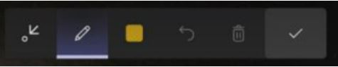

# Annotate a screen in Dynamics 365 Guides HoloLens

If you're using Dynamics 365 Guides on HoloLens, and you're on a call with a remote collaborator using Microsoft Teams (PC, Mac, or mobile) or Dynamics 365 Remote Assist mobile, you and your remote collaborator(s) can annotate in your environment. Annotations are useful for pointing out different parts of your space, including parts that may be difficult or dangerous to reach. All call participants can see each others’ additions, and can make their own annotations. Once an annotation is placed, it remains anchored in your space until the person who placed the annotation deletes it or leaves the call. Call participants can also annotate [shared files or screens](calling-screen-sharing.md).

Any user on Teams (PC or Mac) or Dynamics 365 Remote Assist mobile can annotate the environment of the Dynamics 365 Guides user on HoloLens in a one-to-one or group call. Teams mobile users can also annotate, but only for one-to-one calls. Annotations are not supported for users on Teams Web. 

> [!NOTE]
> To use annotations, you must enable the appropriate permissions in Dynamics 365 Guides. [Learn more](hololens-permissions.md)

## Use Dynamics 365 Guides to annotate

### Draw in your space

> [!NOTE]
> At this time, a HoloLens user can draw in their environment but can't place arrows. The remote collaborator on Teams or Dynamics 365 Remote Assist mobile can draw **and** place arrows in the Dynamics 365 Guides user's environment.
> 
> Annotations don't work well on black or reflective surfaces.

1. When you're on a call, select the **Ink** button on the **Annotate** toolbar.

    

2. Use your hand rays to place the cursor where you want to start drawing.

    > [!NOTE
    > If hand rays are turned off in the HoloLens app, they're automatically turned back on again when you select the **Ink** button.

3. Air tap, keep your index finger and thumb together, and then start drawing in your space. Release the air tap to stop drawing. 

    > [TIP]
    > To use a voice command, select the **Ink** button by saying "Guides, Ink." Then say "Guides, Start inking" and "Guides, Stop inking" to start and stop inking.

### Change ink color

- Select the **Color** button on the **Annotate** toolbar, and then when the **Annotate** toolbar flips over, select the color you want. That color will be used the next time that you draw. 

    
    
### Erase your annotations

Use the following buttons to erase your annotations

|Button|Description|
|---------|----------------------------------------------------|
||Erase all drawings.|
||Undo your most recent action, including the Erase all action. 

## Use Teams (PC or Mac) to annotate the Dynamics 365 Guides user's environment

When you join a call in Microsoft Teams, you'll see your Dynamics 365 Guides collaborator’s space, including holograms, and can use the **Mixed Reality** toolbar in Teams to add annotations.

> [!NOTE]
> -	The toolbar appears only when the video feed for the Dynamics 365 Guides user is active.
> -	The toolbar will appear but will be disabled if the Dynamics 365 Guides user is not ready to receive annotations and files (for example, the  user's outgoing video feed is disabled, the user temporarily loses tracking, or Dynamics 365 Guides is not in the foreground because the user did the Bloom gesture).
> -	The toolbar will not appear if the same Dynamics 365 Guides user is connected from Teams and Dynamics Guides at the same time, regardless of the device used.
> - The toolbar will not appear if you have not turned on the [new Microsoft Teams meeting experience](https://techcommunity.microsoft.com/t5/microsoft-teams-blog/new-meeting-and-calling-experience-in-microsoft-teams/ba-p/1537581).

### Start annotating

To start annotating, first do one of the following to pause the video stream and enter edit mode:

-   Select anywhere in the Meeting window.

-   Select one of the items on the **Mixed Reality** toolbar.

-   Select **Start editing**.

In edit mode, you'll see a live stream of the call in the corner of the app window, including the annotations that other call participants add.

### Add arrows, ink, and files

Use the **Mixed Reality** toolbar to place arrows, draw, or add files in the HoloLens user's space. The following table describes the buttons in the **Mixed Reality** toolbar.

|Button|Description|
|---------|----------------------------------------------------|
||Add an arrow.|
||Add ink (draw).|
||Insert a file in the HoloLens user's space. You can select an image or .pdf file from OneDrive or from your device. [Learn more about sharing a file or your screen](calling-screen-sharing.md)|
||Change the arrow or ink color.|

### Finish editing

When you're done annotating, do one of the following:

-   Select **Stop editing**.

-   Select the live video feed in the corner of your screen.

### Erase your annotations

Use the following buttons to erase your annotations.

|Button|Description|
|---------|----------------------------------------------------|
||In edit mode, undo the last action.|
||If you're in edit mode, erase all of the annotations made during that editing session. In you're in live mode, erase all of the annotations made during that call.

> [!Note]
> - Specific drawings or arrows can’t be removed.
> 
> - Each call participant can only remove the annotations that they add.

### Minimize the Mixed Reality toolbar

The **Mixed Reality** toolbar appears by default whenever you join a new call with a Dynamics 365 Guides user. If you want to focus on the video stream from the HoloLens user, you can minimize the toolbar by selecting the **MR Toolbar** button. 

> [!NOTE]
> The toolbar remains minimized if you switch to a different Dynamics 365 Guides user's video feed. 

To restore the toolbar, select the **MR Toolbar** button again. 

## Use Teams mobile to annotate the Dynamics 365 Guides user's environment 

To add an annotation, select the **Ink button** .
The Dynamics 365 Guides user's video feed will freeze and you'll see the **Mixed Reality toolbar**. 

> [!NOTE
> You can only annotate in one-to-one calls with Teams mobile.

The following table describes the buttons in the **Mixed Reality** toolbar.

|Button|Description|
|---------|----------------------------------------------------|
|| Add an arrow. To add an arrow, tap where you want to place the arrow. To control the direction of the arrow, tap, hold, and draw a circle with your finger until it's facing the desired direction. Release to lock the arrow in place.|
||Add ink (draw).|
||Change the arrow or ink color.|
||Undo your last action in edit mode or undo the most recent annotation you added.|
||To delete all annotations that you added, select this button, and then select **Delete All Notes**. To delete only the annotations you added recently, select this button, and then select **Clear Current Notes**. This does not clear the annotations your collaborator added.

When you’re done adding annotations, select the **Checkmark** button on the **Mixed Reality** toolbar to resume the live video feed. All annotations will persist even after you stop editing. 

> [!NOTE]
> Each call participant can only undo and delete their own annotations.
