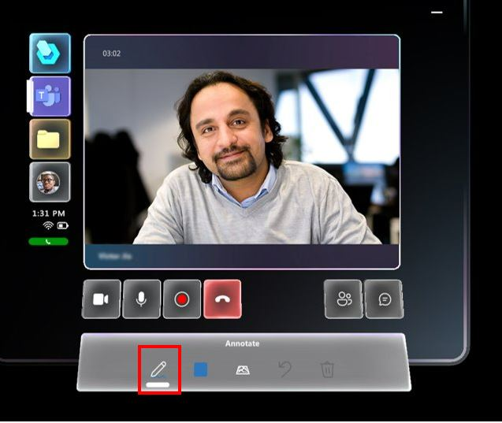
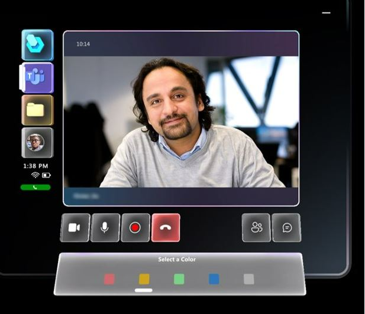
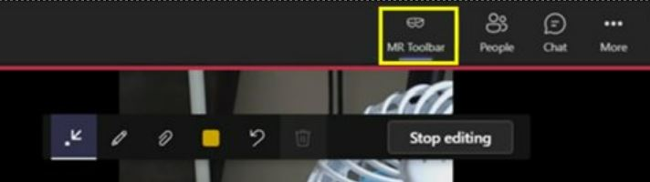

# Work with annotations in Dynamics 365 Guides on HoloLens

If you're using Dynamics 365 Guides on HoloLens, and you're on a call with a remote collaborator using Microsoft Teams desktop, Teams mobile, or Dynamics 365 Remote Assist mobile, you and your remote collaborator(s) can annotate your shared environment. Annotations are useful for pointing out different parts of your space, including parts that may be difficult or dangerous to reach. All call participants can see each others’ additions, and can make their own annotations. Once an annotation is placed, it remains anchored in your space until the person who placed the annotation deletes it (or if the person who added the annotation leaves the call). Adding annotations to files works the same way.

Any user on Teams desktop, Teams for the Mac, or Dynamics 365 Remote Assist mobile can annotate the environment of the Dynamics 365 Guides user on HoloLens. Teams mobile users can annotate only in one-to-one calls, however, not group calls. Annotations are not supported for users on Teams Web. 

> [!NOTE]
> To use annotations, you must enable the appropriate permissions in Dynamics 365 Guides. [Learn more](hololens-permissions.md)

## Annotate your space in Dynamics 365 Guides on HoloLens

### Draw in your space

> [!NOTE]
> At this time, a HoloLens user can draw in their environment but can't place arrows. The remote expert on Teams desktop, Teams mobile, or Dynamics 365 Remote Assist mobile can draw **and** place arrows.
> 
> Annotations don't work well on black or reflective surfaces.

1. When you're on a call, select the **Ink** button on the **Annotate** toolbar.

    

2. Use your hand ray to place the cursor where you want to start drawing.

    > [!NOTE
    > If hand rays are turned off in the HoloLens app, they're automatically turned back on again when you select the **Ink** button.

3. Air tap, keep your index finger and thumb together, and start drawing in your space. Release the air tap to stop drawing. 

    > [TIP]
    > To use a voice command, select the **Ink** button by saying "Guides, Ink." Then say "Guides, Start inking" and "Guides, Stop inking" to start and stop inking.

### Change ink color

- Select the **Color** button on the **Annotate** toolbar, and then select the color you want. The next drawing that you do will be that color.

    
    
### Erase your annotations

- To erase all drawings, select **Erase all** ().

- To undo your most recent action, including the Erase all action, select **Undo** (). 

## Annotate the Dynamics 365 Guides user's environment from Microsoft Teams desktop

When you join a call in Microsoft Teams, you'll see your Dynamics 365 Guides collaborator’s space, including holograms, and can use the **Mixed Reality** toolbar in Teams to add annotations.

> [!NOTE]
> -	The toolbar appears only when the video on stage is from the Dynamics 365 Guides user.
> -	The toolbar will appear but will be disabled if the Dynamics 365 Guides user is not ready to receive annotations and files (for example, the  user's outgoing video feed is disabled, the user temporarily loses tracking, or Dynamics 365 Guides is not in the foreground because the user did the bloom gesture).
> -	The toolbar will not appear if the same Dynamics 365 Guides user is connected from Teams and Dynamics Guides at the same time, regardless of the device used.
> - The toolbar will not appear if you have not turned on the [new Microsoft Teams meeting experience](https://techcommunity.microsoft.com/t5/microsoft-teams-blog/new-meeting-and-calling-experience-in-microsoft-teams/ba-p/1537581).

### Start annotating

To start annotating, first do one of the following to pause the video stream and enter edit mode:

-   Select anywhere in the Meeting window.

-   Select one of the items on the **Mixed Reality** toolbar.

-   Select **Start editing**.

In edit mode, you'll see a live stream of the call in the corner of the app window, including the annotations that other call participants add.

### Add arrows, ink, and files

Use the **Mixed Reality** toolbar to place arrows, draw, or add files in the HoloLens user's space. The following table describes the buttons in the **Mixed Reality** toolbar.

|Button|Description|
|---------|----------------------------------------------------|
||Add an arrow.|
||Add ink (draw).|
||Insert a file in the HoloLens user's space. You can select an image or PDF file from OneDrive or from your device.|
||Change the arrow or ink color.|

### Finish editing

When you're annotating, do one of the following:

-   Select **Stop editing**.

-   Select the live video feed in the corner of your screen.

### Make changes to your edits

To make changes to your edits:

- While in edit mode, select **Undo** () to undo the last action.

- While in edit mode, select **Erase all** () to erase all of the annotations made during that editing session.

- While in live mode, select **Erase all** () to erase all of the annotations made during that call.

> [!Note]
> - Specific drawings or arrows can’t be removed.
> 
> - Each call participant can only remove the annotations that they add.

### Minimize the Mixed Reality toolbar

The Mixed Reality toolbar appears by default whenever you join a new call with a Dynamics 365 Guides user. If you want to focus on the video stream from the HoloLens user, you can minimize the toolbar by selecting the **MR Toolbar** button. 

> [!NOTE]
> The toolbar remains minimized if you switch to a different Dynamics 365 Guides user's video feed. 

To restore the toolbar, select the **MR Toolbar** button again. 

## Annotate the Dynamics 365 Guides user's environment from Microsoft Teams mobile

To add an annotation, select the **Ink button** ().

Then, the Dynamics 365 Remote Assist user's video feed will freeze and you will see the **Mixed Reality toolbar**. 

- To add arrows, select the **Arrow** button (). Then, tap where you would like to place the arrow. To control the direction of the arrow, tap, hold, and draw a circle with your finger until it is at the correct direction. Then release.

- To make drawing annotations, select the **Ink** button ().

- To change the arrow or ink color, select the **Color** button (). 
  
- While in edit mode, select the **Undo** button () to undo the last action.

- To undo the most recent annotation you added, select **Undo**.

- To delete every annotation you’ve added, select the **Erase all** button () and then select **Delete All Notes**.

- To delete only the annotations you added recently, select the **Erase all** button ([Graphic showing the erase icon, which looks like a trash can.](media/calling-annotations-teams-erase-all-button.JPG)), and then select **Clear Current Notes**. It does not clear the annotations your collaborator added.

When you’re done adding annotations, select the checkmark button to resume the live video feed. All annotations will persist even after you stop editing. 

> [!NOTE]
> Each call participant can only undo and delete their own annotations.
