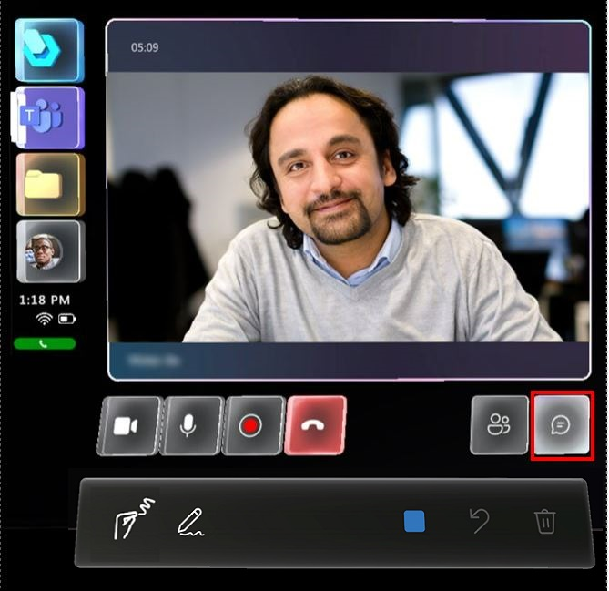
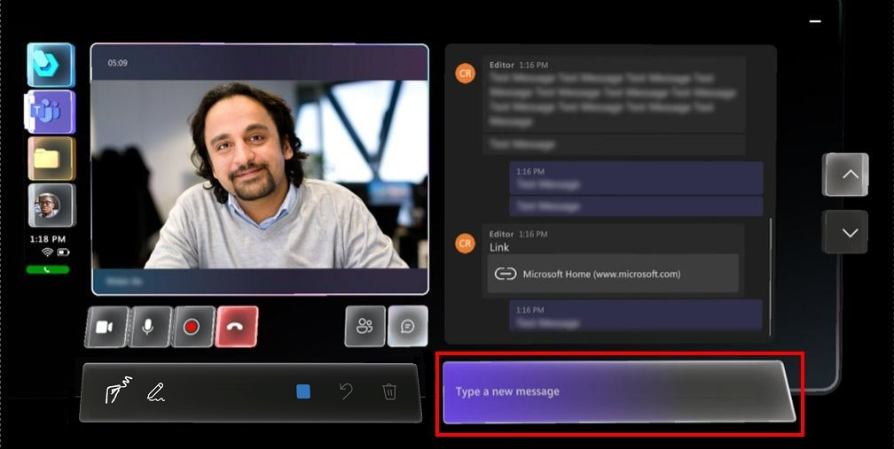
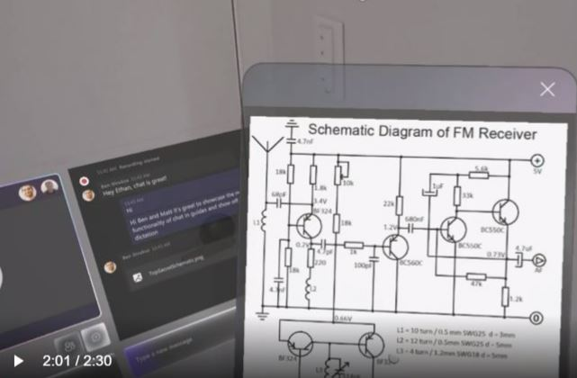
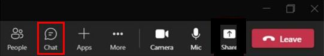

# Start a chat in Dynamics 365 Guides on HoloLens 

When you're on a call in Dynamics 365 Guides on HoloLens, you can chat with one or more remote collaborators on Microsoft Teams desktop or Microsoft Teams mobile. A remote collaborator on the call can share files or links with you in the Chat window. This is particularly useful in service-related scenarios where the remote expert wants to share a diagram or some other illustration to help you diagnose and/or solve a problem.

## Start a chat

1. If you receive a chat message while you're on a call, a red circle appears on the **Chat** button, and the **Chat** button animates. Select the **Chat** button to open the chat. 

    
    
    A new Chat window appears to the right of the Meetings window.     
    
2. To respond to the chat, place your gaze cursor over the box that says "Type a new message". 

    
    
3. In the holographic keyboard that appears, enter your message or use the microphone button to dictate a message. Select the **Send** button (or press the Return key on the holographic keyboard) when you're ready to send the message. 

    
    
4. If a remote expert on the call shares a file, the file or page automatically opens in a new window in your space. You can move this window wherever you want or size it directly with your hands. 

   

   The remote collaborator can also paste a link into the Chat window to share a file.  
   
   > [!NOTE]
   > A remote collaborator can share a file with a Dynamics 365 Guides user, but the Dynamics 365 Guides user cannot share a file with other participants on the call.  
## Start a chat from Teams desktop (PC or Mac)

During a call with a Dynamics 365 Guides user, participants can communicate through the text chat. The chat log is available through Teams after the call ends.

To start a chat:

1. In the call controls, select the **Chat** button. 

    

    The Dynamics 365 Guides user can only see messages that are exchanged during the call. 

2. To send a OneDrive or local file through chat, select the **Attach** button or paste the file directly into the Chat window. 

    >[!Note]
    > Dynamics 365 Guides chat supports certain formats, including bold, italic, strikethrough, and underline. It also supports hyperlinks. However, it does not support HTML-formatted text or lists, such as a passage you copy and paste from a website. 
    >
    > For example, if you copy and paste text from a website that has HTML formatting and send it during a Dynamics 365 Guides call, the Dynamics 365 Guides user will see the text in the Chat window, but the formatting may not be what you expect.
