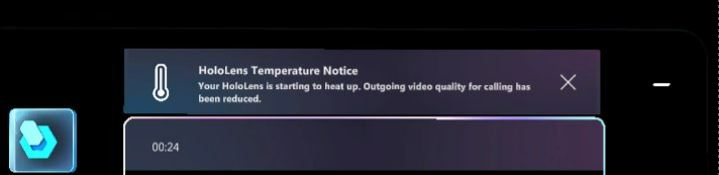

# How Dynamics 365 Guides automatically adjusts HoloLens temperature if the device overheats

If you're on a longer call in Microsoft Dynamics 365 Guides, the HoloLens device can become hot if it's using 
several device capabilities at the same time (for example, multiple cameras, Mixed Reality Capture, and Wi-Fi). To extend the length of the call and keep the device 
from overheating, Dynamics 365 Guides gradually reduces outgoing video quality (resolution and frame rate). If this happens, you'll see a series of messages to let 
you know how and why outgoing video quality is being adjusted. 

> [!IMPORTANT]
> You must use HoloLens OS version 22H1 (Spring 2022 release) or later to use this feature. Also, the Dynamics 365 Guides application must be in the foreground (have the focus) to adjust to temperature changes.  

The first warning message tells you that HoloLens is starting to heat up and that outgoing video quality for calling has been reduced.

If the device continues to heat up, you'll see a warning that the device is approaching a critical temperatures and that outgoing video quality for calling has been further reduced.

If the device reaches a critical temperature, you'll see a warning that outgoing video has been disabled. 

If you attempt to activate video after it has been disabled, you'll see a message that says outgoing video is unavailable. 

When the device returns to an optimal operating temperature, you'll see a message that says outgoing video quality has been restored.

If you had video turned on before it was disabled, the video will automatically be turned back on. If you had video turned off before it was disabled, it will remain 
off but you can turn it back on. 
