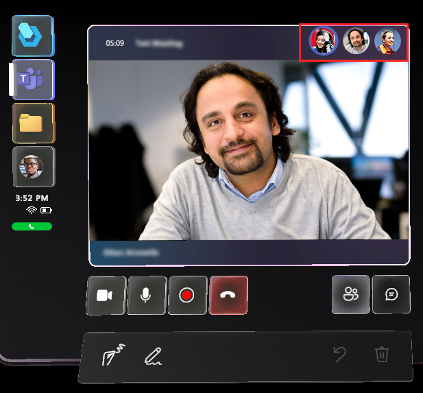
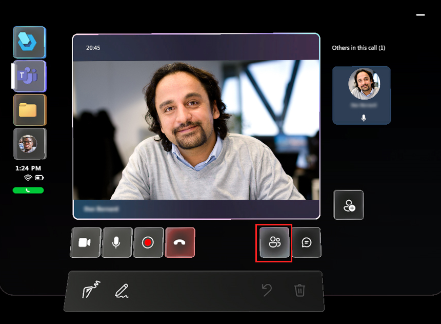
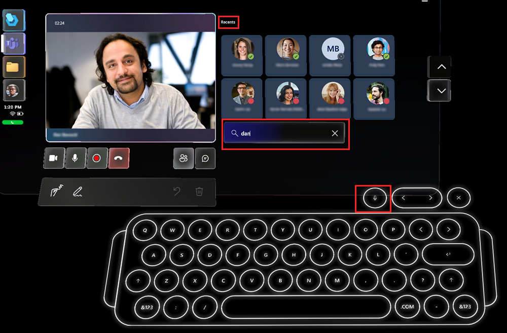
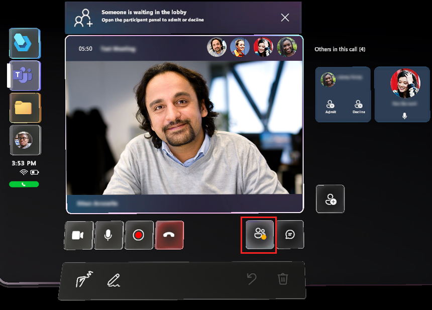

# Join a Microsoft Teams meeting from Dynamics 365 Guides

You can join a Microsoft Teams meeting from Dynamics 365 Guides on HoloLens. A [Microsoft Teams meeting](/microsoftteams/quick-start-meetings-live-events) is a meeting **scheduled** with Teams that includes any number of participants.

It's also possible to join a [Microsoft Teams live event](/microsoftteams/teams-live-events/what-are-teams-live-events) from Dynamics 365 Guides, but this scenario is not officially supported.  

## Prerequisites

- An Exchange Online license (not Exchange on-premises).

## Join a scheduled meeting

1. Look at the palm of your hand to open the **Main** menu, and then select the **Teams** button.

    

1. Select **Meetings**.

    

    The Meeting window opens to the current day so you can see all of your meetings for that day.

    

    > [!NOTE]
    > Dynamics 365 Guides supports the default calendar only. You can't change the layout of the calendar to the day, week, or month view, and you can't substitute a user's secondary calendar (for vacations or team-wide events, for example).
    >
    > Guest users participating on a call cannot access the default calendar for their home organization. They need to sign in to their home organization to access their default calendar.

    - To change to a different day, select the day at the top of the screen.
    - To switch to a different week, use the arrows in the upper-right corner of the screen.
    - To go back to the current day at any time, select **Today** at the top of the screen.

1. To open a specific meeting, select the meeting on the calendar. In the window that appears, you'll see the meeting details, including the meeting date and time, meeting name, and organizer.

1. Choose whether you want video on or off and then select **Join** to join the meeting.

   > [!TIP]
   > If your Teams policy for sharing video is not enabled, the option to turn on or off video is not available.

    When a participant joins the meeting, their avatar is displayed in the upper-right corner of the Meeting window.

    

## Add a participant from your organization to the meeting

To add a participant from your organization who wasn't included in the original invite:

1. Select the **Open participants** button.

1. In the participants area (to the right of the video feed), select the **Add participants** button. This opens the **Recent** list.

    

1. Do one of the following:

    - If the contact you want to add is listed in the **Recent** list, select the contact's tile, and then select **Show video**.

    - If the contact isn't listed in the **Recent** list, place your cursor in the **Search** box, and then in the holographic keyboard that appears, enter the person's name or email address. Use the **Microphone** button if you prefer to use your voice to enter the person's name in the **Search** box.

      

## Admit a participant from outside your organization

> [!NOTE]
> Dynamics 365 Guides users might not be able to join scheduled meetings between different companies if link-rewriting (URL-rewriting services) are used to fight spam. To make sure that users can join scheduled meetings in this situation, add an exception so that links from teams.microsoft.com are not rewritten.

If a participant wants to join the meeting, but they're not part of your organization, a notification appears at the top of the Meeting window to let you know that the participant is waiting in the lobby. A **Participants** button with a red dot (showing action required) appears in the bottom-right corner of the Meeting window.

To admit or decline the participant:

- Select the **Open participants** button below the video feed to display the participant tiles to the right of the video feed. In the first participant tile, select **Admit** or **Decline**.

> [!NOTE]
> The meeting organizer can decide who is admitted into a meeting directly and who has to wait for someone to admit them. [Learn more about choosing who can bypass the lobby.](https://support.microsoft.com/en-us/office/change-participant-settings-for-a-teams-meeting-53261366-dbd5-45f9-aae9-a70e6354f88e)

## Schedule and join a meeting from Teams desktop (PC or Mac)

### Schedule a meeting ahead of the call

Check out the following links:

- [Schedule a meeting in Teams](https://support.office.com/article/Schedule-a-meeting-in-Teams-943507a9-8583-4c58-b5d2-8ec8265e04e5#ID0EAABAAA=Desktop)

- [Watch a video on managing Teams meetings](https://support.office.com/article/Video-Manage-meetings-ba44d0fd-da3c-4541-a3eb-a868f5e2b137)

### Join a Teams meeting

Check out the following links:

- [Join a meeting in Teams](https://support.office.com/article/join-a-meeting-in-teams-1613bb53-f3fa-431e-85a9-d6a91e3468c9)

- [Watch a video on joining a Teams meeting](https://support.office.com/article/join-a-teams-meeting-078e9868-f1aa-4414-8bb9-ee88e9236ee4?ui=en-US&rs=en-US&ad=US)

## Next steps

- [Record a call](calling-record-call.md)
- [Screen and file sharing](calling-screen-sharing.md)
- [Annotations](calling-annotations.md)
- [Access OneDrive files](onedrive-files.md)

[!INCLUDE[footer-include](../includes/footer-banner.md)]
