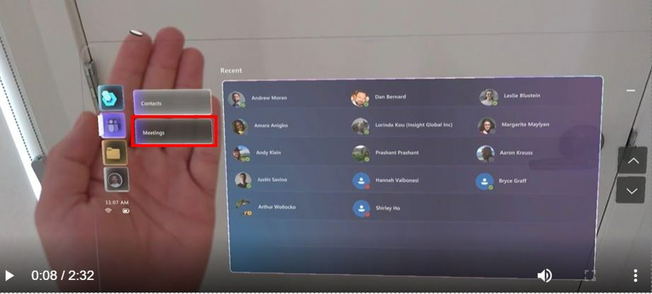
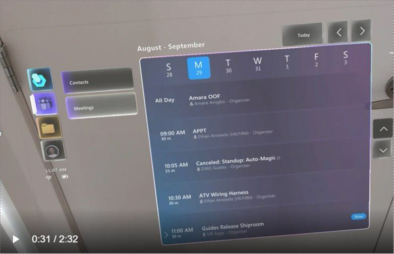
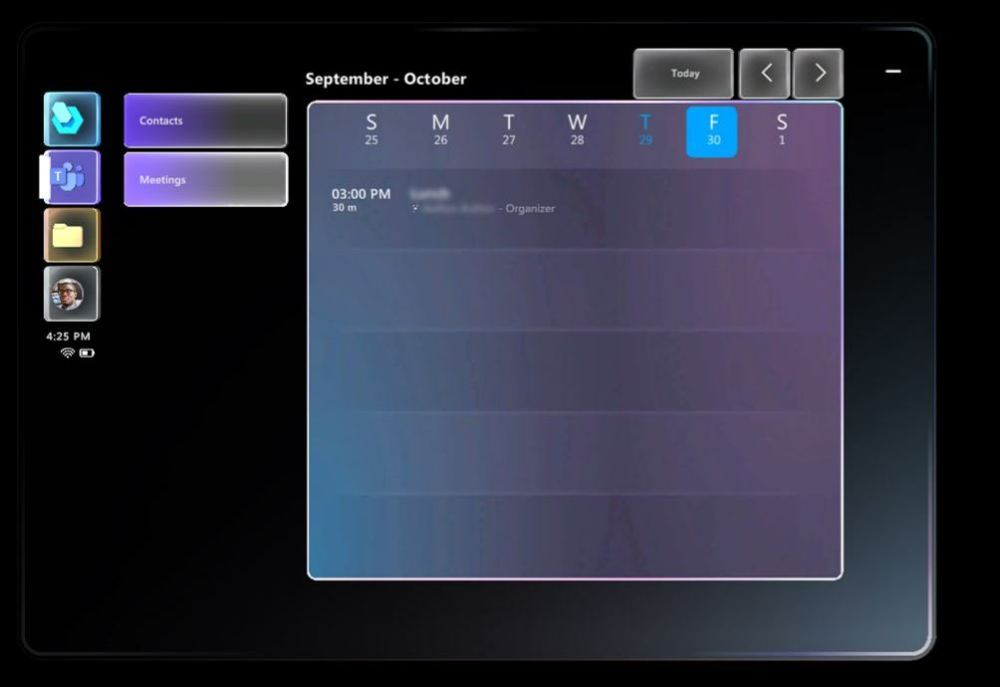
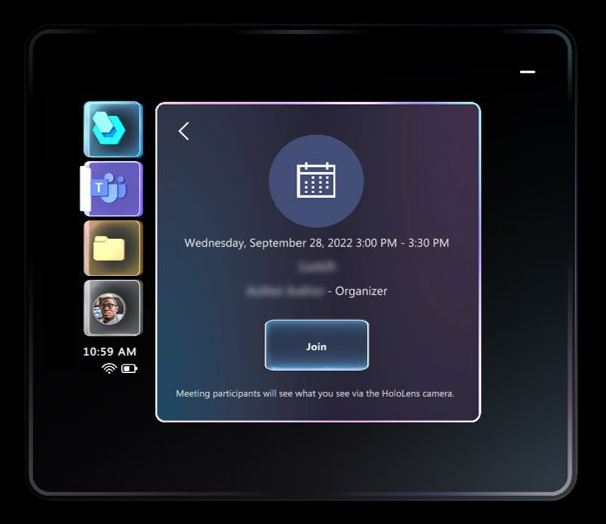
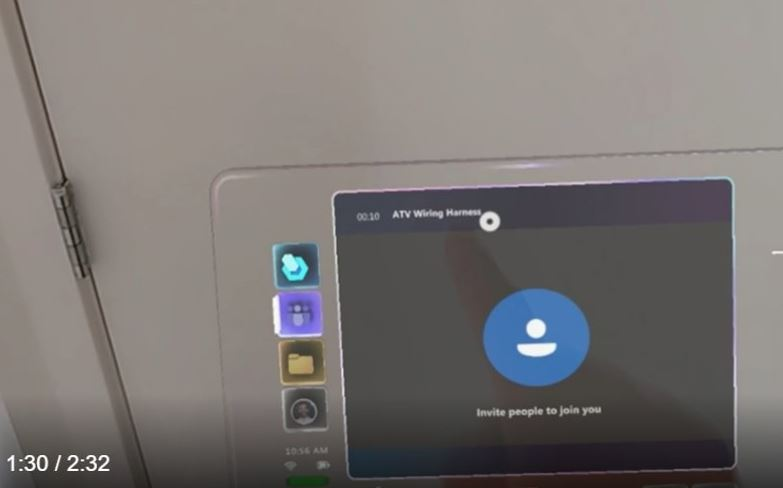
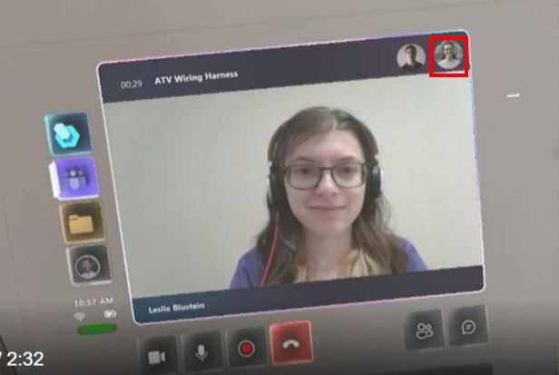
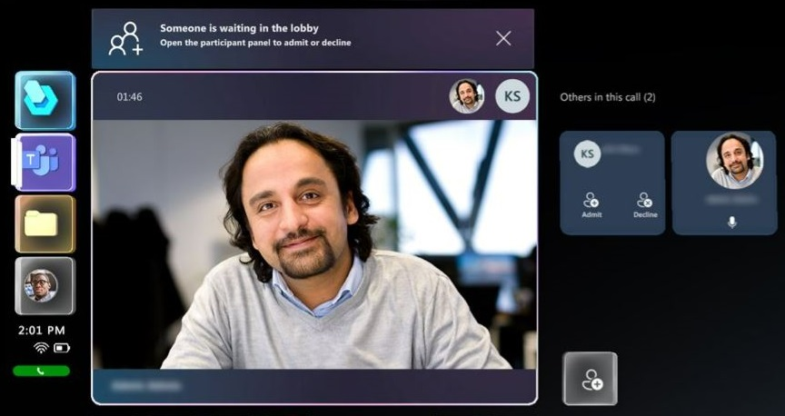
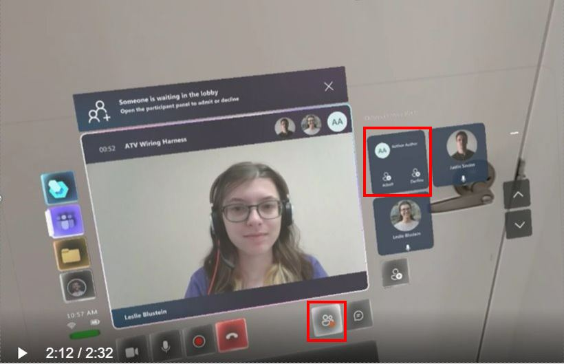

# Join a meeting or live event on Dynamics 365 Guides HoloLens

You can join a Microsoft Teams meeting or Microsoft Teams live event by using Dynamics 365 Guides on HoloLens. A [Microsoft Teams meeting](/microsoftteams/quick-start-meetings-live-events) is a meeting **scheduled** with Teams that includes any number of participants. A [Microsoft Teams live event](/microsoftteams/teams-live-events/what-are-teams-live-events) is an extension of a Teams meeting used to broadcast video and meeting content to a large online audience. A Microsoft Teams live event is useful for one-to-many communications where the host of the event is leading the interactions and audience participation is primarily limited to viewing the content shared by the host. A Dynamics 365 Guides HoloLens user can join a live event as a presenter or attendee in the same way that they join a meeting.

> [!IMPORTANT] 
> To join a meeting from Dynamics 365 Guides on HoloLens, you must have an Exchange Online license (not Exchange on-premises). 

## Join a scheduled meeting

1. Look at the palm of your hand to open the Main menu, and then select the **Communications** button.

    
    
2. Select **Meetings**.

    

    The Meeting window opens to the current day so you can see all of your meetings for that day. 

    

    > [!NOTE]
    > Dynamics 365 Guides supports the default calendar only. You can't change the layout of the calendar to the day, week, or month view, and you can't substitute a user's secondary calendar (for vacations or team-wide events, for example). 

    To change to a different day, select the day at the top of the screen. To switch to a different week, use the arrows in the upper right-corner of the screen. To go back to the current day at any time, select **Today**. 

    

    The bottom of the Meeting window shows the meeting time and duration (left side) and whether the meeting is occurring now (right side). 

   
    
3. To open a specific meeting, select the meeting on the calendar. In the window that appears, you'll see the meeting details, including the meeting date and time, meeting name, and organizer. 

    

4. Select **Join** to join the meeting. You'll see the following screen while participants are joining the meeting.
    
    

    When a participant joins the meeting, their avatar is displayed in the upper-right corner of the Meeting window. 

    
    
## Add a participant from your organization to the meeting

To add a participant from your organizaion that wasn't included in the original invite:

## Admit a participant from outside your organization

> [!NOTE]
> Dynamics 365 Guides users might not be able to join scheduled meetings between different companies if link-rewriting (URL-rewriting services) are used to fight spam. To make sure that users can join scheduled meetings in this situation, add an exception so that links from teams.microsoft.com are not rewritten. 
    
If a participant wants to join the meeting, but they're not part of your organization, a notification appears at the top of the Meeting window to let you know that the participant is waiting in the lobby. A **Participants** button with a red dot (showing action required) appears in the bottom-right corner of the Meeting window. 

    
To admit or decline the participant:

- Select the **Participants** button to display participant tiles on the right of the screen. In the first tile, select **Admit** or **Decline**. 

    

> [!NOTE]
> The meeting organizer can decide who is admitted into a meeting directly and who has to wait for someone to admit them. [Learn more about choosing who can bypass the lobby](https://support.microsoft.com/en-us/office/change-participant-settings-for-a-teams-meeting-53261366-dbd5-45f9-aae9-a70e6354f88e). 

[!INCLUDE[footer-include](../includes/footer-banner.md)]
